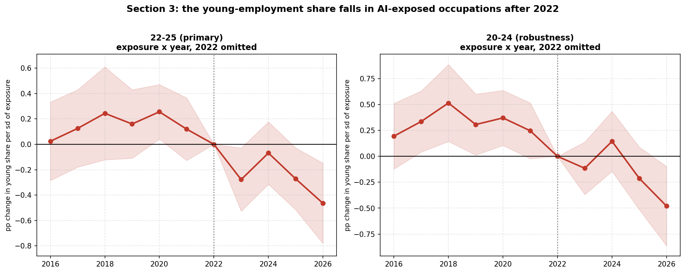
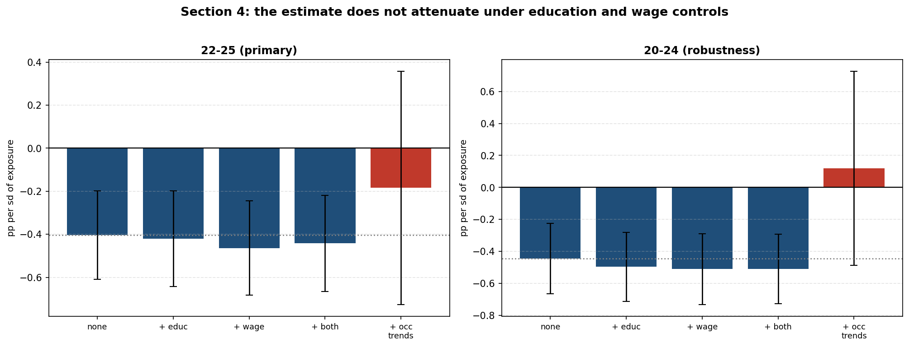
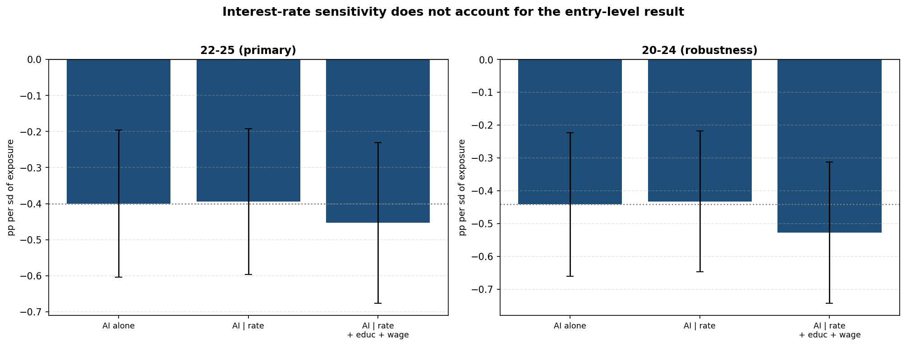
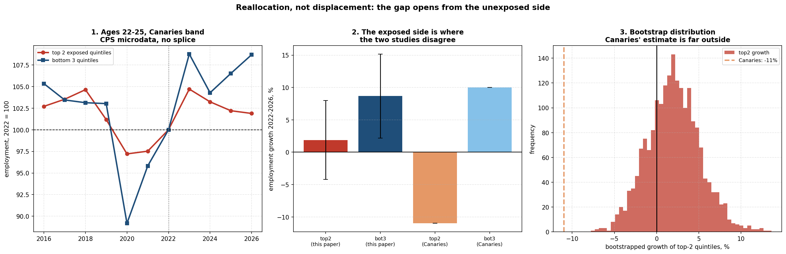
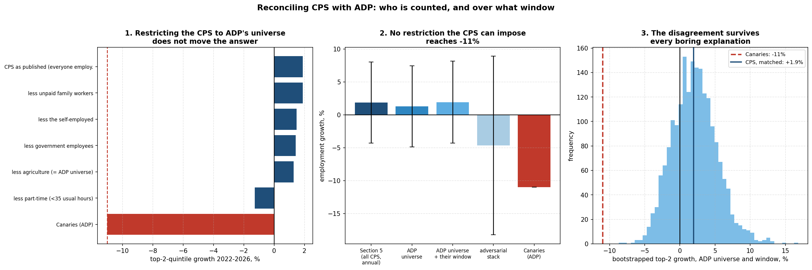
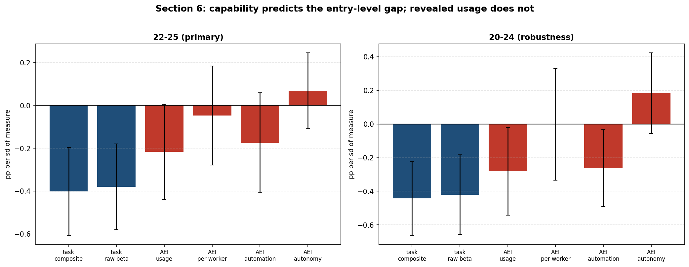

# Underperformance Without Contraction

**Entry-level employment and AI exposure in nationally representative data**

## Abstract

Brynjolfsson, Chandar and Chen (2026) report that employment of 22 to 25 year olds
in the two most AI-exposed occupational quintiles fell about 11 percent between
November 2022 and June 2026 while employment in the three least exposed grew about
10 percent, and that young employment in exposed occupations now stands 19 percent
below where it would be had it kept pace with less-exposed peers. Their evidence is
payroll data from a single provider, and they note their patterns are more
pronounced there than in national survey benchmarks. This paper runs the test on
nationally representative household data: 6.0 million IPUMS CPS person records
covering 2016 to 2026, aggregated to 457 occupations, using their primary exposure
measure.

The compositional pattern replicates and strengthens. The young share of an
occupation's employment falls by 0.40 percentage points per standard deviation of
AI exposure after 2022 (p = 0.0001). It strengthens rather than attenuates under
education and pay controls, where the original attenuates, has a clean pre-AI
placebo, and survives occupation-specific trends fitted on the pre-period and
extrapolated forward. A 2022 break dominates a 2020 break, so the timing is
generative AI rather than a delayed pandemic reallocation. An occupational
interest-rate exposure measure, built from identified monetary shocks and the OEWS
industry-by-occupation matrix, correlates +0.003 with AI exposure and leaves the
estimate unmoved.

The magnitudes do not replicate. Employment of 22 to 25 year olds in the two most
exposed quintiles **grew 1.9 percent**, with a bootstrap interval rejecting
−11 percent at p < 0.001, and neither sample universe nor window accounts for the
discrepancy. On the authors' own preferred kept-pace metric this paper finds a
6.2 percent shortfall against their 19 percent. Exposed occupations underperformed
a growing aggregate without contracting.

A third finding concerns measurement. Replacing the task-based exposure rating with
revealed AI usage turns the result into a null, and in a horse race capability
takes the entire effect. That is partly a fact about the usage measure, which
concentrates 29 percent of its mass on ten occupations holding 0.6 percent of
employment. Results in this literature are measure-dependent enough to flip a
headline finding.

The paper's central limit is that the outcome is a composition. Neither the
numerator nor the denominator moves significantly on its own. The age composition
of AI-exposed occupations demonstrably shifted; that young workers were displaced
from them is not established here.

Full draft, seven sections, read through end to end. Citations verified against
published sources. Remaining: a data appendix.

| # | Section | Status |
|---|---|---|
| **1** | **Introduction** | **drafted** |
| **2** | **Data and measures** | **drafted** |
| **3** | **The young-employment share in AI-exposed occupations** | **drafted** |
| **4** | **Is it exposure, or is exposure a proxy?** | **drafted** |
| **5** | **Where the gap comes from** | **drafted** |
| **6** | **Capability predicts the gap, deployment does not** | **drafted** |
| **7** | **Limits** | **drafted** |

Reproduce Section 3 with `python3 section3_core.py`, Section 4 with
`python3 section4_controls.py` and `python3 section4_rate_confound.py`, Section 6 with `python3 section6_measures.py`,
and Section 5 with
`python3 entry_level_decomposition.py` and `python3 adp_cps_reconciliation.py`.

---

# 1. Introduction

If generative AI substitutes for labor, the effect should appear first at the entry
level. Entry-level work in exposed occupations is disproportionately the drafting,
summarizing, and routine-analysis work that large language models do well, and
hiring is the margin firms adjust first, because declining to hire is cheaper and
faster than separating an incumbent. A labor-substitution effect too small to show
up in aggregate employment could still be visible in who gets hired into exposed
occupations.

Brynjolfsson, Chandar and Chen (2026) report exactly that pattern. In ADP payroll
microdata covering November 2022 to June 2026, employment of 22 to 25 year olds
fell about 11 percent in the two most AI-exposed occupational quintiles while
rising about 10 percent in the three least exposed, and they read the divergence as
AI displacing the entry tier of exposed work.

That finding deserves an independent test, for three reasons the authors themselves
identify. Their abstract concedes that their patterns "attenuate when controlling
for education, show some divergent trends predating generative AI, and are more
pronounced in the ADP analysis sample than in national survey benchmarks." Each is
a live objection, and the third is structural: ADP observes the payroll clients of
one firm, skewed toward employers large enough to outsource payroll.

This paper runs the test on nationally representative household data. The panel is
6.0 million IPUMS CPS person records, 2016 to 2026, aggregated to 457 occupations,
using the same primary exposure measure the original uses.

**The pattern replicates and strengthens.** The young share of employment falls in
AI-exposed occupations after 2022, by 0.40 percentage points per standard deviation
of exposure on the 22 to 25 band, significant at p = 0.0001. It holds on the raw
task-exposure rating with no adjustment, across cutoff years, weighted and
unweighted, and when the largest occupations are dropped. Where the original
attenuates under education controls, this estimate **strengthens**, to −0.4424
with education and pay held constant. Its pre-AI placebo is clean, it survives
occupation-specific trends fitted on the pre-period and extrapolated forward, and
in a horse race between a 2020 step and a 2022 step the 2022 term takes the entire
effect while the 2020 term is indistinguishable from zero. The timing is generative
AI rather than a delayed pandemic reallocation.

**The magnitude does not replicate.** Decomposing
the same gap into levels, employment of 22 to 25 year olds in the two most exposed
quintiles **grew 1.9 percent** over 2022 to 2026, with a confidence interval of
[−4.0, +8.2] that rejects the reported −11 percent at p < 0.001. Restricting the
CPS to exactly ADP's universe and dating it to exactly ADP's window leaves the
estimate unchanged at +1.9 percent. Stacking every specification choice
adversarially reaches −4.7 percent, at which point a third of the sample remains
and the interval rejects nothing in either direction. Exposed occupations
underperformed the growing aggregate by 3.9 percentage points, a shortfall this
data cannot distinguish from zero, and they did not contract, which is what a
displacement account requires. Which side opens the gap is not resolved: measured
against aggregate young employment growth the split is 57.5 to 42.5 with a modest
tilt toward the exposed side, and neither deviation is significant.

**Capability predicts the gap; observed deployment does not.** Replacing the
task-based exposure rating with revealed Claude usage turns the result into a null,
and in a horse race the task-based measure takes everything while revealed usage
goes to zero and changes sign. That is a fact about the revealed measure as much as
about AI: usage concentrates 29 percent of its mass on ten occupations holding 0.6
percent of employment, and those ten are editors, writers, librarians and
announcers. Results in this literature are measure-dependent to a degree that can
flip a headline finding, and this paper's own estimate should be read in that
light.

**What this paper does not establish.** The outcome is a composition. Running the
same specification on the numerator and the denominator separately gives
−2.9 percent on young employment and +1.7 percent on total employment, neither
significant, against a share effect of −4.5 percent that is. The age composition
of exposed occupations shifted; whether young workers were displaced from them is
not resolved here. There is no exogenous variation in exposure anywhere in the
design, and exposure-correlated interest-rate sensitivity, in a window containing a
large monetary tightening, is an untested confounder. Section 7 sets out these
limits and several others.

The contribution is therefore narrower than the original claim and, in one respect,
more secure. The entry-level exposure gap is real, survives a battery the published
version concedes it does not, and is visible in nationally representative data. The
displacement reading of that gap is not supported: in the population as a whole,
young employment in the most AI-exposed occupations did not fall.

Section 2 describes the data. Section 3 gives the core estimate and the diagnostics
that make 22 to 25 the primary band. Section 4 tests whether exposure is standing
in for education, pay, or a pre-existing trend. Section 5 decomposes the gap and
reconciles the disagreement with payroll data. Section 6 reports the divergence
between capability-based and usage-based measures. Section 7 sets out the limits.

---

# 2. Data and measures

## 2.1 The employment panel

The panel is built from IPUMS CPS monthly microdata, 6,013,472 employed person
records aged 16 to 64 covering January 2016 through July 2026. Records are
aggregated to occupation-by-year cells using the OCC2010 harmonized occupation
code, which holds the coding scheme fixed across the 2018 census revision, and
weighted by the CPS final person weight. The panel has 32,645 rows across 473
occupations. Employment covered in 2022 is 141.5 million.

Ages are emitted into bands, and the non-overlapping set is

    under 20,  20 to 24,  25,  26 to 30,  31 to 34,  35 and over

which tiles 16 to 64 exactly. The singleton band at 25 is not decorative. An
earlier version of this panel ran without it, which meant the denominator silently
excluded every 25 year old, understating total employment by about 2 percent and
making the 22 to 25 share a ratio whose numerator included people its denominator
did not. Correcting it moved the estimates in Section 3 by roughly 4 percent and
changed no inference. The construction now asserts that the bands tile before any
estimation runs, so the error cannot recur.

The 22 to 25 band overlaps 20 to 24 by construction and is therefore excluded from
the denominator. Both are reported, with 22 to 25 primary for the reasons in
Section 3.5.

**What this panel is not.** A separate strand of this project splices the CPS onto
published BLS occupation-by-age tables to reach back to 2011, and tests that splice
across eight constructions. That work is on the 20 to 24 band, because the
published BLS tables carry no 22 to 25 band, and it is not used anywhere in this
paper. Every estimate here runs on CPS microdata from 2016 to 2026 alone.

**Two known data gaps.** The October 2025 CPS was never collected, so any
twelve-month window spanning it contains eleven months. Section 5.5 averages over
the calendar months observed at both ends; an earlier version divided by twelve
regardless and manufactured a decline of about 7 percent out of nothing. And the
2026 year is partial, covering January through July.

## 2.2 Exposure

Two task-based measures are used.

**Raw GPT-4 beta.** The Eloundou et al. occupational exposure scores, averaging the
human and model ratings of the share of an occupation's tasks for which a large
language model could reduce completion time by at least half. The source file
carries 923 O*NET-SOC rows, collapsed to six-digit SOC. Across the estimation
sample the measure has mean 0.314 and standard deviation 0.208. This is the primary
measure in the study this paper replicates, which is why it is reported throughout
rather than only as a robustness check.

**Composite.** The raw rating min-max scaled and discounted by a complementarity
index, `exposure x (1 - complementarity)`. The complementarity index is the mean of
five O*NET Work Context ratings on the CX scale: physical proximity, face-to-face
discussion, dealing with external customers, health and safety of other workers,
and consequence of error. The reasoning is that an exposed task performed in person
under high consequence of error is less substitutable than the task rating alone
implies. Mean 0.159, standard deviation 0.132.

The composite is a construct of this project and is not standard. Every result in
this paper is reported under both measures and none depends on the composite; the
raw rating gives −0.3790 against the composite's −0.4004 in the Section 3
baseline. The baseline moves by a few thousandths across the three samples in
Section 2.5, so figures quoted in different sections are not always identical;
each table states the sample it runs on.

**Revealed usage.** The Anthropic Economic Index release of 26 June 2026 maps
Claude conversations to SOC occupations, covering 522 occupations after
crosswalking. It carries a usage share, an automation-versus-augmentation split,
and a mean autonomy score. Section 6 uses it and Section 6.1 documents why it
should not be read as an index of economy-wide AI deployment.

## 2.3 Controls

**Education and preparation.** O*NET Job Zone, a one-to-five ordinal of the
education, experience, and training an occupation requires. Sample mean 2.93.

**Pay.** OEWS May 2022 national annual median wage for detailed occupations,
entered in logs. Sample mean 10.91, about \$54,600.

Both are time-invariant occupational characteristics interacted with the post
indicator, so they identify differential post-2022 movement by preparation and by
pay rather than a level effect, which occupation fixed effects already absorb.

## 2.4 Crosswalking

Exposure, controls, and usage are all defined on SOC codes; the employment panel is
on OCC2010. A crosswalk of 525 unique OCC2010 codes maps between them. Where an
exact six-digit SOC match is unavailable the lookup falls back to the mean over
five-digit and then two-digit prefix matches. This introduces measurement error in
the regressor for a minority of occupations, and Section 7.6 records it.

## 2.5 Estimation samples

Three samples appear, and the differences are mechanical rather than discretionary.

| sample | occupations | cells | used in |
|---|---:|---:|---|
| exposure available | **457** | 4,625 | Sections 3, 7 |
| exposure, Job Zone and OEWS wage all available | **451** | 4,563 | Section 4 |
| exposure and AEI both available | **456** | 4,614 | Section 6 |
| exposure, CPS-only levels, positive base-year employment | 427 (22-25), 421 (20-24) | | Section 5 |

Each is the largest sample on which its specification can be estimated. The
Section 5 counts are smaller because a levels growth rate requires strictly
positive employment in the base year, which a share regression does not.

## 2.6 Reproduction

All estimates in this paper come from four scripts sharing one panel construction
in `entry_panel.py`:

| script | sections |
|---|---|
| `section3_core.py` | 3, and the decomposition in 7.2 |
| `section4_controls.py` | 4 |
| `entry_level_decomposition.py`, `adp_cps_reconciliation.py` | 5 |
| `section6_measures.py` | 6 |

The panel itself is rebuilt by `build_cps_panel_bands.py` from the IPUMS extract.

---

# 3. The young-employment share in AI-exposed occupations

## 3.1 Specification

The estimating equation is a two-way fixed-effects difference-in-differences on an
occupation-by-year panel:

    share_it = a_i + d_t + B * ( z(exposure_i) x post_t ) + e_it

where `share_it` is employment in the age band as a percent of occupation i's total
16 to 64 employment in year t, `a_i` and `d_t` are occupation and year fixed
effects, exposure is z-scored across occupations, and `post_t` is an indicator for
years from 2023. Cells are weighted by occupation employment and standard errors
cluster on occupation, which is the level at which exposure varies and therefore
the level at which residuals are correlated.

B is the change in the young share, in percentage points, associated with a one
standard deviation increase in AI exposure after 2022, holding the occupation's own
level and the common year effect fixed. The sample is 457 occupations and 4,625
occupation-years covering 2016 to 2026, built from 6.0 million IPUMS CPS person
records.

Two exposure measures are used throughout. The raw Eloundou et al. GPT-4 beta
rating is the primary measure in the study this paper replicates. The composite
additionally discounts exposure by an O*NET-derived complementarity index, on the
reasoning that an exposed task performed face to face under high consequence of
error is less substitutable than the rating alone implies. Results are reported
under both, and no claim in this paper depends on the composite.

**A defect corrected in the panel.** The non-overlapping age bands originally used
to reconstruct the denominator were under 20, 20 to 24, 26 to 30, 31 to 34, and 35
plus, which leave a hole at exactly age 25. Every 25 year old was therefore missing
from total employment, understating the denominator by about 2 percent, and the 22
to 25 share was a ratio whose numerator included people its denominator did not.
The panel now carries a singleton band at 25 so the non-overlapping set tiles 16 to
64. Correcting it moved the coefficients by roughly 4 percent and changed no
inference, and it is recorded here because the uncorrected figures appear in
earlier versions of this project.

## 3.2 The core result

**Table 3.1.** Young-employment share on AI exposure, two-way fixed effects,
occupation-clustered standard errors. 457 occupations, 4,625 cells, 2016 to 2026.

| age band | exposure measure | B | SE | p |
|---|---|---:|---:|---:|
| **22-25 (primary)** | **composite** | **−0.4004** | 0.1042 | **0.0001** |
| 22-25 (primary) | raw GPT-4 beta | −0.3790 | 0.1018 | 0.0002 |
| 20-24 (robustness) | composite | −0.4421 | 0.1115 | 0.0001 |
| 20-24 (robustness) | raw GPT-4 beta | −0.4200 | 0.1213 | 0.0005 |

All four specifications give the same answer at the same order of magnitude. A one
standard deviation increase in exposure is associated with a 0.40 percentage point
fall in the 22 to 25 share of an occupation's employment after 2022. Against a mean
22 to 25 share of 8.47 percent, that is a relative decline of about 4.7 percent per
standard deviation. The result does not depend on the complementarity adjustment,
since the raw rating gives −0.3790 on its own.

## 3.3 Timing

A fixed post indicator imposes a single step and reveals nothing about when the
change arrives. Replacing it with a full set of exposure-by-year interactions, with
2022 omitted as the base year, gives the path directly.

**Table 3.2.** Event study, 22 to 25 share, composite exposure. 2022 omitted.

| year | B | SE | 95% CI |
|---|---:|---:|---:|
| 2016 | +0.0240 | 0.1575 | [−0.285, +0.333] |
| 2017 | +0.1250 | 0.1553 | [−0.179, +0.429] |
| 2018 | +0.2440 | 0.1867 | [−0.122, +0.610] |
| 2019 | +0.1602 | 0.1376 | [−0.110, +0.430] |
| 2020 | +0.2560 | 0.1098 | [+0.041, +0.471] |
| 2021 | +0.1195 | 0.1258 | [−0.127, +0.366] |
| 2023 | −0.2776 | 0.1271 | [−0.527, −0.028] |
| 2024 | −0.0684 | 0.1254 | [−0.314, +0.177] |
| 2025 | −0.2721 | 0.1245 | [−0.516, −0.028] |
| 2026 | **−0.4643** | 0.1614 | [−0.781, −0.148] |

One of six pre-2022 coefficients is individually significant, and it is 2020, the
pandemic year, where exposed office occupations retained young workers while
in-person work shed them. The remaining five are indistinguishable from zero. Every
post-2022 coefficient is negative, three of four significantly so, and the series
reaches its most negative value in the most recent year rather than immediately
after the cutoff.

That shape matters for interpretation. A one-off reclassification or a
level shift would jump and then flatten. A diffusion process ramps. The 2024
attenuation to −0.0684 interrupts the monotonicity and is not explained here,
though the point estimate stays negative and the trajectory resumes afterward.

*Figure 1. Exposure-by-year coefficients, 2022 omitted. The 22-25 pre-period is flat; the 20-24 pre-period is not.*

## 3.4 What could be doing the work

Three discretionary choices enter the baseline. Each is varied rather than
asserted.

**Table 3.3.** Sensitivity of the composite-exposure coefficient, p-values in
parentheses.

| | 22-25 | 20-24 |
|---|---:|---:|
| **post from 2022** | −0.3696 (0.0007) | −0.4587 (0.0000) |
| **post from 2023 (baseline)** | −0.4004 (0.0001) | −0.4421 (0.0001) |
| **post from 2024** | −0.3432 (0.0005) | −0.4059 (0.0005) |
| employment weighted (baseline) | −0.4004 (0.0001) | −0.4421 (0.0001) |
| **unweighted** | −0.4325 (0.0124) | **−0.2527 (0.1899)** |
| full sample, 457 occupations | −0.4004 (0.0001) | −0.4421 (0.0001) |
| drop 10 largest occupations | −0.3708 (0.0006) | −0.4756 (0.0001) |
| drop 25 largest occupations | −0.4858 (0.0000) | −0.5789 (0.0000) |

The cutoff year does not carry the result: the coefficient moves within a narrow
band across all three choices and stays significant at better than 1 percent
throughout. Influence does not carry it either, and dropping the 25 largest
occupations strengthens rather than weakens it, which rules out the possibility
that a handful of large occupations are generating the effect.

Weighting does matter, and it matters asymmetrically. The 22 to 25 result survives
unweighted at p = 0.0124. The 20 to 24 result does not, falling to −0.2527 with
p = 0.1899. Employment weighting is defensible here, since the quantity of interest
is what happened to young workers rather than what happened to the average
occupational category, and an unweighted specification gives a 400-person
occupation the same influence as a 2-million-person one. It remains the case that
one of the two bands depends on that choice and the other does not.

## 3.5 Why 22 to 25 is the primary band

This project originally used 20 to 24, and the comparison study uses 22 to 25. The
obvious reason to prefer 22 to 25 is comparability. The better reason is that it is
the more defensible band on this data, and the diagnostics in this section are what
establish that.

Running the event study on 20 to 24 gives four of six pre-2022 coefficients
individually significant at 5 percent, all positive, rising to +0.5148 in 2018. The
20 to 24 share was climbing in exposed occupations for years before generative AI
existed, and the post-2022 fall is measured against that rising path. A
conventional placebo does not catch this, because differencing two halves of the
pre-period removes a smooth trend; the event study catches it because it holds
every year against a single base.

The 22 to 25 band has no such problem, with one pre-period coefficient significant
and that one attributable to the pandemic. It also survives the unweighted
specification that 20 to 24 fails. Both considerations point the same way, so 22 to
25 is primary throughout this paper and 20 to 24 is reported as robustness with the
pre-trend caveat attached wherever it appears.

Which part of the band change is responsible is worth isolating, because moving
from 20 to 24 to 22 to 25 does two things at once: it drops the 20 to 21 year olds
and it adds the 25 year olds. Constructing a 22 to 24 band separates them.

| band | pre-2022 coefficients significant at 5% | largest pre coefficient |
|---|---:|---:|
| 20-24, 20-21 in, 25 out | 4 of 6 | +0.5249 |
| 22-24, 20-21 out, 25 out | 3 of 6 | +0.3300 |
| 22-25, 20-21 out, 25 in | **1 of 6** | +0.2628 |

Dropping the 20 to 21 year olds accounts for less of the improvement than adding
the 25 year olds does. The intuition that students and part-time workers at the
bottom of the band drive the pre-trend is therefore only part of the story, and the
smaller part. Including age 25, which is also precisely the age the uncorrected
panel discarded, is what makes the pre-period clean.

This is worth stating plainly: the 22 to 25 band's clean pre-period is in part a
property of which ages it contains rather than a deep fact about young workers.
It remains the right primary band, being the published comparison band and the one
that passes every diagnostic in Sections 3 and 4, and the reason it passes is more
compositional than the earlier explanation implied.

## 3.6 Summary

The young-employment share falls in AI-exposed occupations after 2022, within
occupation and relative to less-exposed occupations. The estimate is
−0.40 percentage points per standard deviation of exposure for the 22 to 25 band,
significant at p = 0.0001, robust to the exposure measure, the cutoff year,
employment weighting, and the exclusion of the largest occupations. The event study
shows a flat pre-period and a post-2022 path that reaches its most negative value
in 2026. Section 4 asks whether the estimate is exposure proxying for education or
pay.

---

# 4. Is it exposure, or is exposure a proxy?

Section 3 establishes that the young share falls in AI-exposed occupations. It
does not establish that exposure is what matters. Exposed occupations are also
better paid, require more preparation, and were on different paths before 2022.
This section tests each of those.

The section is also where this paper has the most to gain relative to the study it
replicates. Brynjolfsson et al. concede in their own abstract that their patterns
"attenuate when controlling for education, show some divergent trends predating
generative AI, and are more pronounced in the ADP analysis sample than in national
survey benchmarks." The third concession does not apply here, because this paper
runs on a national survey benchmark by construction. The other two are tested
below. The estimation sample is the 451 occupations and 4,563 cells with both a
Job Zone and an OEWS wage.

## 4.1 The controls are informative

A control that is nearly collinear with the treatment tells you little either way,
so the overlap is worth measuring before interpreting anything.

| pair | correlation |
|---|---:|
| exposure, Job Zone | +0.511 |
| exposure, log median wage | +0.372 |
| Job Zone, log median wage | +0.768 |

Exposure is correlated with both controls, which is why the objection is worth
taking seriously, and it is far from collinear with either. Regressing exposure on
Job Zone and log wage together gives an R-squared of 0.263, so **74 percent of the
variation in exposure is orthogonal to both**. There is real independent variation
for the controlled specification to use.

## 4.2 The estimate strengthens under controls

**Table 4.1.** Young-share coefficient with education and wage controls, each
interacted with post. Two-way fixed effects, occupation-clustered SEs. 451
occupations, 4,563 cells (the sample with both controls available).

| specification | 22-25 (primary) | 20-24 (robustness) |
|---|---:|---:|
| no controls | −0.4034 (0.0001) | −0.4446 (0.0001) |
| + education (Job Zone) x post | −0.4208 (0.0002) | −0.4967 (0.0000) |
| + log median wage x post | −0.4636 (0.0000) | −0.5112 (0.0000) |
| **+ both** | **−0.4424 (0.0001)** | **−0.5095 (0.0000)** |
| | *strengthens 10%* | *strengthens 15%* |

The estimate does not attenuate. It moves away from zero under both controls
individually and under both together, in both age bands. This is the direct
contrast with the published result, which attenuates on the same objection, and it
is the single strongest claim this paper makes relative to the existing literature.

The interpretation is that AI exposure is not a restatement of "high-skill
occupation." If it were, adding a preparation measure and a pay measure would
absorb it.

The two controls do not behave alike, and the fully controlled specification shows
why the aggregate description is too simple:

| term | B | SE | p |
|---|---:|---:|---:|
| exposure x post | −0.4424 | 0.1139 | 0.0001 |
| Job Zone x post | −0.1849 | 0.1977 | 0.350 |
| log wage x post | +0.2501 | 0.1432 | 0.081 |

Only pay behaves the way the strengthening story suggests. Higher-paying
occupations took on a larger young share after 2022, and because pay is positively
correlated with exposure, holding it constant sharpens the exposure gradient.
Preparation runs the other way and is insignificant, so it contributes little
either direction. The honest statement is that the wage channel does the work and
the education channel does almost nothing, rather than that both strip out
countervailing variation.

## 4.3 Trends that predate generative AI

The second concession is the harder one, and Section 3.3 already showed it has
teeth for the 20 to 24 band. Two tests follow, and they disagree in an informative
way.

**The demanding version fails, and it cannot do otherwise.** Absorbing an
occupation-specific linear trend fitted over the full 2016 to 2026 window leaves
−0.1623 with a standard error of 0.2638 for the 22 to 25 band, p = 0.54.

That result should not be read as a refutation, for a reason visible in the
numbers. The standard error is two and a half times the baseline's, and the
resulting interval, [−0.679, +0.355], contains zero and also contains this
section's uncontrolled baseline of −0.4034. The specification cannot distinguish the two
hypotheses. That is what happens when a linear trend is fitted through a window
that includes the treatment period and the treatment effect ramps: the trend
absorbs the effect by construction. Section 3.3 showed this effect ramps, reaching
its most negative value in the final year. A diffusion-shaped treatment cannot pass
this test whether or not it is real, so the test is uninformative here rather than
adverse.

**The version a ramping effect can pass.** The standard remedy is to fit each
occupation's trend on the pre-period only and extrapolate it through the post
period, so the treatment window contributes nothing to the trend it is judged
against.

**Table 4.2.** Deviations from occupation-specific trends fitted on 2016 to 2022
and extrapolated forward.

| specification | 22-25 (primary) | 20-24 (robustness) |
|---|---:|---:|
| trend fitted 2016-2022 | **−0.3840 (0.0018)** | −0.2506 (0.0663) |
| trend fitted 2016-2022, excluding 2020-2021 | **−0.3570 (0.0073)** | −0.1966 (0.1681) |

The 22 to 25 estimate survives at close to its baseline magnitude and remains
significant at better than 1 percent, including when the pandemic years are
dropped from the trend fit so that COVID cannot tilt the extrapolation. Young
employment in exposed occupations fell below the path those occupations were
already on, and that is the claim the pre-trend objection is meant to defeat.

The 20 to 24 band does not survive, falling to p = 0.066 and then to p = 0.168
without the pandemic years. This is the third independent diagnostic pointing the
same way, after the event study and the unweighted specification in Section 3, and
it is why 22 to 25 is primary.

*Figure 2. The estimate under each control set, and under occupation-specific trends (red).*

## 4.4 Placebo

Running the controlled specification on 2016 to 2019 with a fake post indicator at
2018 should produce nothing, and it does.

| band | exposure | Job Zone | wage |
|---|---:|---:|---:|
| 22-25 | +0.0401 (p = 0.66) | +0.0418 (p = 0.74) | +0.1328 (p = 0.21) |
| 20-24 | +0.0744 (p = 0.45) | +0.0441 (p = 0.72) | +0.1003 (p = 0.36) |

No term is significant, and the exposure coefficients are small and positive,
which is the opposite sign to the post-2022 estimate. The design does not
manufacture a result from a window where there was nothing to find.

## 4.5 Interest-rate sensitivity

The 2022 to 2026 window contains the sharpest monetary tightening in four decades.
If AI-exposed occupations are concentrated in rate-sensitive industries, the
Section 3 estimate could be measuring the tightening. This is the most serious
unmeasured confounder available, and in this project's case it is not a generic
worry: a separate strand finds that one common factor explains 72 percent of sector
hiring over the same period and tracks the fed funds rate at an 8 to 9 quarter lag.

**Constructing the measure.** For each of 73 NAICS-3 industries, annual employment
growth is regressed on an identified monetary policy shock at lags zero to three
and the coefficients summed, giving the cumulative employment response to a
contractionary shock. Estimation runs 1990 to 2019 only, so the treatment window
cannot contaminate the measure. Industry sensitivity is then mapped onto
occupations through the OEWS May 2022 industry-by-occupation employment matrix: an
occupation's rate exposure is the employment-weighted mean sensitivity of the
industries it works in.

The shock is the Bauer-Swanson series, orthogonalized to macro news. Using the raw
change in the fed funds rate instead does not work, and the failure is worth
recording. A first version of this measure did exactly that and ranked
"Construction of buildings" 69th of 73 for rate sensitivity, with a strongly
positive coefficient. The Fed raises rates because the economy is booming, so the
raw rate change is procyclical, and regressing employment growth on it recovers how
procyclical an industry is rather than how rate-sensitive. On the identified shock
the ordering is what theory predicts: construction of buildings ranks 5th of 73,
specialty trade contractors 6th, with wood and furniture manufacturing also in the
top four. The least sensitive industries are pipeline transportation, oil and gas
extraction, and support activities for mining, which track commodity prices rather
than rates.

**The two dimensions are orthogonal.** The correlation between AI exposure and
rate sensitivity across occupations is **+0.003**, and +0.047 on the raw GPT-4 beta
rating. Whatever the tightening did to entry-level employment, it did not do it
along the AI-exposure dimension.

**Table 4.3.** AI exposure against occupational interest-rate sensitivity.

| specification | 22-25 (primary) | 20-24 (robustness) |
|---|---:|---:|
| AI exposure alone | −0.4004 (0.0001) | −0.4421 (0.0001) |
| rate sensitivity alone | −0.2749 (0.0515) | −0.4070 (0.0105) |
| **AI exposure, controlling for rate sensitivity** | **−0.3940 (0.0001)** | **−0.4326 (0.0001)** |
| rate sensitivity, controlling for AI exposure | −0.2611 (0.0435) | −0.3918 (0.0083) |
| **AI exposure, controlling for rate + education + pay** | **−0.4533 (0.0001)** | **−0.5277 (0.0000)** |

The AI coefficient moves by less than 2 percent when rate sensitivity is held
constant, and strengthens when education and pay are added alongside it. Rate
sensitivity carries its own significant association with the young share, so the
control is not an irrelevant variable that leaves the estimate alone by doing
nothing; it is a real second channel that happens to be independent of the first.

One caution against over-reading the rate term itself. Sorting occupations into
terciles of rate sensitivity gives young-share changes of +0.81, +0.08 and +0.74
percentage points from most to least sensitive, which is non-monotone. The
regression coefficient is a within-occupation, employment-weighted estimate and the
tercile means are raw aggregates, so the two need not agree, but the descriptive
pattern does not support a clean story about what the tightening did to entry-level
hiring. That question is not this paper's, and answering the confounding question
requires only that the two dimensions be orthogonal and that the AI estimate be
stable when both are included. Both hold.

*Figure 3. The AI estimate alone, controlling for occupational interest-rate sensitivity, and controlling for rate sensitivity plus education and pay.*

## 4.6 Is the break at 2022 or at 2020?

The pandemic reorganized work along a dimension correlated with AI exposure, since
exposed occupations are disproportionately the ones that could be done remotely. If
the young-share movement is really a delayed COVID reallocation, a 2020 step should
carry it. Entering both steps in the same regression settles which does.

| band | exposure x post-2020 | exposure x post-2022 |
|---|---:|---:|
| 22-25 | −0.0187 (p = 0.861) | **−0.3927 (p < 0.001)** |
| 20-24 | −0.1373 (p = 0.185) | **−0.3667 (p < 0.001)** |

The 2022 term takes essentially the whole effect and the 2020 term is
indistinguishable from zero. The timing matches generative AI rather than the
pandemic.

## 4.7 What survives

Exposure is not standing in for education or pay, and the estimate strengthens
when both are held constant. It is not standing in for interest-rate sensitivity
either: that dimension is orthogonal to it and controlling for it changes nothing. It is not a pre-existing trend, at least for the 22 to
25 band, which survives extrapolated pre-period trends with and without the
pandemic years. It is not a placebo artifact and it is not COVID timing.

One qualification belongs on the record. The most demanding trend specification,
with trends fitted over the full window, is uninformative rather than supportive,
and a reader who believes that specification is the right one should treat the
result as unproven rather than refuted. Section 7 returns to this.

---

# 5. Where the gap comes from

## 5.1 A share moves when either side moves

Section 3 established that the young-worker share of employment falls in
AI-exposed occupations after 2022, and Section 4 showed that the estimate survives
education and wage controls, a clean pre-AI placebo, and extrapolated pre-period
trends on the primary band. Brynjolfsson, Chandar and Chen (2026) report a closely related fact in
ADP payroll microdata: between November 2022 and June 2026, employment of
22 to 25 year olds fell roughly 11 percent in the two most AI-exposed
occupational quintiles while rising roughly 10 percent in the three least
exposed. They read the divergence as displacement, with AI-exposed occupations
shedding their entry tier.

A gap of that shape admits two accounts, and they carry different meanings.
Under displacement, exposed occupations lose young workers in levels. Under
reallocation, exposed occupations hold roughly flat while unexposed occupations
absorb a growing share of the young cohort. Both produce a widening gap, and the
regression in Section 3 cannot separate them, because the dependent variable is
a ratio and a ratio moves when either side moves. Separating them requires the
levels. This section reports them, and the result is partial: the levels reject
the published magnitude decisively and do not resolve which side opens the gap.

The distinction is not semantic. Displacement implies that AI adoption destroys
entry-level positions in the occupations it touches, which is an argument for
policy aimed at the exposed occupations themselves. Reallocation implies that
those positions persist while the young cohort's growth accrues elsewhere, which
is an argument about labor market entry and occupational choice, with a
different set of instruments and a different urgency. Section 5.6 explains why
these data settle the first question and not the second.

## 5.2 Design

Occupations are sorted into quintiles on the Eloundou et al. GPT-4 beta rating,
the primary exposure measure in Brynjolfsson et al., weighted by 2022 employment
so that the two groups are comparable in size. The comparison window runs 2022 to
2026 and sits entirely inside the CPS microdata panel, so no BLS splice is needed
here, consistent with the rest of the paper as described in Section 2.1. Standard errors come
from a nonparametric bootstrap resampling occupations with replacement, 2,000
replications. Occupations are the sampling unit and the level at which exposure
varies, so they are the level at which resampling has to happen. Both age bands
are reported, with 22 to 25 primary for the reasons given in Section 3.5 and 20 to
24 as robustness.

## 5.3 The exposed side does not fall

Table 5.1 gives employment growth by exposure group.

**Table 5.1.** Employment growth by AI-exposure group, 2022 to 2026. Quintiles on
Eloundou GPT-4 beta, employment weighted. Bootstrap over occupations, 2,000 reps.

| Age band | Group | Growth | 95% CI | p vs 0 |
|---|---|---:|---:|---:|
| 22-25 (n = 427) | top 2 exposed quintiles | **+1.9%** | [−4.0, +8.2] | 0.507 |
| | bottom 3 quintiles | **+8.7%** | [+2.3, +15.0] | **0.007** |
| | gap | −6.8pp | [−15.5, +2.2] | 0.141 |
| 20-24 (n = 421) | top 2 exposed quintiles | +2.2% | [−3.8, +8.8] | 0.526 |
| | bottom 3 quintiles | +8.2% | [+1.8, +15.0] | 0.011 |
| | gap | −6.1pp | [−15.1, +3.3] | 0.205 |
| Brynjolfsson et al. (ADP), same window | top 2 / bottom 3 / gap | −11% / +10% / −21pp | | |

**A note on which of their numbers this compares against.** The −11 percent is
their reported levels figure, quoted verbatim: "In levels, employment of
22-25-year-olds in the two most exposed quintiles fell about 11% between November
2022 and June 2026, while employment of the same age group in the three
least-exposed quintiles grew about 10%." They also state that they now de-emphasise
it in favour of a kept-pace shortfall, the gap against a counterfactual in which
exposed occupations matched less-exposed ones, which stands at 19 percent. Section
5.7 reports this paper's figure on that metric too, because it is the one they lead
with and because this paper's own result is a shortfall rather than a contraction.

Three results follow.

First, the exposed side does not contract. The point estimate is positive in both
age bands, and the 95 percent interval for the 22 to 25 band runs from −4.0 to
+8.2 percent. The −11 percent figure reported in ADP data lies far outside that
interval, and a bootstrap test of the CPS estimate against it rejects at p < 0.001.
The direction of the ADP result is not reproduced in nationally representative
data, and the magnitude is rejected outright.

Second, the significant movement is on the unexposed side. The bottom three
quintiles grew 8.7 percent, with an interval excluding zero at p = 0.007. This is
the one component of the divergence that the data identify with confidence.

Third, the gap itself is not statistically significant in levels. At −6.8
percentage points with an interval of [−15.5, +2.2], the levels comparison cannot
reject the absence of a gap. This is a power result rather than a contradiction,
and Section 5.6 treats it directly.

Decomposing the gap requires a benchmark, and the choice is consequential enough
to state explicitly. Zero growth is the right benchmark for asking whether the
exposed side contracted, and the answer is that it did not. It is the wrong
benchmark for asking which side opens the gap, because young employment overall
grew 5.8 percent over this window, so the no-gap counterfactual is both groups
growing at that common rate rather than at zero. Measured against the aggregate,
the exposed side underperforms by 3.9 percentage points and the unexposed side
outperforms by 2.9, splitting the gap 57.5 to 42.5 with a modest tilt toward the
exposed side. The 20 to 24 band splits 58.8 to 41.2. Both sides move and neither
dominates.

Against a zero benchmark the same arithmetic assigns the unexposed side 128
percent of the gap and the exposed side −28 percent. Shares outside the unit
interval are the diagnostic that the benchmark is wrong, and this paper does not
report that decomposition.

*Figure 4. Employment paths by exposure group, the two studies side by side, and the bootstrap distribution against the published −11%.*

## 5.4 Underperformance is imprecise, contraction is ruled out

The finding above should not be read as an absence of any exposure-related
pattern. Young employment across all occupations grew 5.8 percent over the same
window for the 22 to 25 band. The exposed group grew 1.9 percent, a shortfall of
3.9 percentage points against the aggregate. The 20 to 24 band gives 5.7 percent
against 2.2 percent, a shortfall of 3.6 points.

That shortfall is a point estimate and it is not statistically significant. The
bootstrap interval runs [−8.9, +1.3] with p = 0.141, and it carries the same
p-value as the gap itself. That is necessary rather than coincidental: the
aggregate is a weighted average of the two groups, so the shortfall is a fixed
positive multiple of the gap, and the two are one test reported twice.

This is the honest two-sided statement and the paper carries it in both
directions. Young employment in AI-exposed occupations grew more slowly than young
employment overall, by a margin this data cannot distinguish from zero, which is
consistent with exposure suppressing entry at the margin and equally consistent
with no effect at all. It did not decline, which is what a displacement account
requires, and that part the data do resolve, because the interval excludes the
published magnitude decisively. Underperformance against a growing aggregate and
contraction in levels are different claims, and only the second is settled here,
in the negative.

Table 5.2 gives the full path and supports two further points.

**Table 5.2.** Employment index by exposure group, 22 to 25 year olds, 2022 = 100.

| Year | Top 2 quintiles | Bottom 3 quintiles | Gap |
|---|---:|---:|---:|
| 2016 | 102.7 | 105.3 | −2.6 |
| 2017 | 103.5 | 103.4 | +0.1 |
| 2018 | 104.6 | 103.1 | +1.5 |
| 2019 | 101.2 | 103.0 | −1.8 |
| 2020 | 97.2 | 89.2 | **+8.0** |
| 2021 | 97.5 | 95.8 | +1.7 |
| 2022 | 100.0 | 100.0 | 0.0 |
| 2023 | 104.7 | 108.8 | −4.0 |
| 2024 | 103.2 | 104.3 | −1.0 |
| 2025 | 102.2 | 106.5 | −4.3 |
| 2026 | 101.9 | 108.7 | **−6.8** |

The pre-2022 gap oscillates around zero with no visible trend, which is what the
placebo tests in Section 4 report formally and which supports treating 2022 as a
break rather than a continuation.

The 2020 row is a useful scale check. In the pandemic year the gap ran +8.0
points, larger in absolute value than the −6.8 points reached by 2026, and it ran
in the opposite direction because in-person and manual work absorbed the shock
while exposed office work continued remotely. A gap between these groups of the
magnitude observed in 2026 is within the range this pair of series produces in
response to a large sectoral shock. That does not make the post-2022 movement
uninformative, since its sign, timing and monotonicity after 2023 all differ from
2020, and it is worth stating that the effect being measured is not large relative
to the series' own recent history.

## 5.5 Ruling out the two boring explanations

A disagreement of 12.9 percentage points on the exposed side between two datasets
has two mundane candidate explanations before it can be called substantive: the
two studies count different people, and they date from different points. Both were
tested directly.

ADP observes private, nonagricultural, non-self-employed payroll employees. The
CPS as published covers everyone employed. Walking the CPS down to ADP's universe
one restriction at a time moves the exposed-side growth rate from +1.9 percent to
+1.3 percent, a shift of 0.6 points, while retaining 85 percent of the base.
Re-dating from the annual panel to the twelve-month windows ending November 2022
and July 2026 moves it back by 0.6 points. Applied together, ADP's universe over
ADP's window gives +1.9 percent with a 95 percent interval of [−3.8, +8.9]. That
estimate is indistinguishable from zero at p = 0.52 and still rejects −11 percent
at p < 0.001. Neither explanation closes any material part of the gap.

Two channels do move the estimate, and neither moves it far alone. Dropping any
single industry from the ADP universe spans −0.8 to +3.5 percent. Retaining only
white-collar-heavy sectors, the most generous available proxy for ADP's client
skew toward larger firms, reaches −2.8 percent. Restricting to full-time workers
reaches −1.3 percent. Stacked adversarially, every choice set to whichever value
most favors the displacement reading at once, the CPS reaches −4.7 percent with an
interval of [−17.8, +8.8]. At that point 33 percent of the sample remains and the
interval rejects nothing in either direction, including zero (p = 0.55) and −11
percent (p = 0.33). The correct reading is that the CPS runs out of power before
it runs into agreement.

What remains unresolved is not something the CPS can adjudicate. ADP's firm-size
skew, its client selection, and the difference between a payroll job title and a
self-reported occupation are all plausible sources of the residual, and none is
observable in a household survey. The finding this paper claims is the negative
one and it is robust to everything testable: in a nationally representative frame,
restricted to ADP's universe and dated to ADP's window, young employment in the
most AI-exposed occupations did not contract.

*Figure 5. Walking the CPS to ADP's universe and window, one restriction at a time.*

## 5.6 What each estimand can support

The share regression and the levels decomposition have different power, and the
paper is explicit about which claim rests on which.

The share regression in Section 3 estimates a coefficient of −0.420 on 22 to 25
year olds with occupation and year fixed effects across 451 occupations, and it is
significant at p = 0.0001. It uses variation across every occupation in the panel,
so the effective sample is large.

The levels decomposition estimates a gap of −6.8 points with p = 0.141. It
compares two aggregates, and aggregates of this kind are dominated by a handful of
large occupations, so the bootstrap distribution is correspondingly wide. The loss
of significance reflects the estimand rather than a conflict in the underlying
data. The 3.9 point shortfall against the aggregate is the same test carrying the
same p-value, so it is not independent evidence and is not presented as such.

Both belong in the paper and they support different sentences. The share result
establishes that young workers are increasingly sorted away from AI-exposed
occupations, and it is the paper's inferential finding. The levels result
establishes where in the distribution that sorting occurs, and it rejects a
specific published magnitude. It does not, on its own, establish a statistically
significant reallocation gap, and this paper does not claim one.

## 5.7 Summary

Reproducing the exposure gap in nationally representative data and decomposing it
does not support the displacement reading of the same gap in payroll data.
Employment of young workers in the most AI-exposed occupations grew 1.9 percent
over 2022 to 2026. It underperformed the aggregate by 3.9 points, a shortfall the
data cannot distinguish from zero, and it did not contract, which the data do
resolve: the interval excludes the published figure of −11 percent at p < 0.001.
Neither sample universe nor window explains that discrepancy, and an adversarially
stacked specification reaches only −4.7 percent on a third of the sample.

**On their preferred metric.** Dividing the exposed index by the unexposed index
at 2026 gives the kept-pace shortfall directly: 101.9 against 108.7, a
**−6.2 percent** shortfall for the 22 to 25 band and −5.6 percent for 20 to 24,
against the 19 percent they report. The disagreement is smaller on this metric than
on levels and remains a factor of three. This is the fairer comparison, and it
locates the disagreement precisely: both studies find exposed occupations falling
behind, and they differ on how far.

What the levels establish is narrower than this section's original framing. The
only movement identified with confidence is the less-exposed group growing 8.7
percent, and the gap splits roughly evenly between the two sides. The claim this
paper makes is that entry-level employment in AI-exposed occupations underperformed
a growing aggregate without contracting, and that the published magnitude does not
replicate outside payroll data. It does not claim a statistically significant
reallocation of young workers across the exposure distribution, which these levels
are too coarse to establish.

---

# 6. Capability predicts the gap, deployment does not

The estimate in Sections 3 and 4 uses a task-based exposure measure: a rating of
what share of an occupation's tasks a large language model could perform, built ex
ante from task descriptions. An obvious alternative is to use where AI is actually
being used. The Anthropic Economic Index maps Claude conversations to SOC
occupations and is the natural revealed-preference counterpart.

The two measures give different answers. This section reports the divergence and
argues that it is mostly a fact about the revealed measure.

The sample is the 456 occupations and 4,614 cells where both measures exist.

## 6.1 What the revealed measure measures

Usage is extraordinarily concentrated, and it is not concentrated where
employment is.

| | |
|---|---|
| share of all Claude usage in the top 10 occupations | **29.2%** |
| share of employment in those same 10 occupations | **0.6%** |
| correlation of usage share with occupation employment | +0.015 |

The ten are Counter and rental clerks, Editors, Writers and authors, Technical
writers, Library technicians, Archivists and curators, Librarians, Announcers,
News analysts and reporters, and Miscellaneous media and communication workers.
Setting aside the first, which is likely a crosswalk artifact given the company it
keeps, this is a list of writing, editorial, and library occupations. It is a
portrait of one model's user base and its dominant use case, and treating it as a
map of where AI is deployed across the economy assumes something the data do not
support.

The measure is also mechanically a share of conversations rather than a rate per
worker, so a per-worker intensity, usage share divided by employment share, is
reported alongside it throughout.

Correlations with the task-based measure are moderate, and one of them runs the
wrong way for a displacement story:

| revealed measure | corr with composite | corr with raw GPT-4 beta |
|---|---:|---:|
| usage share | +0.509 | +0.464 |
| usage per worker (log) | +0.381 | +0.396 |
| automation share of usage | **−0.337** | **−0.399** |
| AI autonomy | +0.227 | +0.237 |

The occupations with the highest task-based exposure have usage tilted toward
augmentation rather than automation. Capability and substitutive deployment are
pointing in opposite directions across occupations.

*Figure 6. The same specification under task-based (blue) and revealed-usage (red) measures.*

## 6.2 The same specification under each measure

**Table 6.1.** The Section 3 specification, 22 to 25 share, one measure at a
time. 456 occupations, 4,614 cells (the sample with AEI available).

| measure | B | SE | p |
|---|---:|---:|---:|
| **task-based, composite** | **−0.4018** | 0.1043 | **0.0001** |
| **task-based, raw GPT-4 beta** | **−0.3801** | 0.1020 | **0.0002** |
| revealed, usage share | −0.2171 | 0.1134 | 0.0555 |
| revealed, usage per worker | −0.0474 | 0.1178 | 0.6873 |
| revealed, automation-weighted | −0.1750 | 0.1189 | 0.1411 |
| revealed, AI autonomy | +0.0673 | 0.0903 | 0.4556 |

The task-based measures are significant at better than 0.1 percent. The best the
revealed measures manage is marginal, and the per-worker version, which is the
right functional form if the question is how intensively an occupation's workers
use AI, is a clean null at p = 0.69.

## 6.3 Horse race

Entering both measures together settles which carries the result.

| specification | task-based | revealed |
|---|---:|---:|
| 22-25, vs usage share | **−0.4141 (0.002)** | +0.0267 (0.860) |
| 22-25, vs usage per worker | **−0.4684 (0.000)** | +0.1711 (0.156) |
| 20-24, vs usage share | **−0.4303 (0.003)** | −0.0282 (0.879) |
| 20-24, vs usage per worker | **−0.5403 (0.000)** | +0.2490 (0.157) |

The task-based coefficient is unchanged or larger when the revealed measure is
held constant, and the revealed coefficient goes to zero and changes sign. Whatever
signal the usage share carried on its own in Table 6.1 was the part of it
correlated with capability.

The automation tilt adds nothing. Entered alone it gives +0.1440 (p = 0.20) for the
22 to 25 band, and conditional on task-based exposure it is +0.0165 (p = 0.88).

**A note on AEI's automation and augmentation shares, and its scope.** In the
June 2026 SOC release used here they are exact complements, summing to 100 for
every occupation with a correlation of exactly −1.0000. Only one is identified,
entering both is degenerate, and this section therefore uses the automation share
alone.

This constraint is a property of the release used here and should not be extended
to other work without checking the vintage. Brynjolfsson et al. enter automation,
complementarity, and overall usage jointly from the March 2025 release and report
three distinct estimable coefficients, so their construction is evidently not
degenerate in the same way. What follows from the finding here is narrower: anyone
using this release's collaboration-bucket shares should verify whether the two
carry one dimension or two before assigning them separate roles.

## 6.4 Neither measure predicts the pre-period

The revealed measure is a single 2026 cross-section, dated after the treatment
period it would be used to assign. That raises the possibility that it is
contaminated by the outcome. Running the placebo from Section 4.4 under each
measure tests it.

| measure | B | p |
|---|---:|---:|
| task-based, composite | +0.1195 | 0.148 |
| task-based, raw GPT-4 beta | +0.1173 | 0.162 |
| revealed, usage share | −0.0922 | 0.358 |
| revealed, usage per worker | −0.0769 | 0.535 |
| revealed, automation-weighted | −0.0562 | 0.565 |
| revealed, AI autonomy | +0.1092 | 0.271 |

Nothing is significant. The revealed measure's null in Table 6.1 is not an artifact
of it predicting the pre-period, and the task-based result is not an artifact of
the reverse.

## 6.5 What the divergence does and does not establish

Capability predicts the entry-level gap and deployment does not, and this is the
one place in the paper where two reasonable measures of the same construct
disagree sharply.

The tempting reading is an anticipation channel: firms adjust entry-level hiring
on what they believe AI will be able to do, ahead of any actual deployment, so a
capability rating tracks hiring while a usage log does not. That reading is
consistent with everything in this section and with the ramp in Section 3.3.

It is not established here, and the obstacle is Section 6.1. A measure that puts
29 percent of its mass on ten occupations holding 0.6 percent of employment, and
which lists librarians and announcers among the most AI-intensive occupations in
the economy, is not a reliable index of deployment. The null could mean deployment
does not drive entry-level hiring. It could equally mean this measure does not
capture deployment. These data cannot separate those, and the paper does not claim
to.

What the section does establish is narrower and still useful. Results in this
literature are measure-dependent, the dependence is large enough to flip a headline
finding from significant to null, and any single-measure result, this paper's
included, should be read with that in mind. It also establishes that the
automation-augmentation split available from AEI is one dimension rather than two.

---

# 7. Limits

The result in this paper is a robust conditional correlation. It is not an
identified causal effect, and several of the things a reader would want to know are
things these data cannot establish. They are set out here rather than distributed
through the sections that produced them.

## 7.1 There is no exogenous variation

Exposure is a fixed occupational characteristic interacted with time. Nothing
assigns it, and no occupation is randomly made more or less exposed. The design
therefore identifies the association between a pre-existing occupational trait and
a post-2022 change in age composition, conditional on occupation and year effects,
education, pay, and each occupation's own pre-period trend.

Anything else that differentially affected high-exposure occupations after 2022 is
confounded with AI. Section 4 rules out the specific alternatives that can be
measured, including education, pay, pandemic timing, and pre-existing trends. It
cannot rule out an unmeasured shock with the same incidence. The 2022 to 2026
window contains a large monetary tightening whose sectoral incidence is not
uniform, and the wider project this paper draws on finds that tightening explains
most of the aggregate output-to-jobs break over the same period. Exposure-correlated
interest-rate sensitivity was the most likely candidate, and Section 4.5 now tests
it directly: an occupational rate-exposure measure built from identified monetary
shocks and the OEWS industry-by-occupation matrix correlates +0.003 with AI
exposure, and holding it constant moves the estimate by less than 2 percent.
Brynjolfsson et al. report the same conclusion in their own data. That specific
confounder is closed. Others that would have to be correlated with task exposure
and absent from education, pay, industry rate sensitivity, and each occupation's
own pre-period trend are not ruled out, and cannot be by this design.

## 7.2 The share is a composition, and the panel cannot decompose it

The outcome is the young share of an occupation's employment, which falls if young
employment falls, if total employment rises, or both. In logs the components sum
exactly to the share, so running the same specification on each decomposes it.

| outcome, x100 so it reads as percent per sd | B | SE | p |
|---|---:|---:|---:|
| log young employment, 22 to 25 | −2.8768 | 1.8545 | 0.121 |
| log total employment, 16 to 64 | +1.6555 | 1.5477 | 0.285 |
| **difference, equals log share** | **−4.5323** | 1.5010 | **0.0025** |

The share moves and neither component moves significantly on its own. The point
estimates put roughly two thirds of the movement on young employment falling, and
the panel cannot resolve the split. This is the same limit Section 5 reaches in the
quintile aggregates, reproduced on the full continuous panel, and it is the
central one: the paper establishes that the age composition of exposed occupations
shifted, and it cannot establish that young workers were displaced from them.

## 7.3 The most demanding trend specification is uninformative

Section 4.3 reports that absorbing occupation-specific linear trends fitted over
the full window leaves −0.1623 with p = 0.54. The argument given there is that a
trend fitted through the treatment window absorbs a treatment that ramps, and that
the resulting interval contains both zero and the baseline estimate, so the test
does not discriminate.

That argument is correct, and it is also the kind of argument that is easy to
deploy whenever an inconvenient specification fails. A reader who holds that
occupation-specific trends are the right specification regardless should read this
paper's estimate as unproven rather than refuted. The pre-period-trend version in
Table 4.2 is offered as the resolution, and it is a weaker test than the full-window
version, not a stronger one.

## 7.4 The revealed-usage null is not interpretable

Section 6 finds that a revealed AI-usage measure gives a null where the task-based
measure gives a strong effect. Because that usage measure concentrates 29 percent
of its mass on ten occupations holding 0.6 percent of employment, and identifies
librarians and announcers among the most AI-intensive occupations in the economy,
the null cannot be read as evidence that deployment does not matter. It is equally
consistent with the measure not capturing deployment. The anticipation channel that
would reconcile the two measures is a hypothesis this paper raises and does not
test.

## 7.5 The disagreement with payroll data is not resolved

Section 5.5 removes sample universe and window as explanations for the gap between
this paper's +1.9 percent and the −11 percent reported in ADP payroll data, and
an adversarially stacked specification reaches only −4.7 percent on a third of
the sample. What remains is not adjudicable in a household survey: ADP's skew
toward firms large enough to outsource payroll, its client selection, and the
difference between a payroll job title and a self-reported occupation. It is
possible that both estimates are correct for the populations they cover, and that
entry-level contraction is concentrated in large firms in a way the CPS averages
away. Settling this requires firm-size information the CPS does not carry monthly.

## 7.6 Measurement in the CPS

Occupation is self-reported and harmonized to OCC2010 across coding revisions.
Misclassification is known to be substantial in the CPS and is largely classical
here, so it attenuates within-occupation estimates toward zero rather than
inflating them. That direction is favorable to the paper's finding and unfavorable
to its precision.

Two further data notes. The October 2025 CPS was never collected, so twelve-month
windows spanning it average over eleven months; Section 5.5 handles this explicitly
and an earlier version of that analysis did not, which invented a decline out of
nothing. And the exposure crosswalk maps SOC codes to OCC2010 with partial-prefix
fallback where an exact match is unavailable, which introduces error in the
regressor for a minority of occupations.

## 7.7 Scope

One country, one generative-AI episode, and four post-treatment years. The event
study in Section 3.3 reaches its most negative value in the final year, so the
series is still moving and the magnitude reported here should be treated as an
interim reading rather than a settled one. The 20 to 24 band carries a pre-trend
that the 22 to 25 band does not, and results for that band are reported throughout
with the caveat attached.

Finally, one result in Section 6 sits awkwardly with the paper's own framing and is
recorded rather than explained: the automation share of AI usage correlates
−0.337 with task-based exposure, so the occupations most exposed by capability are
the ones using AI most augmentatively. A simple substitution mechanism does not
predict that.

---

# References

Anthropic (2026). *Anthropic Economic Index*, SOC occupation release, 26 June 2026.

Brynjolfsson, E., B. Chandar and R. Chen (2026). "Canaries in the Coal Mine? Six
Facts about the Recent Employment Effects of Artificial Intelligence." Stanford
Digital Economy Lab / SIEPR working paper, August 2026. Updates and extends the
August 2025 version with data through June 2026.

Eloundou, T., S. Manning, P. Mishkin and D. Rock (2024). "GPTs are GPTs: Labor
market impact potential of LLMs." *Science* 384(6702), 1306-1308. Earlier working
version: arXiv:2303.10130.

Flood, S., M. King, R. Rodgers, S. Ruggles, J. R. Warren, D. Backman, E. Breton,
G. Cooper, J. A. Rivera Drew, S. Richards and D. Van Riper. *Integrated Public Use
Microdata Series, Current Population Survey: Version 13.0* [dataset]. Minneapolis,
MN: IPUMS, 2025. https://doi.org/10.18128/D030.V13.0

U.S. Bureau of Labor Statistics. *Occupational Employment and Wage Statistics
(OEWS)*, May 2022 national estimates.

U.S. Department of Labor, Employment and Training Administration. *O\*NET Database*:
Work Context ratings (CX scale) and Job Zones.
