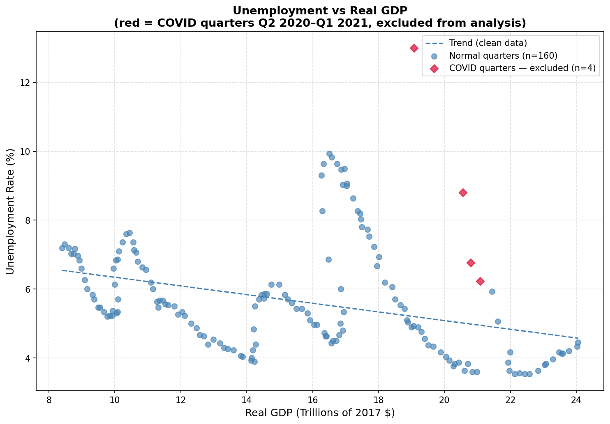
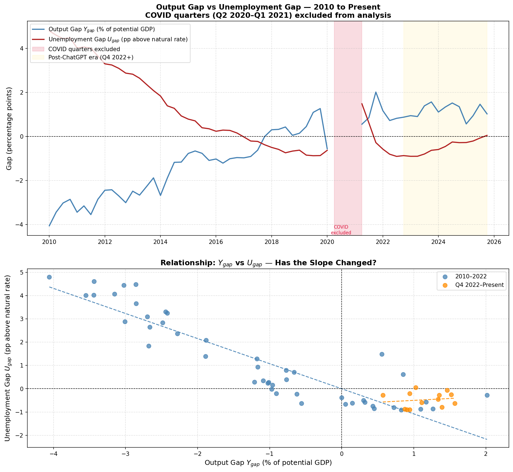
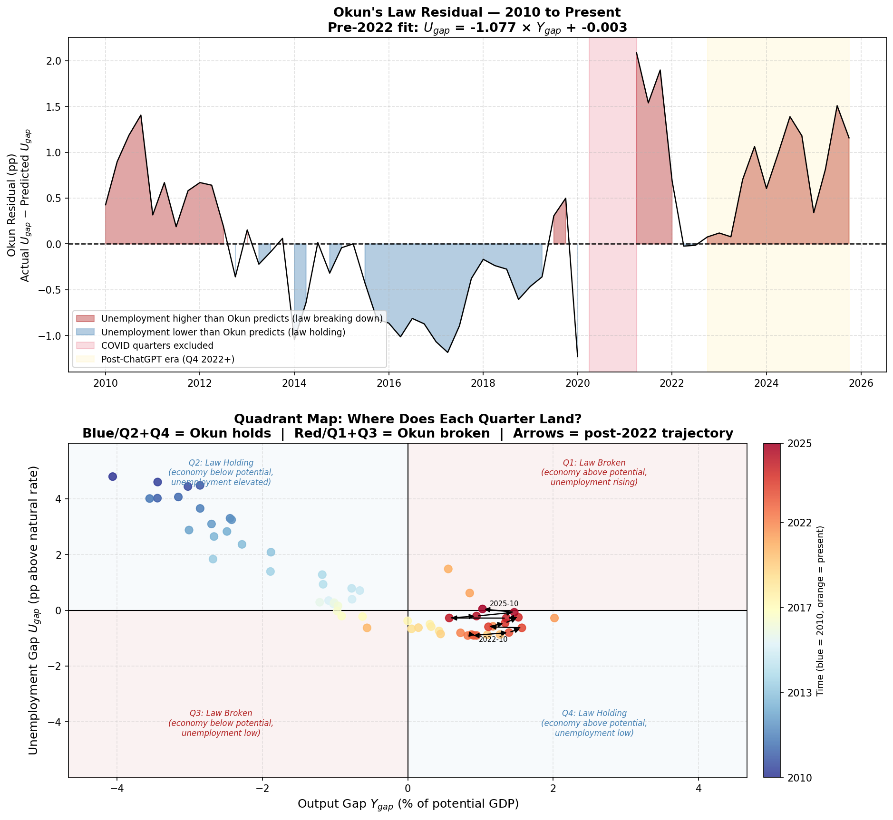
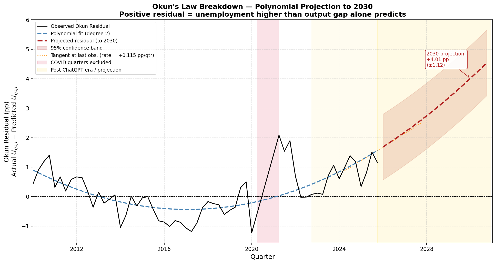
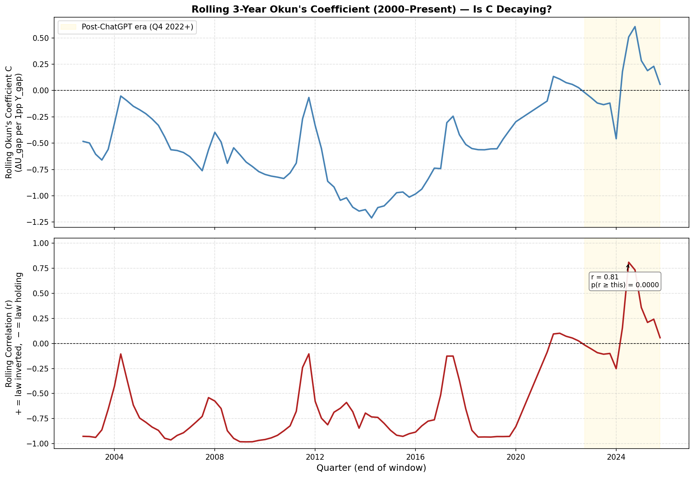
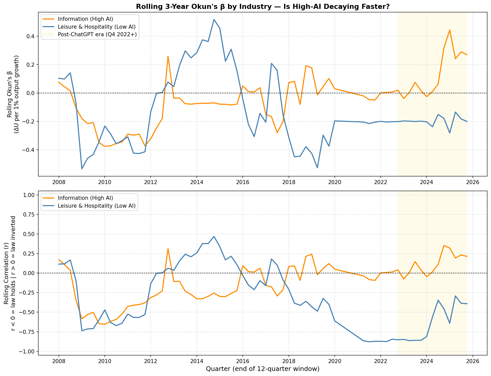
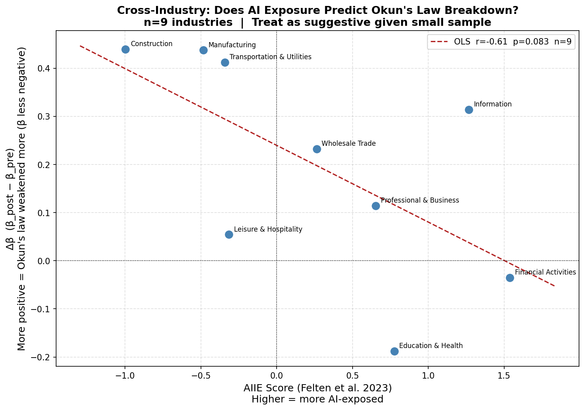
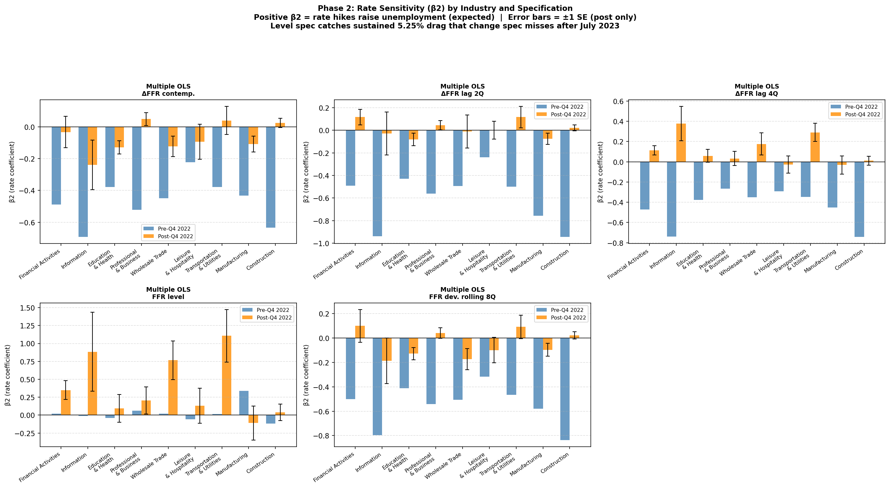

# Okun's Law in the AI Era

**Is the historical link between economic output and unemployment weakening because of AI?**

This project tests whether generative AI (using ChatGPT's release in Q4 2022 as a marker) has started to break Okun's Law, the 60-year-old relationship where GDP growth above potential reliably pulls unemployment down. If firms can now produce more output without proportionally hiring more workers, a core tool of macroeconomic policy is becoming less reliable.

**Status: the aggregate break is real and well-documented. The claim that AI specifically causes it is not yet established**, the one test built to isolate AI (ranking industries by AI exposure) came back pointing the other way. See [What This Does and Doesn't Show](#what-this-does-and-doesnt-show).

> 📄 **The full write-up is in [`docs/Okuns-Law-in-the-AI-Era-paper.pdf`](docs/Okuns-Law-in-the-AI-Era-paper.pdf).** It walks through every chart in narrative form with its limitations stated inline. This README is the companion to that paper: the same story, plus the code that produces each figure. The [chart-by-chart walkthrough](#the-charts-one-by-one) below mirrors the paper's structure.

---

## The core idea: what is Okun's Law?

Okun's Law, first observed by economist Arthur Okun in 1962, says that when an economy grows faster than its sustainable pace, unemployment tends to fall, and when growth slows, unemployment tends to rise. It's the connection between *how much the economy is producing* and *how many people have jobs*. Every 1 percentage point of GDP growth above trend has historically been associated with roughly a 0.5 point fall in unemployment.

It's intuitive: rising demand means firms need more labor to meet it, so they hire. This research asks whether that's stopped being true, whether AI now lets firms meet rising demand without proportionally hiring.

## Data sources

All data is from [FRED](https://fred.stlouisfed.org/) (Federal Reserve Economic Data). Two series measure output, two measure jobs, all resampled to quarterly frequency.

| Series | What it is | Source |
|---|---|---|
| `GDPC1` | Real GDP (2017 dollars) | BEA, quarterly |
| `GDPPOT` | Potential GDP, what GDP would be at max sustainable output | CBO estimate, quarterly |
| `UNRATE` | Civilian unemployment rate | BLS, monthly (resampled to quarterly mean) |
| `NROU` | Natural rate of unemployment | CBO estimate, quarterly |

Industry-level analysis adds BEA real value-added and BLS unemployment series per sector (see `industry_okun_pipeline.py`), the [Felten, Raj & Seamans (2023)](https://onlinelibrary.wiley.com/doi/10.1002/soej.12558) AI Industry Exposure (AIIE) score, the Census Bureau's Business Trends and Outlook Survey (BTOS) AI-adoption question, and `FEDFUNDS` for interest-rate controls.

## Methodology

**Converting to gaps.** Raw GDP can't be compared across decades, the economy is just bigger now. Both series are converted to deviations from normal:

```
Output gap:        Y_gap = (GDPC1 − GDPPOT) / GDPPOT × 100
Unemployment gap:   U_gap = UNRATE − NROU
```

A positive `Y_gap` means the economy is running above potential; a positive `U_gap` means unemployment is above its natural rate. Under Okun's Law, `U_gap` should move in the opposite direction of `Y_gap`.

**Industry-level analysis uses the difference form instead**, since NAIRU/potential-output estimates only exist at the aggregate level:

```
ΔU = β × %ΔY + ε
```

where `ΔU` is the change in the sector's unemployment rate and `%ΔY` is the growth of its real output. Classic Okun's Law implies β ≈ −0.3 to −0.5; β drifting toward zero (or flipping positive) means growth has stopped pulling unemployment down.

The differencing horizon matters because the BLS industry unemployment series are **not seasonally adjusted**. The early two-sector script (`IndustryAnalysis.py`) uses quarter-over-quarter differences, which leave some seasonal pattern in the data, a known weakness. The 9-industry pipeline and everything downstream of it (`industry_okun_pipeline.py`, `okun_phase2_3.py`, `info_overhang.py`) use **year-over-year (4-quarter) differences**, which cancel seasonality exactly by comparing each quarter to the same quarter a year earlier. YoY differencing is computed on the intact series *before* any rows are excluded (pandas differencing is positional, so excluding first would silently compare wrong years), and the exclusion window for these scripts extends through Q1 2022 to also drop the rebound quarters whose year-ago baseline falls inside COVID.

**Excluding COVID.** Q2 2020 – Q1 2021 is dropped from every regression and rolling statistic. GDP cratered and unemployment spiked because businesses were legally closed, not because of any organic output-employment relationship, including these quarters would corrupt every downstream regression. They're kept in the raw dataset and plotted as red diamonds for transparency, just excluded from fitting.

**Era split.** Q4 2022 (ChatGPT's public release) is used throughout as the pre/post-AI cutoff. This is a useful, visible marker but an admittedly imperfect one, enterprise AI adoption happened gradually, and it also happens to sit right on top of the start of the Fed's most aggressive hiking cycle in ~40 years, which is a real confound addressed in Phase 2 below.

## Repository guide

| Script | What it tests | Key outputs |
|---|---|---|
| [`GDPUnemployment.py`](GDPUnemployment.py) | Aggregate Okun's Law, 2000–present, rolling 12-quarter coefficient | `gdp_unemployment_analysis.png`, `gap_divergence.png`, `gap_divergence_abs.png`, `gap_okun_residual_quadrant.png`, `rolling_okuns_coefficient.png`, `okun_projection_2030.png` |
| [`IndustryAnalysis.py`](IndustryAnalysis.py) | Two-sector comparison: Information (high AI exposure) vs. Leisure & Hospitality (low) | `industry_scatter.png`, `industry_rolling_okun.png`, `industry_okun_residual.png`, `industry_unemployment_correlation.png`, `industry_output_vs_unemployment.png` |
| [`industry_okun_pipeline.py`](industry_okun_pipeline.py) | Full 9-industry BLS/BEA pipeline, Δβ ranked and regressed against AIIE score | `okun_industry_summary.csv/.txt`, `okun_industry_detail.xlsx`, `industry_aiie_scatter.png`, `industry_rolling_overlay.png`, per-industry charts (`okun_construction.png`, `okun_manufacturing.png`, etc.) |
| [`okun_phase2_3.py`](okun_phase2_3.py) | Adds a Federal Funds Rate control (6 specifications: no control, lagged 2/4 quarters, level, rolling deviation) to rule out the rate-hike confound | `phase2_results.csv`, `phase2_rate_sensitivity.png`, `phase3_cross_section.csv`, `phase3_cross_section.png` |
| [`btos_interaction.py`](btos_interaction.py) | Cross-checks the AIIE (theoretical exposure) ranking against BTOS (self-reported actual AI adoption) | `btos_beta1_table.csv`, `btos_sector_ranking.csv`, `btos_cross_section.png` |
| [`info_overhang.py`](info_overhang.py) | Tests whether Information sector's breakdown is just a correction from 2020–21 overhiring, not AI or rates | `info_overhang_sanity.png`, `info_overhang_regression.png` |
| [`generate_results_csv.py`](generate_results_csv.py) | Compiles every regression result across all scripts into one labeled CSV | `results_comprehensive.csv` |

Run any script directly with `python3 <script>.py`; each writes its charts and tables to the repo root. Requires `pandas`, `numpy`, `matplotlib`, `scipy`, and (for `industry_okun_pipeline.py`'s Excel export) `openpyxl`.

## The charts, one by one

The analysis builds from the simplest possible picture toward the sharpest statistical test, then stress-tests the result against every confound that could imitate an AI effect. Each chart below is read the way the [paper](docs/Okuns-Law-in-the-AI-Era-paper.pdf) reads it: what the picture shows, what your eye should catch, and where it can mislead you.

### Chart 1 — Unemployment vs. real GDP, the whole history at once



Every dot is one quarter of U.S. history. The x-axis is real GDP in trillions of 2017 dollars; the y-axis is the unemployment rate; reading left to right is reading forward in time. As the economy has grown over the decades, unemployment has tended to fall — the downward slope of the dashed trend line is Okun's Law in its simplest visual form, with recessions pushing dots up and to the left and recoveries pulling them down and to the right.

This chart is also the argument for excluding COVID. The red diamonds (Q2 2020 – Q1 2021) sit far above the trend, exactly where no normal economic relationship would put them, because they were produced by a legal shutdown rather than by the business cycle. **Its limitation is that it stacks the 1980s, 2000s, and 2020s on top of each other with no sense of time** — so it can show that the relationship exists, but not whether it is stable or changing. That is the gap the next charts fill.

### Chart 2 — The two gaps over time, and their scatter



Here the research question becomes directly visible. The top panel plots the output gap (blue) and the unemployment gap (red) on the same axis from 2010; the pink stripe marks the excluded COVID quarters and the gold stripe marks the post-ChatGPT era (Q4 2022 onward). If Okun's Law holds, the two lines should mirror each other across the zero line — when output runs above potential, unemployment should run below its natural rate.

From 2010 to 2019 they do exactly that: as real GDP recovered from the Great Recession (blue rising), the unemployment gap fell in step (red falling), and every point of output recovery converted into job creation just as Okun predicts. **Beginning in late 2022 something visually new appears** — the output gap stays clearly positive (roughly +1 to +1.5%), but the unemployment gap fails to move significantly negative. The two lines flatten and run nearly parallel instead of mirroring. The bottom scatter confirms it: the pre-2022 dots slope down cleanly, while the post-2022 dots sit at a positive output gap with a near-zero unemployment gap and essentially no slope. The limitation is that the orange cluster is only about a dozen quarters, so its flat slope is estimated from a small, noisy sample.

### Chart 3 — The Okun residual and quadrant map



This takes the historical relationship fit on pre-2022 data and asks, for every quarter, how far actual unemployment sits from what that relationship predicts. The top panel shades the residual: red whenever unemployment is running *higher* than the output gap alone would predict (the law breaking down), blue when it holds. The residual turns persistently red across the post-ChatGPT window — the single clearest picture of the aggregate break. The bottom panel plots each quarter in output-gap/unemployment-gap space, colored blue (2010) to orange (present), with arrows tracing the post-2022 trajectory; the recent quarters march into the "law broken" quadrant where output is above potential yet unemployment refuses to fall.

### Chart 4 — Projecting the residual forward



A degree-2 polynomial is fit to the residual over time, and its first derivative — the rate at which output and employment are decoupling — is projected to 2030 with a 95% confidence band. **This is the most speculative chart in the project and should be read as illustration, not forecast:** a quadratic extrapolated off ~13 post-break quarters will happily draw a dramatic curve from very little signal. It is included to make the *direction and acceleration* of the recent residual legible, not to predict a number.

### Chart 5 — The rolling Okun coefficient (the main finding)



This is the most statistically rigorous chart in the analysis. Instead of one regression across all history, a sliding 12-quarter (3-year) window re-estimates the Okun coefficient `C` at every quarter, so its stability over time becomes visible. The top panel is `C` itself: negative means the law holds (output up, unemployment down), near zero means it has weakened, positive means it has inverted. The bottom panel is the rolling correlation between the two gaps.

From 2000 to 2019, `C` hovers steadily in negative territory and the correlation sits near −1.0 — Okun's Law doing exactly what it is supposed to for nearly two decades straight. **After Q4 2022 (gold shading) `C` swings erratically, briefly spiking above +0.5 before collapsing back toward zero, and the rolling correlation inverts all the way to +0.81.** Tested against the historical distribution of pre-2022 correlations, the probability of a value that positive arising by chance is effectively zero (`p ≈ 0.0000`). Three things matter here: the sign of the relationship has flipped in recent windows, its magnitude has become unstable, and the inversion sits far enough into the tail of history that conventional statistics reject the null.

Two honest caveats travel with this chart. A 12-quarter window is only three years of data, so short windows are inherently noisy; and the pre-2022 windows overlap each other, which violates the independence assumption behind that p-value — the true probability is somewhat larger than 0.0000, though in all likelihood still tiny. This documents a break; it does not by itself prove a cause.

### Chart 6 — Two industries, high AI vs. low AI



If AI is really the mechanism, the breakdown should show up most strongly in industries most exposed to it and weakly or not at all in industries that are hard to automate. The first cut compares Information (software, cloud, media — high exposure) against Leisure & Hospitality (restaurants, hotels, entertainment — low exposure), using the difference form of Okun's Law since sector-level potential output and natural rates don't exist. Post-2022, Information's rolling coefficient turns extremely variable and drifts toward a slightly positive slope, while Leisure & Hospitality stays predictably negative throughout — directionally the AI story. But two industries are a small comparison set, and industry-level data is far more volatile than aggregate GDP, so this motivates the real test rather than settling it. One additional caveat specific to this script: it differences quarter-over-quarter on unemployment series that are not seasonally adjusted, so some seasonal noise remains in these estimates — the 9-industry pipeline below switches to year-over-year differences, which cancel seasonality exactly.

### Chart 7 — Nine industries against their AI-exposure score



This is the test built to answer what two industries couldn't: if Information's coefficient flipping positive after 2022 was really about AI rather than coincidence, then industries with more theoretical exposure should show bigger flips and less-exposed industries should show smaller ones. Felten, Raj & Seamans' AI Industry Exposure (AIIE) score gives a ready-made way to rank nine BLS super-sectors on exactly that dimension, so each industry's change in its Okun coefficient (Δβ) is plotted against its exposure.

| Industry | AIIE score | β pre-2022 | β post-2022 | Δβ |
|---|---:|---:|---:|---:|
| Construction | −0.997 | −0.393 | +0.046 | **+0.439** (most weakened) |
| Manufacturing | −0.484 | −0.327 | +0.110 | **+0.437** |
| Transportation & Utilities | −0.342 | −0.255 | +0.157 | **+0.412** |
| Information | 1.268 | −0.134 | +0.180 | +0.314 |
| Wholesale Trade | 0.264 | −0.167 | +0.066 | +0.232 |
| Professional & Business | 0.654 | −0.341 | −0.227 | +0.114 |
| Leisure & Hospitality | −0.315 | −0.356 | −0.302 | +0.054 |
| Financial Activities | 1.538 | −0.022 | −0.057 | −0.035 (strengthened) |
| Education & Health | 0.775 | −0.034 | −0.222 | −0.188 (strengthened) |

*(β = Okun's difference-form coefficient — more negative means the law holds more strongly. Δβ = β_post − β_pre; positive means the law weakened.)*

Before the comparison could be trusted, a labeling error in the scatter had to be caught: the axis description originally claimed a *more negative* change meant the law had weakened more, but Construction's own numbers show the opposite — it moved from a strongly negative −0.386 before 2022 to a barely positive +0.046 after, which is unambiguously a weakening and a *positive* change. **Once the sign convention was corrected, the regression turned out to mean something uncomfortable: a real correlation of roughly −0.61 (p ≈ 0.08 across the nine industries), which says higher AI exposure predicts the Okun relationship getting *stronger*, not weaker.** That is the reverse of the hypothesis, and it is a strong enough result to take seriously rather than wave away.

Reading the nine individually, only Information and Wholesale Trade behaved the way the AI story predicts. The three genuinely high-exposure sectors — Financial Activities, Professional & Business, Education & Health — held steady or strengthened, while the largest breakdowns landed on low-exposure, physical, interest-rate-sensitive sectors: Construction, Manufacturing, Transportation & Utilities. That is backwards from what a dose-response relationship should look like if AI exposure were the active ingredient. Three cases add texture:

- **Construction's** correlation flipped from a tight −0.73 to an equally tight +0.78, but its actual coefficient barely moved off zero in either direction — the relationship became very *reliable* post-2022 without becoming economically *large*, a distinction the correlation number alone hides. Its pre-2022 fit is also visibly anchored by a handful of extreme points from the 2008–2012 housing crash, which raises a real question about how much of that baseline is one historical crisis rather than a stable long-run pattern.
- **Education & Health** shows a weak relationship in both periods (|r| never above about 0.2) — unsurprising for a sector driven by demographics and funding cycles rather than the business cycle, and one whose employment and output series cover mismatched populations.
- **Financial Activities** is the most interesting case: its real output has nearly doubled relative to 2019 while its unemployment rate has stayed low and flat since roughly 2013 — a genuine, dramatic output/jobs divergence, but one building gradually over a decade rather than appearing suddenly at the cutoff, which is exactly why a test built to detect a sharp break around a single date finds nothing unusual there.

### Chart 8 — Ruling out the interest-rate confound (`phase2_rate_sensitivity.png`, `okun_phase2_3.py`)



The biggest threat to a clean AI interpretation is timing. The Federal Reserve's most aggressive rate-hiking cycle in roughly forty years began at almost the same moment as the AI cutoff, and the sectors that broke down most — Construction, Manufacturing, Transportation & Utilities — are also the most interest-rate-sensitive in the economy. A test that can't tell those two events apart will attribute rate-driven disruption to AI by default, simply because they happened together.

So `FEDFUNDS` is added as a control across six specifications (no control, contemporaneous change, lagged 2 and 4 quarters, level, and deviation from an 8-quarter rolling mean). **The low-AI-sector breakdown does not disappear:** after controlling for the contemporaneous rate, Δβ stays at +0.38 for Construction, +0.31 for Manufacturing, and +0.35 for Transportation, holding across most specifications. The rate confound doesn't explain the sector pattern away — but it doesn't rescue the AI hypothesis either, because the breakdown is still concentrated in the low-exposure sectors no matter how the rate is controlled.

### Chart 9 — Does reported AI adoption match theoretical exposure? (`btos_cross_section.png`, `btos_interaction.py`)

AIIE measures theoretical *exposure*; it is not the same as firms actually *using* AI. The Census Bureau's Business Trends and Outlook Survey asks firms directly about AI adoption; sector-level responses to that question are only available from November 2025 onward in the file used here, giving a short (~3-quarter) but real adoption measure to check the exposure ranking against. Financial Activities and Information top both lists, and the rest reorder only modestly — too short a series to run its own time-series regression, but the rank agreement is a modest validation that the Felten et al. exposure score is a reasonable, if imperfect, proxy for where AI is actually landing.

### Chart 10 — Was the Information break just an overhiring correction? (`info_overhang_regression.png`, `info_overhang.py`)

One alternative specific to Information: tech firms over-hired 15–20% above trend in 2020–2021, so the post-2022 "breakdown" might just be that hiring correcting itself through layoffs rather than anything about AI or rates. This adds an employment-overhang control to the Information regression to test whether it absorbs the sector's positive post-2022 coefficient — if the coefficient snaps back toward negative once overhang is accounted for, the overhiring story explains the break; if it stays positive, the structural explanation survives.

## What this does and doesn't show

**Established:** Okun's Law has weakened in the aggregate U.S. economy since Q4 2022. The output gap has stayed positive while the unemployment gap hasn't responded the way two decades of prior data would predict, and the statistical signature (correlation inversion, p ≈ 0.0000) is not something the historical distribution produces by chance.

**Not established:** that AI specifically is the cause. The one test built to isolate an AI effect — ranking industries by AI exposure and checking whether exposure predicts more weakening — came back pointing the *other* way, and that result survives a rate-hike control. This doesn't mean AI isn't part of the story; the AIIE score measures occupational exposure to AI capability, not measured displacement, and true labor substitution may lag exposure by longer than 12–13 quarters of post-ChatGPT data can currently show. It does mean the current evidence can't distinguish "AI is breaking Okun's Law" from "post-pandemic fiscal policy (IIJA, CHIPS Act, IRA) inflated physical-sector output without proportional hiring" or "monetary policy is doing more of this than AI is."

## Limitations

- Post-ChatGPT sample is short (~10–13 clean quarters); rolling-window statistics from that few points are noisy, and overlapping windows violate the independence assumption behind the reported p-values (making them somewhat optimistic, though likely still small).
- Rolling windows slide over the COVID-excluded dataset, so windows ending in 2022–2024 stitch together quarters from before Q2 2020 and after the exclusion — they span more than 3 calendar years, and the earliest "post-ChatGPT" windows still contain pre-COVID quarters.
- The two-sector script (`IndustryAnalysis.py`) differences quarter-over-quarter on non-seasonally-adjusted unemployment series, leaving seasonal noise in its estimates; the 9-industry pipeline's YoY differencing supersedes it for anything quantitative.
- The Q4 2022 cutoff is a convenient, visible marker (ChatGPT's launch date), not a measured adoption date — actual enterprise AI adoption was gradual and is itself confounded with the 2022–2023 rate-hiking cycle.
- Industry-level data is more volatile than aggregate GDP/unemployment, and a 9-industry cross-section is a small sample for a regression-based test.
- This project documents a correlation-level break and tests one candidate explanation (AI exposure) against two obvious confounds (interest rates, overhiring correction). It does not establish causality.

## Reproducing this

1. Download the FRED series listed above (plus the industry-level and `FEDFUNDS` series referenced in each script's header) as CSVs into `FRED-Data/` at the repo root (the directory is gitignored; every script reads from it).
2. `pip install pandas numpy matplotlib scipy openpyxl`
3. Run scripts in this order for the full pipeline: `GDPUnemployment.py` → `IndustryAnalysis.py` → `industry_okun_pipeline.py` → `okun_phase2_3.py` → `btos_interaction.py` → `info_overhang.py` → `generate_results_csv.py`.
