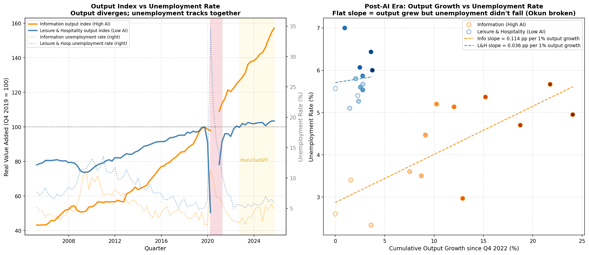
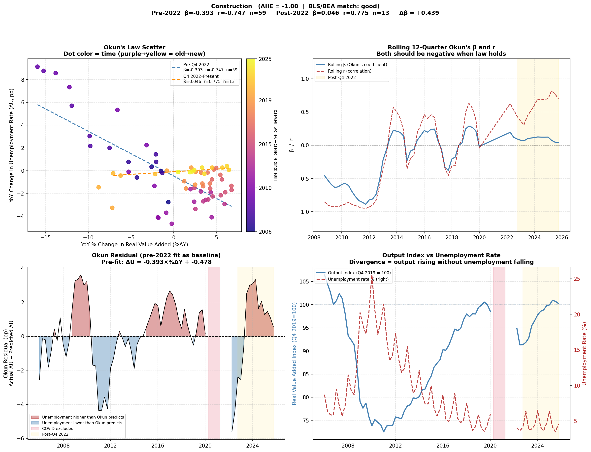
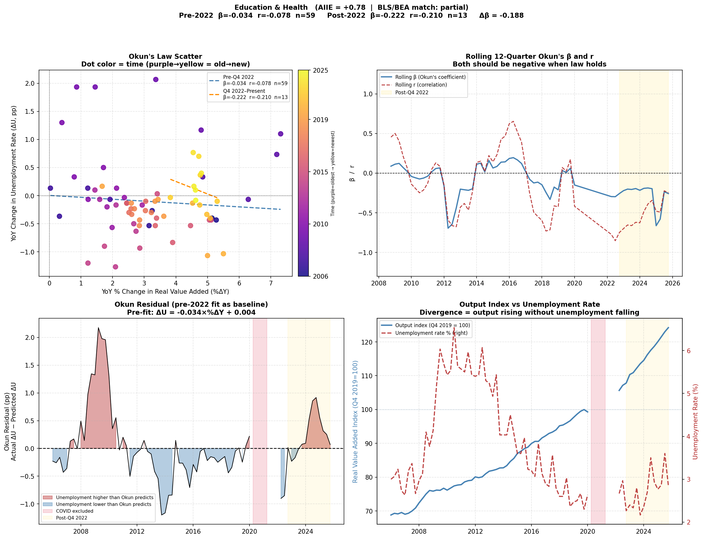
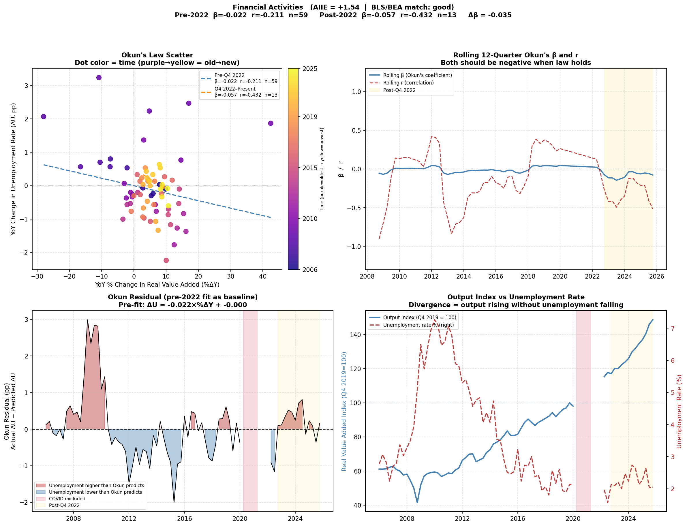
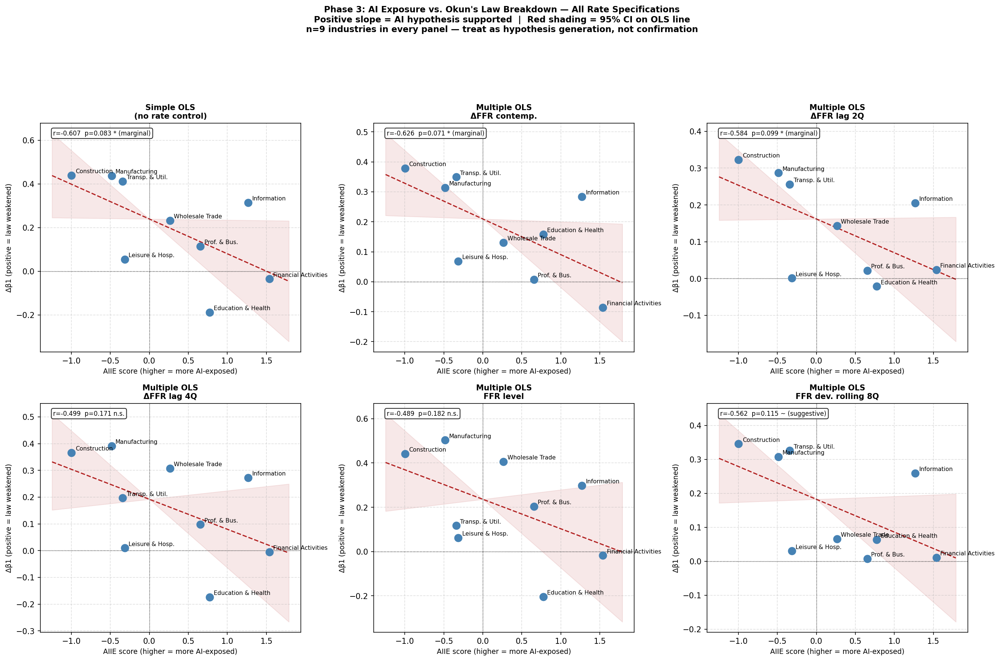
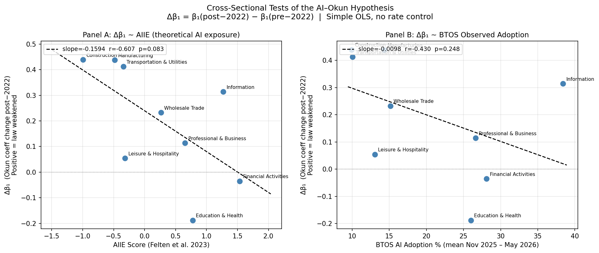
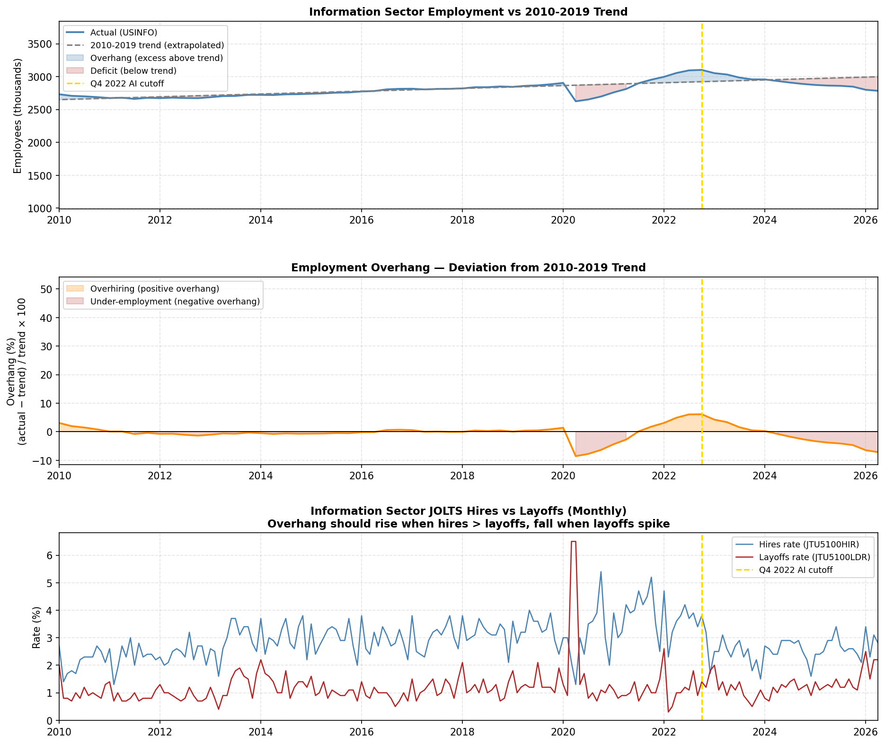
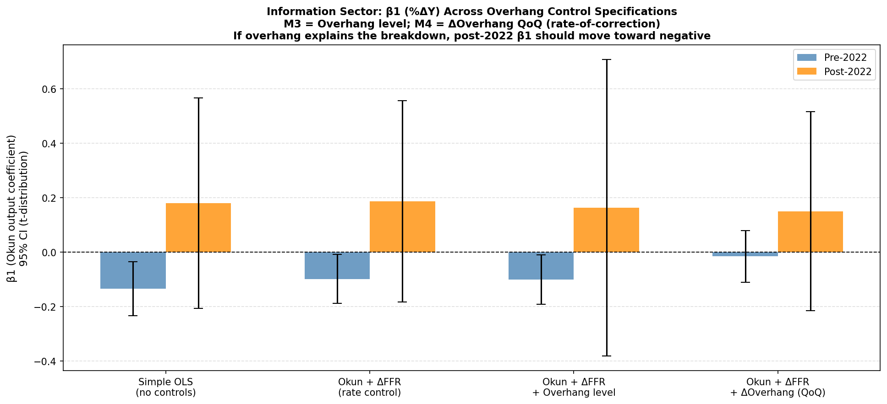
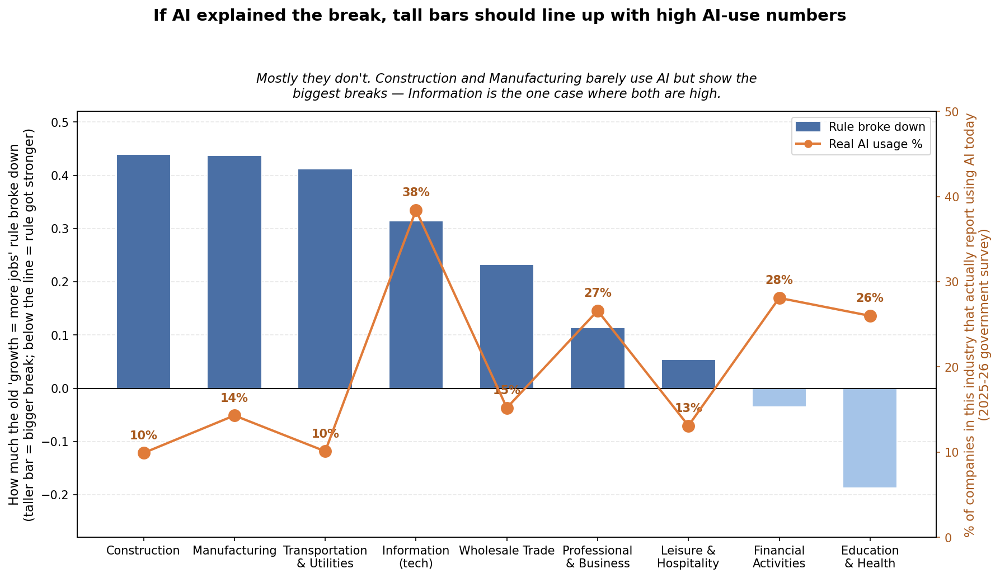

# Okun's Law in the AI Era

**Is the historical link between economic output and unemployment weakening because of AI, and if so, where?**

For 60 years there has been a reliable rule in economics: when the economy grows faster than usual, more people get hired and unemployment falls. Every 1 extra point of growth has historically pulled unemployment down by about half a point. If AI now lets companies produce more without hiring proportionally more workers, that rule should start to fail. Every policymaker who leans on it, including the Federal Reserve, the CBO, and the White House, would have to rebuild their playbook.

## The bottom line

A real, statistically extreme break in the growth-to-jobs relationship shows up after Q4 2022 in the aggregate U.S. economy. But once the pattern is broken down industry by industry, "AI broke everything" does not hold. The test built specifically to check it runs the wrong direction across nine industries.

What survives closer inspection is a two or three mechanism story. Tech shows a break that survived every alternative explanation tried against it, which leaves AI as the standing candidate. Meanwhile the biggest breakdowns actually landed in construction and manufacturing, which also survived interest-rate controls and most likely reflect the 2021-2022 fiscal spending wave (IIJA, CHIPS Act, IRA) inflating physical-sector output without proportional hiring.

| | |
|---|---|
| **Data window** | 2000 Q1 to 2026 Q1 |
| **Pre-AI sample** | 59 clean quarters |
| **Post-AI sample** | 13 clean quarters |
| **Excluded (COVID)** | Q2 2020 to Q1 2021 |
| **Cutoff** | Q4 2022 (ChatGPT launch) |

> 📄 **The formal write-up is in [`docs/Okuns-Law-in-the-AI-Era-paper.pdf`](docs/Okuns-Law-in-the-AI-Era-paper.pdf).** This README is the companion: the same story in more depth, plus the code that produces every figure and the reasoning that connects each phase to the next.

---

## How to read this

Findings in this project are not all equally solid, so each phase carries a verdict label saying what it actually stands on:

| Label | What it means |
|---|---|
| **Established** | Held up to every test tried against it. Report it as the finding. |
| **Contradicts** | The evidence points the opposite way from what was expected. Reported honestly rather than buried. |
| **Uncertain** | Suggestive but underpowered. Do not build load-bearing claims on it. |
| **Mixed / Open** | Reshapes the question rather than answering it. |

Two conventions used throughout the tables:

- **Positive Δβ** means Okun's Law weakened in that industry. This is the direction that would support the AI story.
- **Negative Δβ** means the law actually got stronger.

Technical detail is tucked into expandable sections like this one, so the main text stays readable without them:

<details>
<summary><b>Example: the same question stated precisely</b></summary>

Test whether Okun's Law, the empirical negative relationship between the output gap `Y_gap = (GDP − GDP_pot)/GDP_pot` and the unemployment gap `U_gap = U − NROU`, has structurally weakened since Q4 2022, and whether that weakening is attributable to AI exposure as opposed to rival mechanisms such as monetary tightening, post-COVID labor stock corrections, and fiscal spending.

</details>

## The chart map

Six main charts do most of the work. Each answers a different question, and each exists because the previous chart's result raised the next question. Reading this table first makes the whole logic visible at a glance.

| Phase | What it shows | Chart | What it raises next |
|---|---|---|---|
| **P1** | The output-employment relationship, stable for 20 years, becomes unstable and inverts after Q4 2022. Establishes that something happened. | `rolling_okuns_coefficient.png` | Which industries drove this? |
| **P2** | Tech (high AI exposure) breaks the way P1 shows; hospitality (low exposure) stays fine. Suggestive of AI. | `industry_rolling_okun.png` | Does this scale to all 9 industries? |
| **P3** | Nine data points, one line. The line slopes the opposite way from what the AI story predicts. Physical, non-AI sectors broke the most. | `industry_aiie_scatter.png` | Was it the Fed's rate hikes, not AI? |
| **P4** | The same test run six ways of controlling for rates. Some breaks survive every control; others fall apart. | `phase2_rate_sensitivity.png` | Maybe the AI-exposure measure itself is broken? |
| **P5** | Real 2025-26 AI adoption vs. the 2021 theoretical score. They line up almost perfectly. | `btos_cross_section.png` | For tech, is the break just the pandemic hiring bubble correcting? |
| **P6** | Tech's break tested against a pandemic-overhiring correction. Overhiring is real but does not explain the break. | `info_overhang_regression.png` | Feeds the final verdict. |

## Data sources

All data is from [FRED](https://fred.stlouisfed.org/) (Federal Reserve Economic Data). Two series measure output, two measure jobs, all resampled to quarterly frequency.

| Series | What it is | Source |
|---|---|---|
| `GDPC1` | Real GDP (2017 dollars) | BEA, quarterly |
| `GDPPOT` | Potential GDP: what GDP would be at maximum sustainable output | CBO estimate, quarterly |
| `UNRATE` | Civilian unemployment rate | BLS, monthly (resampled to quarterly mean) |
| `NROU` | Natural rate of unemployment | CBO estimate, quarterly |

Industry-level analysis adds BEA real value-added and BLS unemployment series per sector, the [Felten, Raj & Seamans (2023)](https://onlinelibrary.wiley.com/doi/10.1002/soej.12558) AI Industry Exposure (AIIE) score, the Census Bureau's Business Trends and Outlook Survey (BTOS) AI-adoption question, and `FEDFUNDS` for interest-rate controls.

## Methodology

**Converting to gaps.** Raw GDP can't be compared across decades, because the economy is simply bigger now than it was in 1990. A $1 billion deviation today means something completely different than it did in the 1990s. So both output and unemployment are converted into deviations from normal:

```
Output gap:        Y_gap = (GDPC1 − GDPPOT) / GDPPOT × 100
Unemployment gap:   U_gap = UNRATE − NROU
```

A positive `Y_gap` means the economy is running above potential; a positive `U_gap` means unemployment is above its natural rate. Under Okun's Law, `U_gap` should move in the opposite direction of `Y_gap`.

**Industry-level analysis uses a simpler form.** Individual industries don't have their own published "potential output" or "natural unemployment rate," so the gap form can't be applied to them. The difference form uses changes instead:

```
ΔU = β × %ΔY + ε
```

This just asks: when an industry's output moved, how much did its unemployment move? Classic Okun's Law implies β ≈ −0.3 to −0.5. A β drifting toward zero, or flipping positive, means growth has stopped pulling unemployment down.

<details>
<summary><b>Why the differencing horizon matters</b></summary>

The BLS industry unemployment series are **not seasonally adjusted**. The early two-sector script (`IndustryAnalysis.py`) uses quarter-over-quarter differences, which leave some seasonal pattern in the data. That is a known weakness. The 9-industry pipeline and everything downstream of it use **year-over-year (4-quarter) differences**, which cancel seasonality exactly by comparing each quarter to the same quarter a year earlier.

YoY differencing is computed on the intact series *before* any rows are excluded, since pandas differencing is positional and excluding first would silently compare wrong years. The exclusion window for these scripts extends through Q1 2022 to also drop the rebound quarters whose year-ago baseline falls inside COVID.

</details>

**Excluding COVID.** Q2 2020 through Q1 2021 is dropped from every regression and rolling statistic. GDP cratered and unemployment spiked because businesses were legally closed and people were legally prohibited from working, not because of any organic output-employment relationship. Including these quarters would corrupt every downstream regression by making the model look for economic structure in what was really a policy shock. They're kept in the raw dataset and plotted as red diamonds for transparency, just excluded from fitting.

**Era split.** Q4 2022 (ChatGPT's public release) is used throughout as the pre/post-AI cutoff. This is a useful, visible marker but an admittedly imperfect one: enterprise AI adoption happened gradually, and the cutoff also sits right on top of the start of the Fed's most aggressive hiking cycle in roughly 40 years, which is a real confound addressed in Phase 4.

## Repository guide

| Script | What it tests | Key outputs |
|---|---|---|
| [`GDPUnemployment.py`](GDPUnemployment.py) | Phase 1: aggregate Okun's Law, rolling 12-quarter coefficient | `gdp_unemployment_analysis.png`, `gap_divergence.png`, `gap_divergence_abs.png`, `gap_okun_residual_quadrant.png`, `rolling_okuns_coefficient.png` |
| [`IndustryAnalysis.py`](IndustryAnalysis.py) | Phase 2: two-sector comparison, tech vs. hospitality | `industry_scatter.png`, `industry_rolling_okun.png`, `industry_okun_residual.png`, `industry_unemployment_correlation.png`, `industry_output_vs_unemployment.png` |
| [`industry_okun_pipeline.py`](industry_okun_pipeline.py) | Phase 3: full 9-industry pipeline, Δβ regressed against AIIE | `okun_industry_summary.csv/.txt`, `okun_industry_detail.xlsx`, `industry_aiie_scatter.png`, per-industry charts |
| [`okun_phase2_3.py`](okun_phase2_3.py) | Phase 4: six Federal Funds Rate control specifications | `phase2_results.csv`, `phase2_rate_sensitivity.png`, `phase3_cross_section.csv`, `phase3_cross_section.png` |
| [`btos_interaction.py`](btos_interaction.py) | Phase 5: validates AIIE against real reported AI adoption | `btos_beta1_table.csv`, `btos_sector_ranking.csv`, `btos_cross_section.png` |
| [`info_overhang.py`](info_overhang.py) | Phase 6: tests the pandemic-overhiring alternative for tech | `info_overhang_sanity.png`, `info_overhang_regression.png` |
| [`generate_results_csv.py`](generate_results_csv.py) | Compiles every regression result into one labeled CSV | `results_comprehensive.csv` |

Run any script directly with `python3 <script>.py`; each writes its charts and tables to the repo root. Requires `pandas`, `numpy`, `matplotlib`, `scipy`, and (for the Excel export) `openpyxl`.

---

# The six phases

The project ran in six phases. Each one either confirmed or complicated what the previous phase seemed to show.

## Phase 1: Did Okun's Law actually break?

> **Verdict: ESTABLISHED**

**The question.** Has the historical relationship between growth and unemployment measurably weakened since generative AI arrived?

**The method, in plain terms.** Take four government-published series: real GDP, CBO's estimate of the economy's sustainable output, the unemployment rate, and CBO's estimate of the "natural" unemployment rate. Convert both output and unemployment into gaps, meaning how far each sits above or below its normal level. Then, instead of running one big test across all 25+ years of data, re-run the test on a sliding 3-year window that moves quarter by quarter across the whole timeline. This makes it possible to see whether the growth-to-jobs relationship has been stable over time or whether it has changed.

**What the numbers mean.** The relationship's slope (called `C`) answers: when the economy grows above normal, how much does unemployment change? Negative means the rule works, so growth up means unemployment down. Near zero means the rule has weakened. Positive means it has inverted, meaning growth up but unemployment also up, which normally does not happen. The correlation `r` is a −1 to +1 measure of how tightly the two move together.


**Key finding.** From 2000 to 2019, `C` stays firmly negative and the rolling correlation sits near −1.0, the rule working almost mechanically for two decades straight. After Q4 2022, `C` swings wildly, briefly spiking above +0.5 before collapsing back toward zero. The correlation inverts all the way to **+0.81**. Tested against the historical distribution of pre-2022 correlations, the probability of a value that positive appearing by chance is effectively zero (`p ≈ 0.0000`).

**What this shows:** something changed in the U.S. economy right around when generative AI arrived. The pattern of correlation flip, coefficient instability, and effectively-zero historical probability is not what the pre-2022 data would produce on its own.

**What it doesn't show:** why it changed. A correlation flipping does not identify a cause. AI, interest rates, fiscal spending, and post-pandemic labor effects all hit at similar timing. Every downstream phase tries to distinguish these.

> **Bridge, P1 → P2.** P1 shows the whole U.S. economy broke, but the whole economy is nine industries mixed together. If any single one of them told a different story, the aggregate picture might be misleading. So the next question was: which industries actually drove this? The obvious starting point is to compare the industry most exposed to AI against the one least exposed.

## Phase 2: Does the break show up more in AI-heavy industries?

> **Verdict: SUGGESTIVE BUT UNDERPOWERED**

**The question.** If AI is really the cause, the sector with the most exposure should break the rule and the sector with almost none shouldn't.

**The method, in plain terms.** Swap in the difference form of Okun's Law described above, since individual industries have no "potential output." Pick two industries at opposite extremes of AI exposure: Information (tech, software, cloud, media) against Leisure & Hospitality (restaurants, hotels, entertainment). Apply the same rolling-window approach as Phase 1 to each industry separately.


**Key finding.** After 2022, tech's rolling relationship turns very unstable and drifts toward a slightly positive slope, while hospitality's stays predictably negative throughout. Directionally, this is the AI story: high-exposure sector breaks, low-exposure sector doesn't.

The clearest picture of what that actually looks like is the output-versus-unemployment chart below. The left panel indexes each sector's real output to 100 at Q4 2019 (so growth is comparable regardless of dollar size) with each sector's unemployment rate overlaid. The right panel plots cumulative output growth against the unemployment rate for every quarter since Q4 2022.



Tech's output more than doubled relative to its pre-pandemic base while its unemployment rate barely moved, which is the dose of "output up, jobs flat" the whole project is chasing. Hospitality's output grew far less, and its dots in the right panel still trace the expected downward slope. Read plainly: tech produced dramatically more without hiring proportionally more; hospitality didn't produce much more, so there was nothing for its labor market to decouple from.

**Why this can't stand alone.** A general claim about AI can't rest on two data points. Either industry might have broken, or held, for reasons completely unrelated to AI. This chart showed the aggregate break from P1 split into two components that both looked consistent with the AI story, and that apparent confirmation is exactly why P3 was necessary.

> **Bridge, P2 → P3.** Two industries looked like the AI story predicts. But that is the equivalent of flipping a coin twice, getting heads twice, and calling the coin biased. The next step is the actual test: run the same setup on all nine major industries and see whether industries with more AI exposure show bigger breaks in a proper statistical sense.

## Phase 3: The nine-industry dose-response test

> **Verdict: CONTRADICTS THE SIMPLE AI STORY**

**The question.** Across every major U.S. industry, does an industry's AI exposure actually predict how much its version of Okun's rule broke?

**The method, in plain terms.** Run the same growth-versus-unemployment test on each of the nine major U.S. industries, once for the 59 quarters before Q4 2022 and once for the 13 quarters after. The change in each industry's Okun slope (called Δβ) captures how much its rule weakened. Then plot each industry's Δβ against its AI exposure score and fit a single line through the nine dots. If AI is the mechanism, the line should slope up: more exposure, more breakdown.

<details>
<summary><b>What AIIE is, precisely</b></summary>

The AI Industry Exposure Index (Felten, Raj & Seamans 2023) rates each industry by how well its workforce's core tasks map to documented AI capabilities. It was built before ChatGPT, so it measures theoretical exposure to a broad set of AI applications such as image recognition, translation, and strategic reasoning, rather than LLM adoption specifically. It is validated against real 2025-26 adoption in Phase 5.

</details>

**The nine industries, ranked by AI exposure:**

| Industry | AIIE | Slope pre | Slope post | Δβ (change) | Reading |
|---|---:|---:|---:|---:|---|
| Financial Activities | 1.538 | −0.022 | −0.057 | −0.035 | Held / strengthened |
| **Information (tech)** | 1.268 | −0.134 | +0.180 | **+0.314** | Inverted |
| Education & Health | 0.775 | −0.034 | −0.222 | −0.188 | Strengthened |
| Professional & Business | 0.654 | −0.341 | −0.227 | +0.114 | Modestly weakened |
| Wholesale Trade | 0.264 | −0.167 | +0.066 | +0.232 | Inverted |
| Leisure & Hospitality | −0.315 | −0.356 | −0.302 | +0.054 | Barely moved |
| Transportation & Utilities | −0.342 | −0.255 | +0.157 | +0.412 | Large inversion |
| **Manufacturing** | −0.484 | −0.327 | +0.110 | **+0.437** | Large inversion |
| **Construction** | −0.997 | −0.393 | +0.046 | **+0.439** | Large inversion |


**Key finding.** Only tech and Wholesale Trade behaved the way the AI story predicts. The three sectors with genuinely high exposure, Finance, Professional & Business, and Education & Health, held steady or got stronger. The three biggest breakdowns landed on low-exposure, physical, interest-rate-sensitive sectors: construction, manufacturing, and transportation. Run as a formal test: **r = −0.607, p = 0.083.** The correlation runs the opposite direction from the AI hypothesis. This is the single result that reshaped the whole project.

The three physical sectors that broke hardest get their own separate, COVID-inclusive analysis in [`physical-sector-inversion/`](physical-sector-inversion/README.md), which dates each inversion to 2024-2025 and sets up the fiscal-versus-rates question.

**Three cases worth understanding:**

- **Construction's** correlation flipped from −0.73 to +0.78, a tight and reliable inversion, but its actual slope barely moved off zero (+0.046). The relationship became very predictable without becoming economically large. Its pre-2022 fit is also anchored by extreme housing-crash data points, which raises real questions about how much of the baseline reflects one crisis rather than a stable relationship.

  <details>
  <summary>Construction's full four-panel breakdown</summary>

  

  The bottom-right panel is the clearest version of the story: real output (blue) has climbed well past its pre-pandemic level since 2022, while the unemployment rate (red, right axis) has stayed low and flat rather than falling further, which is what growth this strong would historically have done.

  </details>

- **Education & Health** shows a weak relationship in both periods, which is unsurprising since it is driven by demographics and public funding rather than the business cycle. Its data has an additional known problem: the employment series covers Education plus Health combined, while the output series covers only Health.

  <details>
  <summary>Education & Health's full four-panel breakdown</summary>

  

  The scatter (top-left) is a formless cloud rather than a clean line in either period, and the rolling β and r (top-right) drift close to zero for most of the sample. This is a sector where Okun's Law was never a strong fit to begin with, AI era or not.

  </details>

- **Finance** is the most interesting case. Real output has nearly doubled since 2019 while employment has been flat and low since roughly 2013, a genuine and dramatic output/jobs divergence, but one building gradually over a decade rather than appearing at the cutoff. A test built to detect a sharp break at a single date can't see gradual multi-decade decoupling. Finance may have absorbed most of its AI-driven labor adjustment during the algorithmic-trading and automated-underwriting era, decades before Q4 2022. Finance turned out to expose a blind spot in the whole method: measured on unemployment it looks like "the law held," but measured on employment it is the largest output-to-jobs decoupling in the project. That re-measurement, plus whether the rate of productivity growth is accelerating, gets its own separate analysis in [`finance/`](finance/README.md).

  <details>
  <summary>Financial Activities' full four-panel breakdown</summary>

  

  The bottom-right panel shows exactly this: output (blue) has been climbing steadily since 2007 with barely a dent from COVID, while unemployment (red) fell hard after the 2008 crisis and has stayed low and flat ever since. The divergence is real, but it is a decade-long trend, not a Q4 2022 event, which is why the sharp-break test built for this project doesn't flag it.

  </details>


> **Bridge, P3 → P4.** P3's surprising scatter needs a serious alternative explanation before it can be trusted, and there is one sitting exactly on the cutoff date. The Fed's most aggressive rate-hiking cycle in 40 years began at almost the same moment as ChatGPT, and the sectors that broke most (construction, manufacturing, transportation) are exactly the sectors most sensitive to interest rates. A test that can't tell rates apart from AI will silently blame the wrong thing.

## Phase 4: Ruling interest rates in or out

> **Verdict: REDEFINES THE QUESTION**

**The question.** Does the industry-level breakdown survive controlling for the Fed's 2022-23 tightening cycle, which started at almost exactly the same time as AI?

**The method, in plain terms.** Add the Federal Funds Rate to each industry's test as a separate variable, so the growth-versus-unemployment relationship is measured net of the direct effect of rates. But there is no single right way to measure "the effect of interest rates." Rates hurt some sectors on impact, others with a delay, and some sectors react to the *level* of rates rather than the change. So the test is run six different ways, and the key question becomes: which industries' breakdowns survive every way of measuring rates, and which fall apart depending on the choice?

| Rate spec | What it captures |
|---|---|
| `simple` | Baseline, no rate control |
| `rc_lag0` | Contemporaneous change in rates |
| `rc_lag2` | Rate change 2 quarters ago (policy takes time) |
| `rc_lag4` | Rate change 4 quarters ago |
| `rc_level` | The rate level itself (sustained-drag effect) |
| `rc_dev_rolling` | How far above the recent norm the rate is running |

**The critical robustness diagnostic.** An industry whose Δβ range is narrow and always positive across specs is telling you something trustworthy. An industry whose range crosses zero is telling you the rate-control approach can't separate real signal from noise for that sector.

| Industry | simple | lag0 | lag2 | lag4 | level | dev | Range | Reading |
|---|---:|---:|---:|---:|---:|---:|---:|---|
| **Information (tech)** | +0.31 | +0.28 | +0.21 | +0.27 | +0.30 | +0.26 | 0.11 | Tight, always positive, robust |
| **Construction** | +0.44 | +0.38 | +0.32 | +0.37 | +0.44 | +0.35 | 0.12 | Robust, not a rate artifact |
| **Manufacturing** | +0.44 | +0.31 | +0.29 | +0.39 | +0.50 | +0.31 | 0.22 | Robust, not a rate artifact |
| Transportation & Util. | +0.41 | +0.35 | +0.26 | +0.20 | +0.12 | +0.33 | 0.30 | Unstable, inconclusive |
| Wholesale Trade | +0.23 | +0.13 | +0.14 | +0.31 | +0.41 | +0.07 | 0.34 | Unstable, inconclusive |
| Prof. & Business | +0.11 | +0.01 | +0.02 | +0.10 | +0.20 | +0.01 | 0.20 | Small breakdown, uncertain |
| Leisure & Hospitality | +0.05 | +0.07 | +0.00 | +0.01 | +0.06 | +0.03 | 0.07 | Barely moved, law held |
| Financial Activities | −0.04 | −0.09 | +0.02 | −0.01 | −0.02 | +0.01 | 0.11 | No shift, law held |
| Education & Health | −0.19 | +0.16 | −0.02 | −0.17 | −0.20 | +0.06 | 0.36 | Weak signal, inconclusive |

The table above summarizes each industry's Δβ range; the chart below shows the actual cross-sectional test (Phase 3's Δβ ~ AIIE regression) redrawn once for each of the six rate specifications, so the whole robustness check is visible at a glance rather than read off a table. The fitted line's slope stays negative, the wrong direction for the AI hypothesis, in every single panel.



The chart below shows a different slice of the same data: instead of the AIIE regression, it plots each industry's rate-sensitivity coefficient (β2) directly, comparing pre- and post-2022 bars side by side for every rate specification.


**What Phase 4 actually settled:**

- **Tech's break isn't from interest rates.** Its post-period slope ranges only +0.165 to +0.223 across all six specs, always positive, tighter than any other industry. The best remaining explanation is AI.
- **Construction and manufacturing also broke, and not from rates either.** But their AI exposure is the lowest in the sample, so AI can't be the explanation. The most likely candidate is federal fiscal spending (IIJA, CHIPS Act, IRA) inflating their output without proportional hiring, because those bills funded contracts and capital projects rather than payroll. This is the biggest untested piece of the project.
- **Transportation and Wholesale Trade should be dropped from any confident story either way.** Their results cross zero across specs, meaning the modeling can't separate signal from specification choice for those sectors.

> **Bridge, P4 → P5.** Rates don't rescue the AI story. But the whole AI-exposure ranking in P3 came from a 2021 academic index built before ChatGPT existed, which is a legitimate concern. If tech isn't really the highest-exposure sector, or construction isn't really the lowest, the surprising cross-sectional finding could be a measurement problem instead of a real one.

## Phase 5: Is the AI-exposure ranking actually right?

> **Verdict: VALIDATES THE MEASURE**

**The question.** Does the 2021 theoretical exposure score actually match which industries are using AI in 2025-26?

**The method, in plain terms.** The Census Bureau's Business Trends and Outlook Survey asks businesses every two weeks whether they've used AI in the past two weeks. Sector-level results, averaged across 14 biweekly panels from November 2025 onward, produce a real, self-reported adoption rate per industry. Then rank the nine industries by that adoption rate and compare to the AIIE ranking used in P3.

| Industry | AIIE | AIIE rank | BTOS % | BTOS rank |
|---|---:|---:|---:|---:|
| Information (tech) | 1.268 | 2 | 38.4% | 1 |
| Financial Activities | 1.538 | 1 | 28.1% | 2 |
| Professional & Business | 0.654 | 4 | 26.6% | 3 |
| Education & Health | 0.775 | 3 | 26.0% | 4 |
| Wholesale Trade | 0.264 | 5 | 15.2% | 5 |
| Manufacturing | −0.484 | 8 | 14.3% | 6 |
| Leisure & Hospitality | −0.315 | 6 | 13.1% | 7 |
| Transportation & Util. | −0.342 | 7 | 10.1% | 8 |
| Construction | −0.997 | 9 | 9.9% | 9 |



**Key finding.** Spearman rank correlation = **0.917, p = 0.001.** The 2021 theoretical score and the 2025-26 real-world adoption survey agree almost perfectly on the sector ranking. AIIE is a sound proxy for where AI is actually landing. One meaningful reordering: manufacturing rose from AIIE rank 8 to BTOS rank 6, so it is not the obviously-low-exposure sector that AIIE alone suggested.

Redrawing P3's cross-section using real adoption instead of the theoretical score produces the same wrong-direction slope. That closes off "the AI ranking is broken" as an easy escape hatch.

<details>
<summary><b>The continuous-adoption test still can't run yet</b></summary>

The original hope was to replace the harsh Q4 2022 cutoff with a continuously-rising adoption variable per industry, testing whether the Okun slope smoothly changes with real adoption rather than stepping at one date. That would fix the "AI didn't switch on like a light" problem baked into the design.

Data reality: BTOS's sector-level continuous data starts November 2025, so only about 3 quarters exist. A pooled regression with 3 quarters of adoption data per industry can't identify the interaction term. Revisit in late 2026 when another year of readings has accumulated.

</details>

> **Bridge, P5 → P6.** Rates didn't rescue the simple AI story and neither did remeasuring exposure. Both of those results only sharpened tech's own finding. But there is one more common alternative sitting on tech specifically: maybe tech's break isn't AI at all, just the pandemic hiring bubble popping.

## Phase 6: Ruling out the last obvious alternative for tech

> **Verdict: OVERHANG IS REAL, BUT DOESN'T EXPLAIN THE BREAK**

**The question.** Tech firms went on a huge hiring spree in 2020-21 that they've been reversing ever since. Is that layoff correction what makes tech look like a broken Okun's Law, with no actual AI involved?

**The method, in plain terms.** Build a real "overhang" measure from FRED data: fit a straight-line trend on tech employment from 2010-2019, extend it forward, and measure how far actual tech employment sits above or below that line each quarter. Then run four nested tests on tech's Okun relationship: no controls, then adding rates, then adding overhang as a level, then adding overhang as its rate of change. If the overhiring story is right, adding overhang should absorb tech's post-2022 inversion and pull the slope back toward negative.

**Is the overhang variable real? Yes.** Tech employment peaked at **+6.13% above trend in Q4 2022** and has fallen to **−7.14% below trend by Q2 2026**. That is a real, monotonic post-pandemic correction, so the hypothesis has genuine substance to test.



**The critical diagnostic: does tech's slope move when overhang is controlled for?**

| Model | β1 (Okun slope) | Δ from M2 | β3 (overhang effect) | β3 p-value | VIF | Verdict |
|---|---:|---:|---:|---:|---:|---|
| M1 (baseline) | +0.180 | | | | | Okun inverted |
| M2 (+ΔFFR) | +0.186 | | | | | Rate-controlled benchmark |
| M3 (+overhang level) | +0.163 | −0.023 | −0.061 | 0.891 | 18.8 | Collinear, can't be trusted |
| **M4 (+ΔOverhang QoQ)** | **+0.150** | −0.036 | −0.849 | 0.205 | 1.2 | **Clean test, β1 barely moves** |

<details>
<summary><b>Why M3 doesn't work and M4 does</b></summary>

Overhang and interest rates both drift downward from Q4 2022 through 2026, as the pandemic correction unwinds and the Fed rate falls. That makes them nearly identical in their movements (correlation 0.948) in the post-period, which is why VIF explodes to about 19. When two variables carry the same information, the test can't decide which one deserves credit for what, and neither result is trustworthy.

Differencing overhang to its quarter-over-quarter change (M4) strips the shared trend out. VIF drops to 1.2 and the test becomes clean.

</details>



**Key finding.** In the clean specification (M4), tech's Okun slope moves only −0.036 when overhang is added, smaller than any of the six rate specs produced. The overhang variable has the theoretically right sign (β3 = −0.849) but p = 0.205, which is a real null on a specification that had every opportunity to succeed.

What makes this null load-bearing rather than incidental: in the *pre*-period, M4's ΔOverhang absorbs almost all of the slope, dropping it to −0.016. So the test demonstrably *can* move the slope when the mechanism is real. In the post-period it stays at +0.150. Overhang is a real phenomenon that fails to explain tech's Okun break.

**Tech's post-period slope across every test tried:**

| Model | Slope post | What was controlled for |
|---|---:|---|
| Simple | +0.180 | Nothing |
| + ΔFFR (lag 0) | +0.186 | Rate shocks |
| + ΔFFR (lag 2) | +0.186 | Delayed rate transmission |
| + ΔFFR (lag 4) | +0.223 | Longer-lag transmission |
| + FFR level | +0.165 | Sustained-drag effect |
| + FFR rolling deviation | +0.183 | Restrictiveness vs. recent history |
| + Overhang level | +0.163 | Post-COVID correction (collinear spec) |
| + ΔOverhang QoQ | +0.150 | Post-COVID correction (clean spec) |

Range across all eight specs: **+0.150 to +0.223.** It never crosses zero and never falls below +0.15. This is the tightest, most stress-tested result in the whole project.

---

# Where the whole thing stands

The project split what looked like one question into three questions with three different answers.

The single chart that makes the counterintuitive result easiest to see combines Phase 3's Δβ with Phase 5's real BTOS adoption numbers on one axis: if AI explained the break, the tall bars (biggest breakdowns) should line up with the industries that report high AI usage today. Mostly they don't.



Construction and Transportation both broke hard while reporting only 10% AI usage. Information is the one case where a tall bar and high usage (38%) line up. Financial Activities and Education & Health, both with usage above 25%, sit below the zero line, meaning the law held or strengthened there.

### The aggregate break in Okun's Law → **ESTABLISHED**

The correlation inverted from about −1.0 to +0.81 after Q4 2022, with a probability under the historical distribution of effectively zero. This stands on its own regardless of what any of the industry-level work found. It doesn't identify a cause, but it identifies a real break.

### The tech sector as an AI story → **BEST-SUPPORTED CASE**

Tech's post-period slope stayed positive across eight distinct model specifications (six rate plus two overhang), with a range of just +0.150 to +0.223. Ruled out: rate shocks measured six ways, sustained rate drag, contemporaneous overhiring, and the dissipating overhiring correction. The standing candidate is AI-driven productivity substitution.

### "AI is breaking Okun's Law economy-wide" → **NOT SUPPORTED**

The cross-sectional test, which is the actual test built to check whether AI exposure predicts breakdown, runs the wrong direction across every rate specification and under both AIIE and BTOS as the exposure measure. Sign consistency across specs is real, but consistently in the wrong direction, and none survive Bonferroni correction. This doesn't disprove an AI role, but the direct dose-response evidence points the opposite way.

### Construction, manufacturing, and probably transportation → **POINTS TOWARD FISCAL POLICY**

These broke as much or more than tech, and their breaks aren't caused by rates (construction and manufacturing survive all six rate specs). But their AI exposure sits at the bottom of both AIIE and BTOS. The most parsimonious explanation is federal fiscal spending: IIJA (2021), the CHIPS Act (2022), and the Inflation Reduction Act (2022) inflated output in exactly these physical sectors without proportional hiring, because those bills funded contracts and capital projects rather than payroll. This is the highest-value untested piece of the project.

### Transportation & Utilities, Wholesale Trade → **INCONCLUSIVE**

Their Δβ crosses zero across rate specifications, meaning the modeling can't currently tell signal from specification choice for these sectors. Confident claims about them are currently unearned.

## Methodology bugs caught and fixed

Every one of these would have produced a different-shaped conclusion if it hadn't been caught. Documenting them is part of why the surviving findings are trustworthy: they have been actively attacked, and the ones that remain do so because they held.

<details>
<summary><b>Bug 1: Mislabeled Δβ axis on the AIIE scatter</b></summary>

The original axis annotation on the Phase 3 dose-response chart said "more negative Δβ = law weakened more." That is backwards; positive Δβ means weakening. Once fixed, the cross-sectional slope's true direction became visible, and it runs opposite to the hypothesis. Uncaught, the Phase 3 conclusion would have been reported with the correct math but the wrong verbal interpretation, likely as "confirmed AI story."

</details>

<details>
<summary><b>Bug 2: Duplicate rate specification (rc_dev_pre22 was identical to rc_level)</b></summary>

Two supposedly different rate specs, "FFR level" and "FFR deviation from the 2015-2021 mean," were identical by construction. Subtracting a fixed constant from a regressor in OLS changes the intercept, never the slope. The spec was rewritten to use a rolling 8-quarter deviation, which does carry independent information. Uncaught, this would have made "5 out of 6 specs agree" oversell what was really "4 independent specs plus a duplicate agree."

</details>

<details>
<summary><b>Bug 3: Backwards direction on the ΔFFR lag</b></summary>

The lag-2 and lag-4 specs were originally implemented as `shift(-lag)`, which computes future values (leads) rather than past values (lags). This dropped 2 quarters from the post-period sample and produced a misleading "conventional significance" at lag-2 (p = 0.025) that reversed once fixed. The correct implementation `shift(+lag)` shows all specs land in the marginal-to-not-significant range. This was the closest anything came to producing a false-positive publishable result.

</details>

<details>
<summary><b>Bug 4: Sign convention confusion for Transportation & Utilities</b></summary>

In the level-spec comparison, Transportation's Δβ was reported as −0.116 and labeled a "sign flip," when the actual value under the standard convention Δβ = β_post − β_pre is +0.117. The direction had been flipped by accidentally computing pre minus post. That "sign flip" narrative was overstated: Transportation shrinks substantially under the level control but doesn't reverse.

</details>

<details>
<summary><b>Bugs 5 and 6: caught in a later repository audit</b></summary>

The Phase 3 confidence band was drawn from `slope ± 1.96·SE` alone, which wrongly pinches to zero width at x = 0 and ignores intercept uncertainty. It is now a proper t-based mean-response band. Separately, every script's data path had silently broken when the data folder was renamed, so nothing in the repository would run as committed. Both are fixed, and the full pipeline was re-run to confirm every result CSV reproduces byte-identically.

</details>

## What this project honestly can't establish

- **n = 13 post-AI quarters is small.** Rolling-window statistics from that few data points are noisy, and every industry-level regression's post-period confidence intervals are wide.
- **Overlapping rolling windows violate the independence assumption** behind the reported p-values, making them somewhat optimistic, though even corrected values are almost certainly still tiny.
- **Rolling windows also splice across the COVID gap.** A 12-quarter window ending in 2022-2024 stitches together quarters from before Q2 2020 and after the exclusion, so it spans more than 3 calendar years.
- **Q4 2022 is a marker, not a measurement.** ChatGPT's launch is a visible cutoff but not a moment of measurable enterprise adoption. Real adoption ramped gradually through 2023-2025.
- **AIIE was built in 2021** to measure exposure to a broad set of AI capabilities, not specifically generative AI. The strong BTOS validation (ρ = 0.917) partly rescues this, but the mechanism AIIE ranks is not exactly the mechanism this project is about.
- **A 9-industry cross-section is a small sample** for a regression-based test. Any single test's p-value should be treated as directional, not definitive.
- **No fiscal-policy control has been run yet.** The current best guess for construction and manufacturing is IIJA/CHIPS/IRA exposure, which is a hypothesis, not a tested claim.
- **Correlation, not causation.** The project documents a break, tests three named alternative causes against it, and identifies which sectors' breaks survive which tests. It does not establish that AI caused tech's break in any strict causal sense, only that the alternatives tested so far do not explain it.

## Glossary

<details>
<summary><b>Okun's Law</b></summary>

The empirical negative relationship between economic output and unemployment. When output exceeds its potential, unemployment falls below its natural rate. Every roughly 1 percentage point of extra GDP growth has historically pulled unemployment down by about 0.5 points. First observed by economist Arthur Okun in 1962. It appears here in two forms: the aggregate gap form (Phase 1) using deviations from potential and natural rates, and the industry-level difference form (Phases 2-6) using period-to-period changes.

</details>

<details>
<summary><b>Difference form vs. gap form</b></summary>

Gap form: `U_gap = c × Y_gap + ε`, which requires CBO estimates of "potential" that only exist at the aggregate level. Difference form: `ΔU = β × %ΔY + ε`, which uses the change in unemployment and the growth of output. The difference form needs no potential estimates, so it can be applied to individual industries. Used throughout Phases 2-6.

</details>

<details>
<summary><b>β (beta) and Δβ (delta beta)</b></summary>

β is the Okun coefficient from the difference form, the slope of unemployment change per 1% of output growth. Historically about −0.3 to −0.5. More negative means the law holds more strongly; near zero means it has weakened; positive means it has inverted. Δβ = β_post − β_pre is the change in that slope before versus after Q4 2022. Positive Δβ means Okun weakened; more negative Δβ means Okun strengthened.

</details>

<details>
<summary><b>AIIE (AI Industry Exposure Index)</b></summary>

A theoretical exposure score published by Felten, Raj & Seamans (2023), one number per NAICS industry, ranging in this project from Financial Activities (+1.538, highest) to Construction (−0.997, lowest). Built by mapping O*NET occupational abilities to documented AI capabilities such as image recognition, translation, speech recognition, and strategic reasoning. It predates ChatGPT, so it captures theoretical exposure to AI broadly rather than measured LLM adoption.

</details>

<details>
<summary><b>BTOS (Business Trends and Outlook Survey)</b></summary>

A Census Bureau biweekly survey asking businesses whether they have used AI to produce goods or services in the past two weeks. Sector-level continuous data starts November 2025. Used two ways here: validating the AIIE ranking against real 2025-26 adoption (ρ = 0.917), and as a substitute exposure measure in the cross-sectional test. The intended continuous panel test is data-limited until late 2026.

</details>

<details>
<summary><b>FFR (Federal Funds Rate) and ΔFFR</b></summary>

The Fed's overnight lending rate, the primary lever of U.S. monetary policy. In the rate-control specs, ΔFFR is the year-over-year change in FFR, capturing the rate-shock effect, while the FFR level and rolling deviation capture the sustained-drag effect of persistently elevated rates.

</details>

<details>
<summary><b>Rolling window regression</b></summary>

Instead of fitting one regression across the whole history, refit the regression on the most recent N quarters at every point in time (here N = 12 quarters, or 3 years). This produces a time series of coefficients so their stability becomes visible. The main aggregate finding in Phase 1 uses a rolling coefficient and rolling correlation.

</details>

<details>
<summary><b>Overhang variable</b></summary>

A custom regressor built for Phase 6: the percentage deviation of tech-sector employment from its extrapolated 2010-2019 trend. It peaks at +6.13% above trend in Q4 2022 (the pandemic hiring bubble) and falls to −7.14% below trend by Q2 2026 (the tech-layoff correction). Two forms are tested: the level (M3, collinear with ΔFFR) and the change (M4, VIF = 1.2, the clean test).

</details>

<details>
<summary><b>VIF (Variance Inflation Factor)</b></summary>

A diagnostic measuring how much a regressor's variance is inflated by correlation with the other regressors. Values above 5 are generally flagged; above 10 is severe. In Phase 6, M3 has VIF ≈ 19 for both ΔFFR and overhang (severe collinearity), while M4 brings both down to about 1.2 (clean).

</details>

<details>
<summary><b>Bonferroni correction</b></summary>

A conservative multiple-comparisons correction. If you run k independent tests of the same hypothesis, the per-test significance threshold has to be tightened to α/k. This project runs the Δβ ~ AIIE cross-section under 6 different rate specs, so a naive p < 0.05 threshold has to become p < 0.01. None of the six specs pass that bar.

</details>

<details>
<summary><b>Spearman rank correlation (ρ)</b></summary>

A correlation coefficient computed on ranks rather than raw values, so it is robust to non-linearity and outliers. Used to validate AIIE against BTOS: ρ = 0.917 (p = 0.001) means the two rankings agree almost perfectly on sector order.

</details>

<details>
<summary><b>Cross-sectional regression</b></summary>

A regression run across units (industries) at a fixed point in time, rather than across time within a single unit. Phase 3's Δβ ~ AIIE is a cross-sectional regression: 9 industries, one Δβ and one AIIE per industry, fitting a line through 9 points.

</details>

<details>
<summary><b>YoY (year-over-year) differencing</b></summary>

Computing the change in a series over 4 quarters rather than 1. Required for the industry-level analysis because the BLS industry unemployment series are not seasonally adjusted. YoY differencing compares each quarter to the same quarter a year earlier, canceling seasonality exactly.

</details>

## The other aggregate charts

Phase 1's rolling coefficient is the load-bearing aggregate chart, but `GDPUnemployment.py` produces three more that build up to it.

<details>
<summary><b>Unemployment vs. real GDP, the whole history at once</b></summary>


Every dot is one quarter of U.S. history. The x-axis is real GDP in trillions of 2017 dollars, the y-axis is the unemployment rate, and reading left to right is reading forward in time. As the economy has grown, unemployment has tended to fall, and the downward slope of the dashed trend line is Okun's Law in its simplest visual form.

This chart is also the argument for excluding COVID: the red diamonds sit far above the trend, exactly where no normal economic relationship would put them. Its limitation is that it stacks the 1980s, 2000s, and 2020s on top of each other with no sense of time, so it shows that the relationship exists but not whether it is stable.

</details>

<details>
<summary><b>The two gaps over time, and their scatter</b></summary>


The top panel plots the output gap (blue) and unemployment gap (red) on the same axis from 2010. If Okun's Law holds, the two should mirror each other across the zero line. From 2010 to 2019 they do exactly that. Beginning in late 2022 the output gap stays clearly positive, roughly +1 to +1.5%, but the unemployment gap fails to move significantly negative, and the two lines flatten and run nearly parallel instead of mirroring.

The bottom scatter confirms it: pre-2022 dots slope down cleanly, while post-2022 dots sit at a positive output gap with a near-zero unemployment gap and essentially no slope.

</details>

<details>
<summary><b>The Okun residual and quadrant map</b></summary>


This takes the relationship fit on pre-2022 data and asks, for every quarter, how far actual unemployment sits from what that relationship predicts. The top panel shades the residual red whenever unemployment runs higher than the output gap alone would predict. It turns persistently red across the post-ChatGPT window.

The bottom panel plots each quarter in output-gap and unemployment-gap space, colored blue (2010) to orange (present), with arrows tracing the post-2022 path into the "law broken" quadrant where output is above potential yet unemployment refuses to fall.

</details>

## Reproducing this

1. Download the FRED series listed above, plus the industry-level and `FEDFUNDS` series referenced in each script's header, as CSVs into `FRED-Data/` at the repo root. The directory is gitignored, and every script reads from it.
2. `pip install pandas numpy matplotlib scipy openpyxl`
3. Run scripts in this order for the full pipeline: `GDPUnemployment.py`, `IndustryAnalysis.py`, `industry_okun_pipeline.py`, `okun_phase2_3.py`, `btos_interaction.py`, `info_overhang.py`, then `generate_results_csv.py`.

All numbers in this README are verified against `okun_industry_summary.csv`, `phase2_results.csv`, `phase3_cross_section.csv`, `btos_sector_ranking.csv`, and `results_comprehensive.csv` in this repository.
