# Okun's Law in the AI Era

**Is the historical link between economic output and unemployment weakening because of AI, and if so, where?**

For 60 years there has been a reliable rule in economics: when the economy grows faster than usual, more people get hired and unemployment falls. Every 1 extra point of growth has historically pulled unemployment down by about half a point. If AI now lets firms produce more without hiring proportionally more workers, that rule should start to fail, and every policymaker who leans on it (the Federal Reserve, the CBO, the White House) would have to rebuild their playbook.

This project set out to test that, reached a conclusion that seemed to *contradict* the AI story, and then discovered the conclusion was an artifact of measuring the wrong labor variable. Corrected, the evidence leans the other way, though not far enough to pin the effect on generative AI specifically. The whole arc, including the wrong turn, the correction, and a later test that failed to confirm the timing, is documented below, because how the answer moved matters as much as the answer.

## The bottom line

1. **A real, statistically extreme break in the growth-to-jobs relationship appears after Q4 2022 in the aggregate U.S. economy.** The rolling output-unemployment correlation, near −1.0 for two decades, inverts to +0.81. A distribution-free bootstrap puts the odds of that under a continuation of the pre-2022 regime at about 1 in 2,000 (p ≈ 0.0005).
2. **Whether that break looks like AI depends entirely on how you measure labor.** Measured on unemployment, AI exposure predicts *less* breakdown (the "contradicts AI" result). But unemployment is saturated for the high-AI service sectors, which sit at their unemployment floor and cannot register a decoupling. Measured on **real productivity** (real output per worker, the variable AI actually targets), AI exposure significantly *predicts* the output-to-jobs decoupling (r = +0.77, p = 0.016). A purpose-built job-replaceability score predicts it even better (r = +0.90, p = 0.001), and the result reproduces on a measure built purely from **observed** AI usage rather than theory (r = +0.76, p = 0.017), which answers the circularity objection. **But this is a claim about levels, not timing:** a direct test of whether replaceable sectors *accelerated* after AI arrived comes back insignificant, so the result cannot be pinned to generative AI specifically.
3. **What looked like a second story in the physical economy turned out to be an economy-wide hiring slowdown.** The biggest unemployment-side inversions landed in the low-AI goods sectors in 2024-2025, and neither AI nor the 2021-2022 fiscal wave explains them. Decomposing the inversion showed why: hiring slowed in **8 of 9 sectors**, one common factor explains 72% of sector employment growth, and that factor tracks the Fed funds rate lagged 8-9 quarters at **r = −0.74** (p < 0.0001, n = 75). The goods "inversion" is a fragile short-window artifact on top of that real slowdown; it reverses at a 20-quarter window.

So the honest headline is: the aggregate break is real; the AI-consistent part of it lives in the high-replaceability sectors (Information and Finance most clearly) and is visible in productivity, not unemployment; and the goods-sector break is not a separate mechanism at all but the visible edge of a rate-driven hiring slowdown that hit almost the whole economy.

**Study design at a glance:**

| | |
|---|---|
| Data window | 2000 Q1 through the latest data (2025 Q4 / 2026 Q2 depending on series) |
| Pre-AI sample | 59 clean quarters per industry |
| Post-AI sample | 13 clean quarters per industry |
| Era cutoff | Q4 2022 (ChatGPT launch) |
| Excluded (industry pipeline) | Q2 2020 through Q1 2022 (COVID plus YoY rebound quarters) |
| Excluded (aggregate) | Q2 2020 through Q1 2021 |
| Rolling window | 12 quarters |

---

## How to read this

Findings carry a verdict label for what they actually stand on:

| Label | Meaning |
|---|---|
| **Established** | Held up to every test tried against it. |
| **Reversed** | An earlier conclusion that a later correction overturned. Both are shown. |
| **Supports / Contradicts** | The evidence points toward or against the AI hypothesis. |
| **Uncertain** | Suggestive but underpowered or measurement-fragile. |
| **Separate mechanism** | Real, but points at something other than AI. |

Two conventions in the tables: **positive Δβ** means Okun's law weakened in a sector (measured on unemployment); **higher real productivity growth** means output outran labor (the decoupling, measured properly). Significance stars follow the usual convention (\*\*\* p<0.001, \*\* p<0.01, \* p<0.05, . p<0.10).

## Data sources

All macro data is from [FRED](https://fred.stlouisfed.org/). The aggregate analysis uses real GDP (`GDPC1`), potential GDP (`GDPPOT`), the unemployment rate (`UNRATE`), and the natural rate (`NROU`). The industry analysis adds, per sector, BEA real value added, BLS unemployment, BLS employment (headcount) and hours, and JOLTS hires and openings, plus `FEDFUNDS` for rate controls and `GDPDEF` (the GDP deflator) for real-terms corrections. The exposure measures are the [Felten, Raj & Seamans (2023)](https://onlinelibrary.wiley.com/doi/10.1002/soej.12558) AI Industry Exposure (AIIE) index, the Census Bureau's BTOS AI-adoption survey, and, for the replaceability score, [Eloundou et al. (2023)](https://github.com/openai/GPTs-are-GPTs) GPT exposure, O\*NET Work Context, and the BLS OEWS industry-occupation matrix. Raw data lives in a gitignored `FRED-Data/` folder.

## Methodology

**Gaps (aggregate).** Raw GDP cannot be compared across decades, so both output and unemployment are converted to deviations from normal: the output gap `(GDP − GDP_potential)/GDP_potential` and the unemployment gap `U − NROU`. Under Okun's law they move in opposite directions.

**Difference form (industry).** Sectors have no published potential output or natural rate, so the industry work uses `ΔU = β·%ΔY`, the change in a sector's unemployment against its output growth, both as year-over-year differences (which cancel the seasonality in the not-seasonally-adjusted sector unemployment series). YoY differences are computed before any rows are dropped, since pandas differencing is positional.

**Robustness across forms.** The aggregate break is not an artifact of the gap form: re-running the aggregate economy in the difference form still shows the post-2022 inversion, with a peak rolling correlation of about +0.55 versus +0.81 in the gap form. The gap form amplifies the signal (persistently one-sided gaps inflate within-window correlation), which is why the headline +0.81 should be quoted alongside the milder difference-form figure.

**Excluding COVID.** Q2 2020 through Q1 2021 is dropped from the aggregate regressions (the shutdown was a policy shock, not an economic relationship). The industry pipeline drops through Q1 2022, because a YoY difference for the 2021 rebound quarters has its baseline inside the COVID collapse. The physical-sector sub-study deliberately *keeps* COVID, see Part 4.

**Real, not nominal.** This turned out to be the load-bearing methodological point. Output must be measured in **real** (inflation-adjusted) terms. Eight of nine sectors use BEA real value added directly. Finance was the exception that nearly sank the analysis: its output series (`VAFI`) is nominal, and BEA's own finance deflator is FISIM-broken, so finance is deflated with the neutral GDP deflator throughout (details in Part 3).

**Era split.** Q4 2022 (ChatGPT's release) is the pre/post-AI marker throughout. It is a visible cutoff, not a measured adoption date, and it sits on top of the Fed's 2022-2023 hiking cycle, a confound addressed directly in Phase 4.

<details>
<summary>Known series-coverage mismatches (flagged, not fixable with public data)</summary>

Three sectors have imperfect alignment between their output, unemployment, and employment series:

- **Education & Health:** output is Health Care & Social Assistance only (NAICS 62), while unemployment and employment cover Education plus Health (61+62).
- **Wholesale Trade:** the unemployment series covers Wholesale and Retail combined, while output and employment are Wholesale only (NAICS 42).
- **Transportation & Utilities:** output is Transportation & Warehousing only (NAICS 48-49), unemployment includes Utilities (22), and employment sums the two CES series (48-49 plus 22) to match the unemployment definition.

Finance originally had a fourth mismatch (employment included Real Estate); it is fixed by using Finance & Insurance employment (`CES5552000001`). The three above add noise to those sectors' estimates and are one reason their results get less weight.

</details>

## Repository guide

| Script / folder | What it does |
|---|---|
| [`GDPUnemployment.py`](GDPUnemployment.py) | Phase 1: aggregate Okun's law, rolling coefficient, the break |
| [`IndustryAnalysis.py`](IndustryAnalysis.py) | Phase 2: two-sector comparison, tech vs hospitality |
| [`industry_okun_pipeline.py`](industry_okun_pipeline.py) | Phase 3: nine-industry cross-section, Δβ vs AIIE (unemployment) |
| [`okun_phase2_3.py`](okun_phase2_3.py) | Phase 4: rate controls (baseline plus five FFR specifications) |
| [`btos_interaction.py`](btos_interaction.py) | Phase 5: validates AIIE against real reported AI adoption |
| [`info_overhang.py`](info_overhang.py) | Phase 6: tests the pandemic-overhiring alternative for tech |
| [`real_productivity_ai_crosssection.py`](real_productivity_ai_crosssection.py) | The correction: the cross-section on real productivity (the flip) |
| [`ai_replaceability_score.py`](ai_replaceability_score.py) | The job-replaceability score that improves on AIIE |
| [`recency_test.py`](recency_test.py) | Tests whether the AI result is timed to AI (it is not: levels hold, acceleration does not) |
| [`permutation_test.py`](permutation_test.py) | Distribution-free bootstrap replacing every normal-approximation p-value |
| [`aei_revealed_validation.py`](aei_revealed_validation.py) | Rebuilds the score from observed Claude usage (Anthropic Economic Index) |
| [`jolts_margins.py`](jolts_margins.py) | Part 5: which margin moved (openings, hires, layoffs, quits), all nine sectors |
| [`oews_within_industry.py`](oews_within_industry.py) | Part 5: the occupation-level test with industry fixed effects, plus a pre-AI placebo |
| [`is_the_slowdown_distinctive.py`](is_the_slowdown_distinctive.py) | Part 5: benchmarks the episode against every downturn since 1990; shows the nine-sector AI test fails on the dot-com bust |
| [`okun_employment_form.py`](okun_employment_form.py) | Part 5: shows the unemployment form is blind for 7 of 9 sectors, and the transform flips the AI sign |
| [`cyclical_abnormality.py`](cyclical_abnormality.py) | Part 5: repairs the nine-sector test with rank statistics, cyclical baselines, and episodes as a null |
| [`tech_capital_vs_labor.py`](tech_capital_vs_labor.py) | Part 5: the capital-side discriminator; same job losses as 2001, opposite capital conditions |
| [`physical-sector-inversion/does_okun_break_in_recessions.py`](physical-sector-inversion/does_okun_break_in_recessions.py) | Tests whether goods-sector Okun always breaks in downturns. It does not: it works best in them |
| [`finance/`](finance/README.md) | Finance deep dive (all content also summarized in Part 3 below) |
| [`physical-sector-inversion/`](physical-sector-inversion/README.md) | Goods-sector deep dive, including the fiscal test (`fiscal_control.py`, USAspending) |
| [`generate_results_csv.py`](generate_results_csv.py) | Compiles all regression results into `results_comprehensive.csv` (12 labeled sections) |

Requires `pandas`, `numpy`, `matplotlib`, `scipy`, `openpyxl`.

---

# Part 1: The aggregate break

## Phase 1: Did Okun's law actually break?

> **Verdict: ESTABLISHED**

Take real GDP, potential GDP, the unemployment rate, and the natural rate; convert output and unemployment to gaps; then, instead of one regression across all history, re-estimate the Okun coefficient on a sliding 12-quarter window so its stability over time is visible.

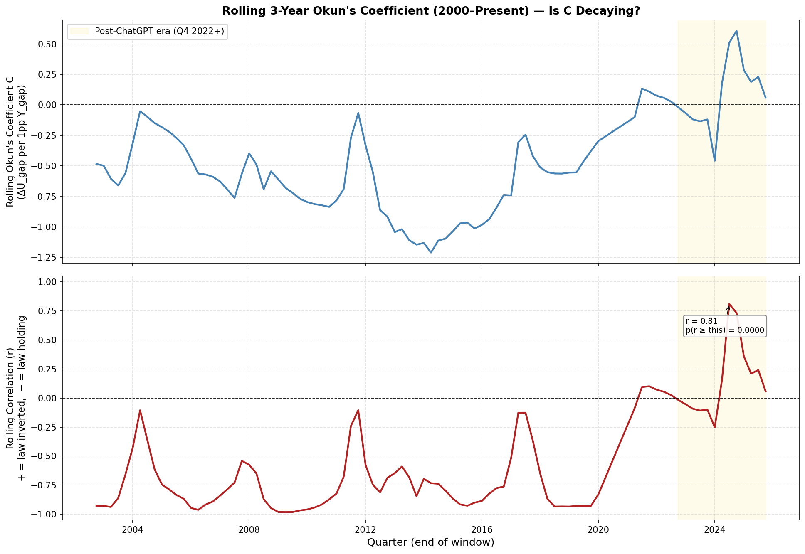

From 2000 to 2019 the coefficient stays firmly negative and the rolling correlation sits near −1.0, the rule working almost mechanically for two decades. **After Q4 2022 the coefficient swings wildly and the correlation inverts to +0.81.** The same inversion appears in the difference form of the aggregate data (peak r ≈ +0.55), so it is not an artifact of the gap specification.

**How unlikely is that, properly measured?** The normal approximation used elsewhere in this project reports p ≈ 0.0000, but it assumes normality and ignores that overlapping windows are autocorrelated, both of which understate the tail. A distribution-free circular block bootstrap (null: the pre-2022 regime simply continued, resampling the actual pre-2022 data in blocks) gives **p ≈ 0.0005**, roughly 1 in 2,000. That is orders of magnitude larger than the naive figure and still decisive, so the aggregate break survives the stricter test. See `permutation_test.py`.

Caveats: the post-2022 sample is short (~10-13 clean quarters) and the windows splice across the COVID gap. This documents a break; it does not identify a cause. Every later phase tries to.

<details>
<summary>The three supporting aggregate charts (level scatter, gap divergence, residual quadrant)</summary>

`GDPUnemployment.py` also produces `gdp_unemployment_analysis.png` (the level scatter of every quarter, and why COVID must be excluded), `gap_divergence.png` (the two gaps tracking until 2022 then running parallel), and `gap_okun_residual_quadrant.png` (the residual turning persistently red post-2022 and the recent quarters marching into the "law broken" quadrant).

</details>

---

# Part 2: Which industries, measured on unemployment

This is the part of the project that reached the wrong conclusion. It is kept in full because the correction only makes sense against it.

## Phase 2: Two industries, high AI vs low AI

> **Verdict: SUGGESTIVE**

Comparing Information (high AI exposure) against Leisure & Hospitality (low), using the difference form: post-2022, tech's rolling coefficient turns unstable and drifts positive while hospitality's stays negative. Directionally the AI story, but two industries cannot carry a general claim.

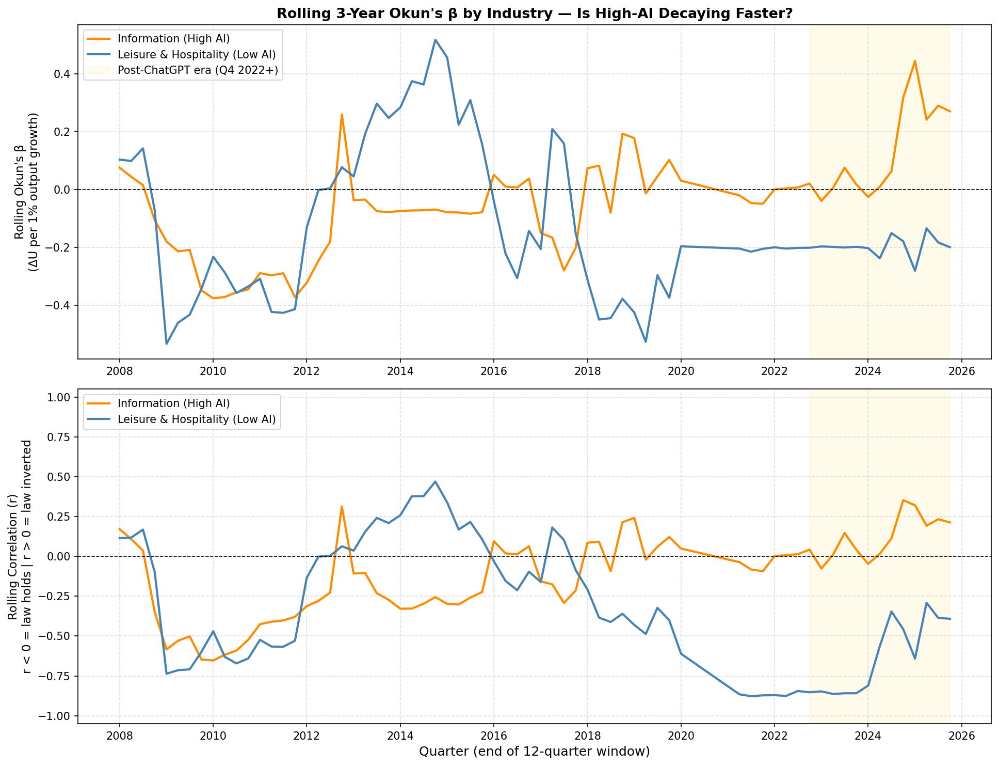

## Phase 3: Nine industries against AI exposure

> **Verdict: CONTRADICTS AI (on unemployment), later REVERSED**

Run the difference-form test on all nine sectors, once on the 59 clean pre-cutoff quarters and once on the 13 post-cutoff quarters, and regress each sector's change in Okun coefficient (Δβ) against its AIIE exposure score.

| Industry | AIIE | β pre (sig) | β post (sig) | Δβ | Reading |
|---|---:|---:|---:|---:|---|
| Construction | −0.997 | −0.39 \*\*\* | +0.05 \*\* | **+0.44** | large inversion |
| Manufacturing | −0.484 | −0.33 \*\*\* | +0.11 \* | **+0.44** | large inversion |
| Transportation & Utilities | −0.342 | −0.26 \*\*\* | +0.16 | **+0.41** | large inversion |
| Information | 1.268 | −0.13 \*\* | +0.18 | +0.31 | inverted |
| Wholesale Trade | 0.264 | −0.17 \*\*\* | +0.07 | +0.23 | inverted |
| Professional & Business | 0.654 | −0.34 \*\*\* | −0.23 \* | +0.11 | modest |
| Leisure & Hospitality | −0.315 | −0.36 \*\*\* | −0.30 \*\*\* | +0.05 | barely moved |
| Financial Activities | 1.538 | −0.02 | −0.06 | −0.04 | held |
| Education & Health | 0.775 | −0.03 | −0.22 | −0.19 | strengthened |

Two things the significance columns add. First, the pre-2022 law was strong and precisely estimated in seven of nine sectors (the exceptions being Finance and Education & Health, where β was never distinguishable from zero, an early hint that the instrument cannot see those sectors). Second, most post-period coefficients are individually insignificant at n = 13, so the post-period story rests on the pattern across sectors, not on any single estimate.

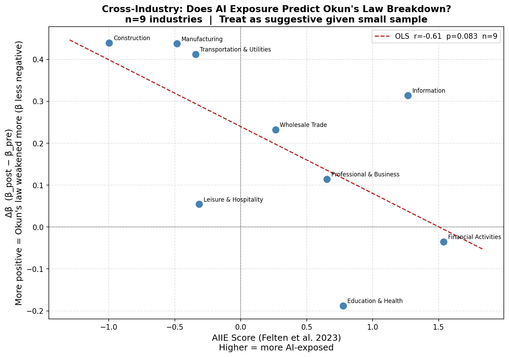

The cross-sectional regression runs **the wrong way for the AI hypothesis: r = −0.61, p = 0.083.** It stays negative under the BTOS adoption measure as the regressor too (r = −0.43, n.s.), and no specification in either measure clears a Bonferroni-corrected threshold; the finding was always sign consistency rather than any single p-value. The biggest breakdowns are in low-exposure physical sectors; the high-exposure sectors (Finance, Professional & Business, Education & Health) held or strengthened. This looked like a clean refutation of the AI story. It was not. The tell is Financial Activities at "held": holding that up against the fact that finance is one of the most AI-exposed sectors in the economy is what eventually cracked the whole result open (Part 3).

**Three sector cases worth understanding before the correction:**

- **Construction:** its correlation flipped from a tight −0.75 pre to an equally tight +0.77 post, but its post coefficient is only +0.05. The relationship became very reliable without becoming economically large, a distinction the correlation number alone hides. Its pre-2022 fit is also anchored by the 2008-2012 housing crash, so some of the −0.39 baseline may reflect one crisis rather than a stable law.
- **Education & Health:** a weak relationship in both eras (|r| under ~0.21), unsurprising for a sector driven by demographics and public funding rather than the business cycle, and it carries a known output-coverage mismatch (see Methodology).
- **Financial Activities:** β near zero in both eras with unemployment pinned near 2%. On this instrument the sector is unreadable, which is the thread the whole correction pulled on.

## Phase 4: Was it interest rates?

> **Verdict: rates rejected here, but the test used lags that were too short. See the correction below and in Part 4.**

The Fed's most aggressive hiking cycle in 40 years began right at the AI cutoff, and the sectors that broke most (Construction, Manufacturing, Transportation) are the most rate-sensitive. So the Δβ estimate is re-run under a no-control baseline plus five Federal Funds Rate specifications: contemporaneous YoY change, changes lagged 2 and 4 quarters, the rate level, and the deviation from an 8-quarter rolling mean. The full matrix:

| Industry | simple | lag0 | lag2 | lag4 | level | dev | Range | All positive? |
|---|---:|---:|---:|---:|---:|---:|---:|---|
| Construction | +0.44 | +0.38 | +0.32 | +0.37 | +0.44 | +0.35 | 0.12 | yes, tight |
| Manufacturing | +0.44 | +0.31 | +0.29 | +0.39 | +0.50 | +0.31 | 0.22 | yes |
| Transportation & Utilities | +0.41 | +0.35 | +0.26 | +0.20 | +0.12 | +0.33 | 0.30 | yes, wide |
| Information | +0.31 | +0.28 | +0.21 | +0.27 | +0.30 | +0.26 | 0.11 | yes, tight |
| Wholesale Trade | +0.23 | +0.13 | +0.14 | +0.31 | +0.41 | +0.07 | 0.34 | yes, wide |
| Professional & Business | +0.11 | +0.01 | +0.02 | +0.10 | +0.20 | +0.01 | 0.20 | yes, small |
| Leisure & Hospitality | +0.05 | +0.07 | +0.00 | +0.01 | +0.06 | +0.03 | 0.07 | yes, tiny |
| Financial Activities | −0.04 | −0.09 | +0.02 | −0.01 | −0.02 | +0.01 | 0.11 | no (held) |
| Education & Health | −0.19 | +0.16 | −0.02 | −0.17 | −0.20 | +0.06 | 0.36 | no (unstable) |

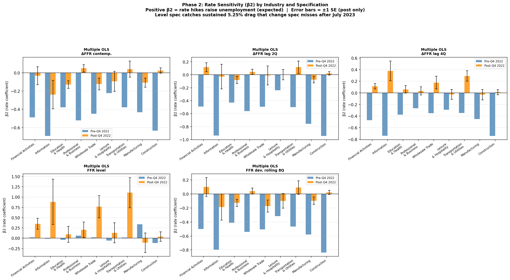

Reading it: the breakdown survives every way of measuring rates in seven of nine sectors, and is tightest exactly where it matters (Construction, Manufacturing, Information). The two sectors that cross zero are the two that "held" anyway. Transportation and Wholesale stay positive but swing widely across specs, so their magnitudes deserve less confidence.

> **Correction: this phase's rate controls were too short, and the fix has now been run.** Every specification above uses a lag of 0, 2, or 4 quarters (`for lag in [0, 2, 4]` in [`okun_phase2_3.py`](okun_phase2_3.py)). Part 4 finds the rate-to-hiring channel peaks at **8-9 quarters**, entirely outside that range. [`extended_lag_test.py`](extended_lag_test.py) re-runs the identical specification with lags out to 12 quarters. Results in the box below.

### The extended-lag re-test

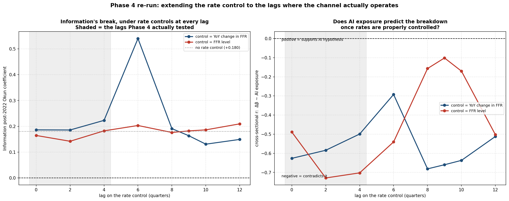

The longer lags are a **harder** test, not a softer one: in the post-2022 window the lag-0 FFR level barely varies (3.64% to 5.33%, sd 0.63) because rates were high and flat, while the lag-8 version spans 0.07% to 5.33% (sd 2.37). Phase 4's original level control had almost nothing to work with.

**Result 1: Information's break survives, and this is now a much stronger claim.** Its post-2022 coefficient stays positive under every lag from 0 to 12 in both the change and level forms, never once turning negative:

| Rate control | L0 | L2 | L4 | **L6** | **L8** | **L9** | **L10** | **L12** |
|---|---:|---:|---:|---:|---:|---:|---:|---:|
| FFR level | +0.165 | +0.142 | +0.182 | +0.203 | +0.176 | +0.182 | +0.186 | +0.210 |
| ΔFFR (YoY) | +0.186 | +0.186 | +0.223 | +0.540 | +0.191 | +0.163 | +0.131 | +0.149 |

Tech's decoupling is not a monetary artifact at any lag tested. Construction is similarly stable (+0.043 to +0.058 throughout), so its small breakdown is not a rate artifact either.

**Result 2: the "contradicts AI" cross-section is not robust to the fix.** Regressing Δβ on AI exposure at each lag, the wrong-direction result depends entirely on which rate form is used:

| Rate control | L0 | L2 | L4 | **L8** | **L9** | **L10** |
|---|---:|---:|---:|---:|---:|---:|
| ΔFFR (YoY) | −0.63 | −0.58 | −0.50 | **−0.68** (p=.04) | −0.66 | −0.64 |
| FFR level | −0.49 | −0.73 | −0.70 | **−0.16** (p=.69) | **−0.10** (p=.80) | −0.17 |

Under the change form the negative correlation persists and even strengthens. Under the level form at the lags where the rate channel actually operates, it **collapses to nothing** (r = −0.10, p = 0.80). So Part 2's headline finding, that AI exposure predicts *less* breakdown, is specification-dependent once rates are controlled at the right horizon. It should be reported as inconclusive rather than as a contradiction of the AI hypothesis.

Neither side wins cleanly. Tech's individual break passed a genuinely harder test; the cross-sectional evidence against AI weakened to a null under half the specifications. The defensible summary is that **rates do not explain Information's decoupling, and the cross-section can no longer settle the question either way.**

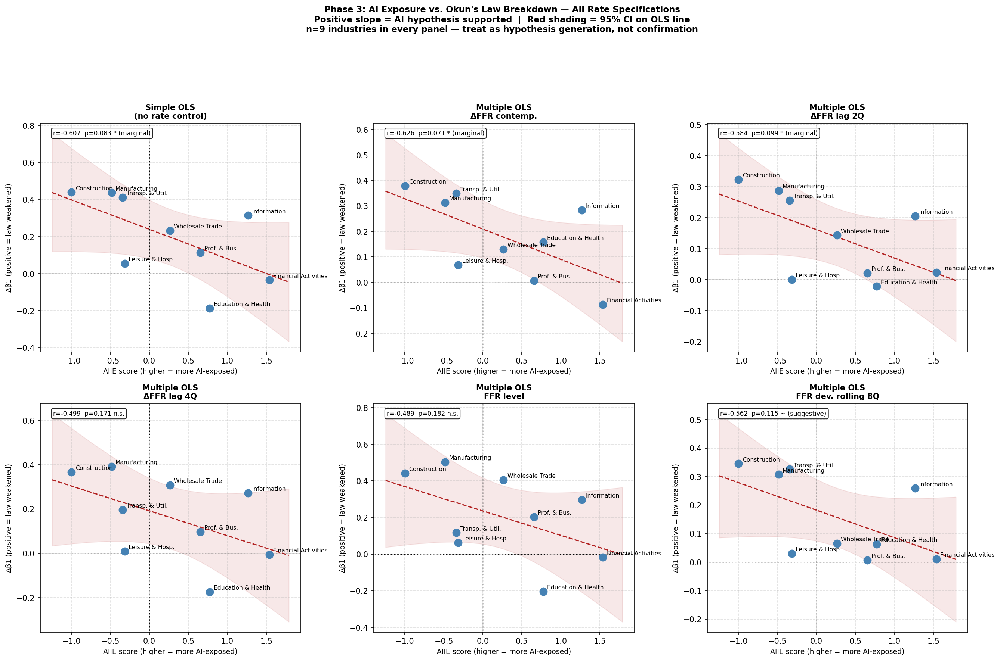

The cross-sectional slope against AIIE also stays negative in every one of the six specifications (the six-panel chart above), so the unemployment-side contradiction was robust. The problem was never robustness; it was the instrument.

## Phase 5: Is the AI-exposure measure any good?

> **Verdict: VALIDATES the measure**

AIIE is a 2021 theoretical score built before ChatGPT. The Census BTOS survey asks firms directly, every two weeks, whether they used AI in the last two weeks; sector-level answers exist from November 2025, and the analysis averages 14 biweekly panels.

| Industry | AIIE rank | BTOS adoption | BTOS rank |
|---|---:|---:|---:|
| Information | 2 | 38.4% | 1 |
| Financial Activities | 1 | 28.1% | 2 |
| Professional & Business | 4 | 26.6% | 3 |
| Education & Health | 3 | 26.0% | 4 |
| Wholesale Trade | 5 | 15.2% | 5 |
| Manufacturing | 8 | 14.3% | 6 |
| Leisure & Hospitality | 6 | 13.1% | 7 |
| Transportation & Utilities | 7 | 10.1% | 8 |
| Construction | 9 | 9.9% | 9 |

**Spearman ρ = 0.917, p = 0.001**: theoretical exposure and real adoption agree almost perfectly on sector order, so the surprising Phase 3 result is not a mismeasured regressor. The one meaningful reorder is Manufacturing (AIIE rank 8, BTOS rank 6), which is adopting more AI than its occupational-exposure score suggests.

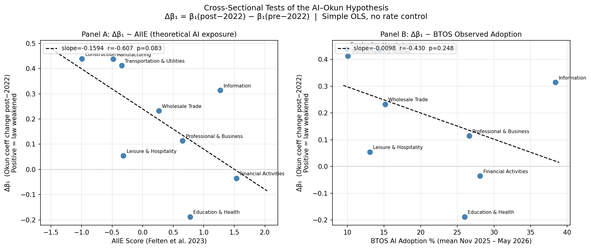

<details>
<summary>Why the intended continuous-adoption test cannot run yet</summary>

The clean version of this study would replace the hard Q4 2022 dummy with each sector's continuously rising BTOS adoption rate and estimate an interaction (does the Okun slope weaken as adoption climbs). With sector-level BTOS existing only from November 2025, there are ~3 quarters of variation per sector, far too little to identify the interaction. Revisit around late 2026 when another year of panels exists.

</details>

## Phase 6: Was tech's break just pandemic overhiring?

> **Verdict: Overhang is real but does NOT explain tech's break**

Tech genuinely over-hired: Information employment peaked about +6% above its 2010-2019 trend in Q4 2022 and has since fallen about 7% below it. The question is whether that correction, rather than AI, produced tech's Okun inversion. Nested regressions on the Information sector:

| Model | β1 (Okun slope, post-2022) | Overhang β3 | p(β3) | VIF | Verdict |
|---|---:|---:|---:|---:|---|
| M1: no controls | +0.180 | | | | inverted |
| M2: + rate control | +0.186 | | | | benchmark |
| M3: + overhang level | +0.163 | −0.06 | 0.89 | ~19 | collinear with rates, uninformative |
| M4: + Δoverhang (clean) | **+0.150** | −0.85 | 0.21 | 1.2 | **slope barely moves** |

Two details make the null result load-bearing rather than incidental. The M3 specification is discarded honestly: overhang and the rate control move almost identically post-2022 (correlation 0.95, VIF ~19), so neither coefficient there means anything; differencing the overhang (M4) removes the collinearity (VIF 1.2). And M4 passes a placebo check: in the **pre**-period, adding Δoverhang absorbs nearly the entire Okun slope (to −0.016), proving the test can detect the mechanism when it is real. Post-2022 it moves the slope by only −0.036.

Across all eight specifications tried against it (baseline, five rate controls, two overhang controls), tech's post-2022 slope stays inside **+0.150 to +0.223**, never approaching zero. Overhiring existed; it does not explain the break.

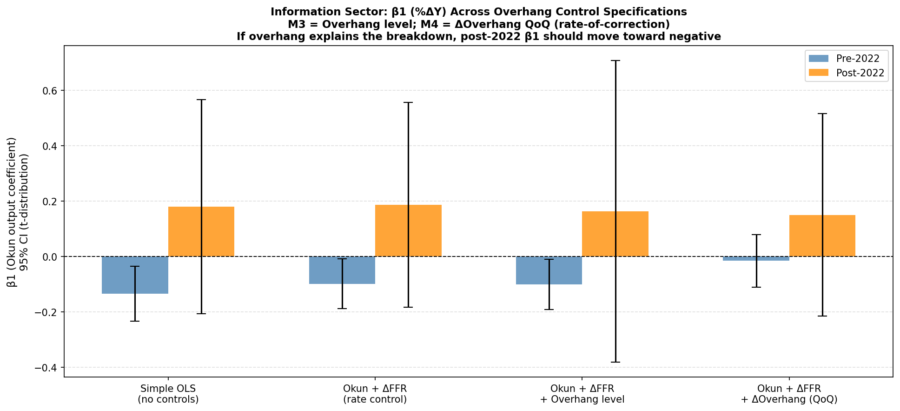

---

# Part 3: The correction that reversed the headline

Phase 3 rested entirely on the **unemployment rate**. That is the wrong instrument for the sectors that matter most, and finding out why reversed the project's central conclusion.

## The turn: unemployment cannot see a full-employment sector

Finance was filed under "the law held." But finance output has grown far faster than its headcount, which is the textbook picture of producing more without hiring more. The reason unemployment missed it: finance unemployment is welded to its ~2% structural floor, the frictional minimum for a professional-services sector.

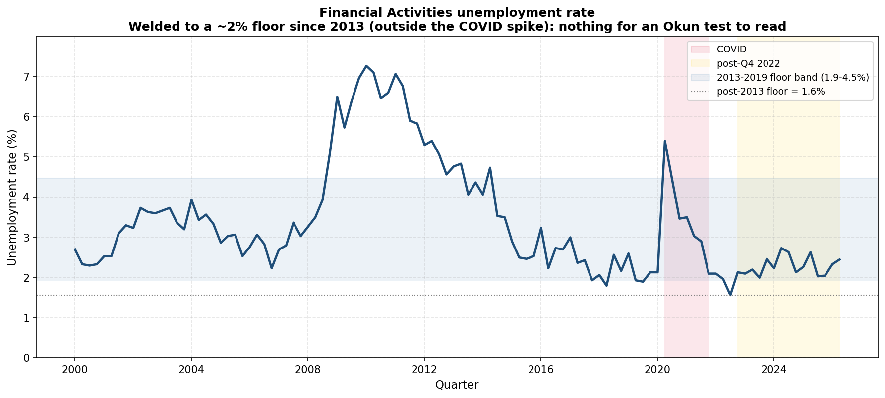

When output grows, unemployment there cannot fall any further, so the Okun test reads "no response" and scores it "held" (2013-2019 mean 2.9%; 2023-2025 mean 2.3% with a standard deviation of 0.24 points, almost no signal at all). Flat unemployment at full employment hides two opposite worlds, hiring many workers versus hiring almost none while productivity climbs, and unemployment cannot tell them apart. Employment can. The high-AI sectors (Finance, Professional & Business) are exactly the low-unemployment sectors where this blindness bites.

## Finance re-examined: a three-stage correction

The finance re-measurement went wrong twice before it went right, and the swing between the stages is the lesson (full detail in [`finance/`](finance/README.md)):

1. **Nominal (too big).** The finance output series (`VAFI`) is nominal. Using it, output looked like it doubled since 2013 and productivity rose 79%. Mostly prices.
2. **BEA finance deflator (too small).** Deflating with BEA's own Finance & Insurance deflator collapses real productivity to ~0.3%/yr, "no decoupling." But that deflator is **FISIM-contaminated**: financial output is imputed from interest-rate spreads, so when the Fed hiked, BEA booked the nominal surge as price rather than quantity. The finance deflator ran ~4.8%/yr against ~2.9%/yr economy-wide, in a pattern that tracks the rate cycle rather than inflation.
3. **Neutral GDP deflator (honest).** Re-deflated with `GDPDEF`, the answer brackets like this:

| Deflator | Real output growth | Real productivity |
|---|---:|---:|
| BEA finance deflator (FISIM-contaminated) | 1.5%/yr | 0.3%/yr |
| **GDP deflator (neutral)** | **3.8%/yr** | **2.4-2.8%/yr** |


Under the neutral deflator, finance real productivity runs roughly **double the ~1.5%/yr US average**. A NAICS fix (using Finance & Insurance employment, `CES5552000001`, instead of Financial Activities employment that includes Real Estate) barely moved anything, so the deflator was the whole story.

**And the decoupling is accelerating.** In real terms, averaging YoY growth within each period (`finance/productivity_acceleration.py`):

| Period | Real output | Employment | Real productivity |
|---|---:|---:|---:|
| 2013-2019 | +3.6%/yr | +1.4%/yr | +2.1%/yr |
| 2022-2023 | +0.2%/yr | +1.3%/yr | −1.1%/yr |
| **2024-2025** | **+5.6%/yr** | **+0.2%/yr** | **+5.5%/yr** |


The decomposition next to Information adds the key nuance: both of the two most AI-exposed sectors accelerate sharply in 2024-2025, by different routes. **Finance accelerates from the output side** (real output speeds up while hiring stalls at +0.2%/yr). **Tech accelerates from the labor side** (output growth holds near +6.7%/yr while employment turns negative at −2.5%/yr, outright job cuts). Tech's shape is the cleaner labor-substitution signature; finance's is consistent with AI but also with a strong financial market.

<details>
<summary>Finance caveats, kept prominent</summary>

- Even GDP-deflated, value added can be inflated by a financial-market boom rather than more real work per person, so part of the 2024-2025 spike may be a bull market. Direction robust, magnitude not.
- The GDP deflator is not exactly right for finance either; the truth is bracketed between 0.3 and ~2.6%/yr full-period, with the weight of evidence near the top given the FISIM problem.
- The rolling employment-elasticity chart for finance shows a spike to ~+0.5 in windows ending 2022; that is a COVID-rebound artifact (output and employment recovering together inside the window), not an AI signal.
- JOLTS is mixed rather than a hiring freeze: finance hires slipped (2.5% to 2.2%/mo) while openings rose (4.1% to 4.5%), so firms are posting but converting fewer hires.

</details>

## The corrected cross-section: measured on real productivity, AI supports the decoupling

> **Verdict: SUPPORTS AI (reverses Phase 3)**

Re-run the nine-industry cross-section on real productivity growth (real output per worker), with finance deflated by the GDP deflator and the other eight using their BEA real value added:

| Industry | AI exposure | Real productivity 2013-25 |
|---|---:|---:|
| Information | 1.27 | +7.2%/yr |
| Financial Activities | 1.54 | +2.8%/yr |
| Professional & Business | 0.65 | +2.8%/yr |
| Education & Health | 0.78 | +1.1%/yr |
| Manufacturing | −0.48 | +1.0%/yr |
| Wholesale Trade | 0.26 | +0.3%/yr |
| Leisure & Hospitality | −0.32 | +0.1%/yr |
| Transportation & Utilities | −0.34 | −0.3%/yr |
| Construction | −1.00 | −0.9%/yr |

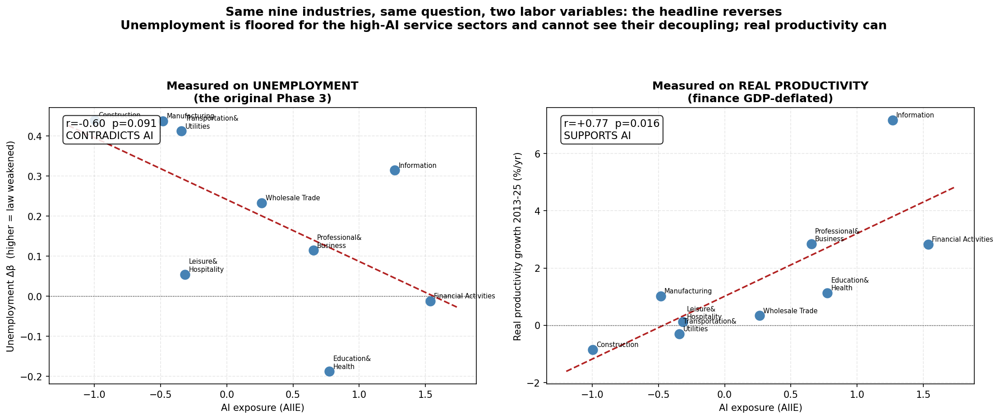

The three highest-AI sectors have the three highest real productivity growth rates; the lowest-exposure sectors have the lowest. Same nine industries, opposite conclusion:

| Labor variable | r vs AI exposure | p | verdict |
|---|---:|---:|---|
| Unemployment Δβ (Phase 3) | −0.61 | 0.083 | contradicts AI |
| Employment elasticity change (Δγ) | +0.28 | 0.47 | no relationship |
| **Real productivity growth** | **+0.77** | **0.016** | **supports AI** |

The middle row is included for completeness: the change in each sector's output-elasticity of employment shows no cross-sectional relationship with exposure either way, so the reversal comes specifically from the productivity lens, where the level *and* trend of output per worker are visible rather than only short-run co-movement. The project's central "contradicts AI" finding does not survive being measured on the variable AI actually targets.

## A better predictor than AIIE: the job-replaceability score

> **Verdict: SUPPORTS AI, more cleanly**

AIIE measures whether AI can *touch* a job. What determines whether Okun's law breaks is whether AI *replaces* the worker (automation) or *assists* them (augmentation). Education and Finance can have similar exposure but opposite substitution: finance tasks are largely substitutable, teaching needs a human in the room. So the project builds a replaceability score:

```
Replaceability = Exposure x (1 - Complementarity)
```

Exposure comes from Eloundou et al.'s GPT-exposure scores (beta tier, mean of human and model ratings); complementarity from five O\*NET Work Context variables that shield a job (physical proximity, face-to-face discussion, dealing with the public, responsibility for others' safety, consequence of error), normalized and averaged; the product is aggregated to industry with BLS OEWS employment weights.

| Industry | AIIE | Complementarity | Replaceability | Real productivity |
|---|---:|---:|---:|---:|
| Information | 1.27 | 0.49 | **0.325** | +7.2%/yr |
| Financial Activities | 1.54 | 0.56 | 0.267 | +2.8%/yr |
| Professional & Business | 0.65 | 0.54 | 0.233 | +2.8%/yr |
| Wholesale Trade | 0.26 | 0.56 | 0.207 | +0.3%/yr |
| Education & Health | 0.78 | **0.65** | 0.152 | +1.1%/yr |
| Manufacturing | −0.48 | 0.56 | 0.138 | +1.0%/yr |
| Transportation & Utilities | −0.34 | 0.59 | 0.120 | −0.3%/yr |
| Construction | −1.00 | 0.65 | 0.091 | −0.9%/yr |
| Leisure & Hospitality | −0.32 | 0.59 | 0.088 | +0.1%/yr |

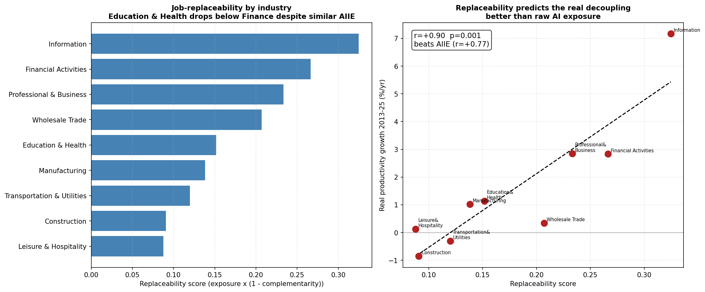

It does what it should: **Education & Health drops from 3rd on AIIE to 5th on replaceability**, below Finance, because it has the highest complementarity in the sample (teaching and care need a human in the room). And it predicts the real decoupling **better than AIIE: r = +0.90, p = 0.001** versus +0.77, while correlating 0.87 with AIIE (a refinement, not a different universe). The purpose-built substitution measure is the strongest predictor in the project of where output decoupled from labor.

## The recency test: does the AI result survive being timed to AI?

> **Verdict: FAILS TO CONFIRM. The strongest objection survives.**

The productivity result above is measured over 2013-2025, a window that mostly predates generative AI. So the obvious objection is that it captures long-run automation rather than anything about the AI era. This is the direct test of that objection: if AI is doing the work, exposure should predict not just the **level** of productivity growth but the **change** in it, with replaceable sectors accelerating more after AI arrived relative to their own pre-AI baseline.

```
acceleration = productivity growth (2024-2025) - productivity growth (2013-2019)
```

| Industry | Replaceability | 2013-19 | 2022-23 | 2024-25 | Acceleration |
|---|---:|---:|---:|---:|---:|
| Information | 0.325 | +6.9 | +5.1 | +9.4 | +2.5 |
| Financial Activities | 0.267 | +2.1 | −1.1 | +5.5 | +3.4 |
| Professional & Business | 0.233 | +1.5 | +2.4 | +3.3 | +1.8 |
| Wholesale Trade | 0.207 | +1.1 | −4.7 | +1.0 | −0.1 |
| Education & Health | 0.152 | +0.8 | +1.4 | +0.8 | −0.1 |
| Manufacturing | 0.138 | +0.8 | −2.3 | +3.2 | **+2.4** |
| Transportation & Utilities | 0.120 | −0.1 | −1.8 | +1.8 | **+1.9** |
| Construction | 0.091 | −0.1 | −6.5 | +1.7 | **+1.8** |
| Leisure & Hospitality | 0.088 | −0.1 | −1.8 | −0.7 | −0.5 |

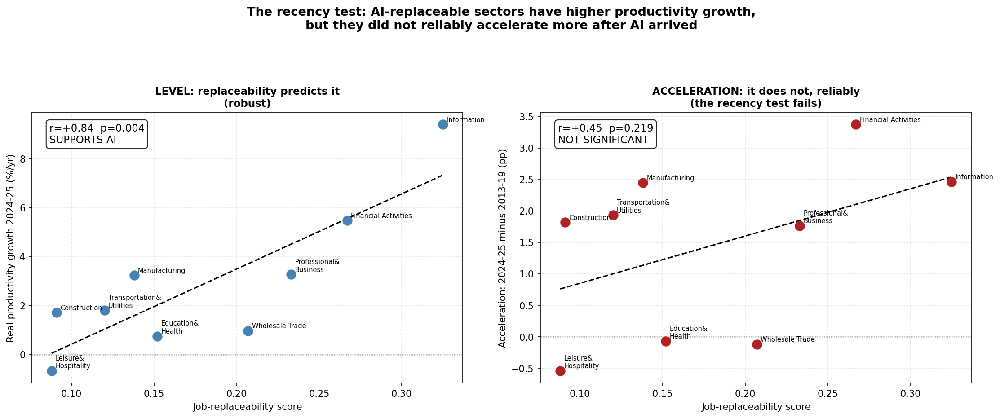

**The test fails.** Acceleration against replaceability gives r = +0.45, p = 0.22, and against AIIE r = +0.26, p = 0.50. Neither is significant. The reason is visible in the bolded rows: Manufacturing, Transportation, and Construction, three of the four *least* replaceable sectors, accelerated as much as the high-replaceability ones. Meanwhile the level result on the same data stays strong (2024-25 level against replaceability, r = +0.84, p = 0.004).

Robustness, since n = 9 is underpowered and the window choice matters:

| Baseline | Post window | r | p | Spearman | p |
|---|---|---:|---:|---:|---:|
| 2013-2019 | 2024-2025 | +0.45 | 0.22 | +0.52 | 0.15 |
| 2015-2019 | 2024-2025 | +0.36 | 0.34 | +0.35 | 0.36 |
| 2013-2019 | 2023-2025 | +0.44 | 0.23 | +0.48 | 0.19 |
| 2010-2019 | 2024-2025 | +0.55 | 0.12 | +0.67 | 0.05 |
| 2013-2019 | 2025 only | +0.83 | 0.005 | +0.85 | 0.004 |

The slope is positive in all five specifications, which is worth something. But it clears significance only in the narrowest post window, which is also the most specification-searched, so that row should not be quoted as the result. Two candidate explanations for the failure, and this analysis cannot separate them: either AI's productivity effect is not yet large enough to detect against the noise in a nine-sector, two-year window, or the level relationship really is long-run automation that AI has not yet visibly changed.

**What this costs the project.** The AI claim now rests explicitly on *levels*, that the sectors with more replaceable jobs sustain higher real productivity growth, and not on a discontinuity timed to AI's arrival. That is a materially weaker claim than "AI caused a break," and the "long-run automation" caveat stays in force rather than being cleared. Reproduce with `recency_test.py`.

## Validating the score against what people actually do with AI

> **Verdict: SUPPORTS AI. The circularity objection is substantially answered.**

The replaceability score's weakest point is circularity: both of its inputs (Eloundou's GPT-exposure ratings and O\*NET complementarity) describe how automatable a job *looks on paper*, so "automatable sectors show labor-saving productivity" is uncomfortably close to restating the measure's own construction. The fix is to rebuild it from **observed behavior** instead of ratings.

The [Anthropic Economic Index](https://huggingface.co/datasets/Anthropic/EconomicIndex) publishes what people actually do with Claude, by SOC occupation: an `observed_exposure` (how much AI use an occupation shows) and a `collaboration_bucket_automation_pct` (of that use, the share where the model does the task outright rather than assisting a human). That yields a direct analog of the project's own construction, with nothing theoretical in it:

```
AEI replaceability = observed exposure x automation share
```

aggregated to the nine industries with the same OEWS employment weights (67% to 95% employment coverage per industry).

| Industry | Theoretical replaceability | AEI exposure | AEI automation share | **AEI replaceability** | Real productivity |
|---|---:|---:|---:|---:|---:|
| Information | 0.325 | 0.262 | 0.524 | **0.138** | +7.2%/yr |
| Financial Activities | 0.267 | 0.268 | 0.508 | **0.129** | +2.8%/yr |
| Wholesale Trade | 0.207 | 0.230 | 0.560 | 0.112 | +0.3%/yr |
| Professional & Business | 0.233 | 0.214 | 0.555 | 0.111 | +2.8%/yr |
| Education & Health | 0.152 | 0.135 | 0.477 | 0.070 | +1.1%/yr |
| Manufacturing | 0.138 | 0.107 | 0.579 | 0.055 | +1.0%/yr |
| Construction | 0.091 | 0.085 | 0.600 | 0.049 | −0.9%/yr |
| Transportation & Utilities | 0.120 | 0.072 | 0.647 | 0.038 | −0.3%/yr |
| Leisure & Hospitality | 0.088 | 0.038 | 0.566 | 0.018 | +0.1%/yr |

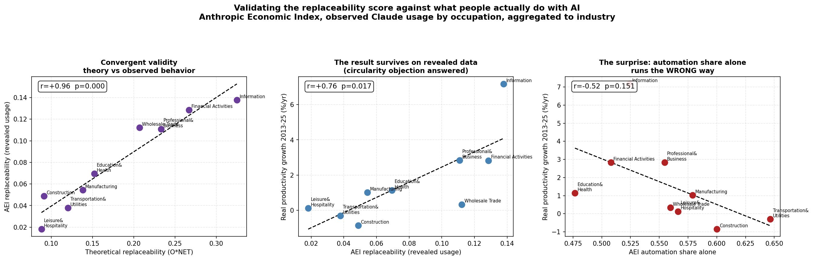

**Three results, one of them a surprise.**

**1. Convergent validity is remarkable.** The revealed-usage score correlates **+0.96** with the theoretical O\*NET score across the nine industries. Two entirely independent constructions, one from expert task ratings and one from millions of observed conversations, rank the industries almost identically. That is strong evidence the theoretical score was measuring something real rather than an artifact of its own assumptions.

**2. The productivity finding survives on revealed data.** AEI replaceability predicts real productivity growth at **r = +0.76, p = 0.017** (Spearman +0.80, p = 0.010), essentially matching AIIE's +0.77 and close behind the theoretical score's +0.90. Since nothing in the AEI measure is a judgment about automatability, the circularity objection is substantially answered: the relationship holds when the regressor is pure observed behavior.

**3. The surprise: automation share alone runs the wrong way.** Taken by itself, the automation-versus-augmentation split is *negatively* related to productivity (Spearman −0.78, p = 0.013). The physical sectors have the **highest** automation shares in the sample (Transportation 0.65, Construction 0.60, Manufacturing 0.58) while the knowledge sectors have the lowest (Education 0.48, Finance 0.51, Information 0.52). The reading: when a construction or transport worker does reach for AI, they hand the task over outright, they just do it very rarely (exposure 0.07 to 0.11 against 0.21 to 0.27 for knowledge work). So **usage intensity, not the automation/augmentation split, carries the industry-level signal.** That partly undercuts the theoretical elegance of "exposure times one minus complementarity," since complementarity turns out to show up as *low usage* rather than as augmentation-style usage. The composite still works because the exposure term dominates.

**4. It does not rescue the recency test.** Acceleration against AEI replaceability is r = +0.41, p = 0.28, in line with the theoretical measures. Since the failure now repeats across three independently constructed exposure measures, including one built from 2026-vintage usage data, it is a property of the data rather than of any single measure. That strengthens the case that the timing limitation is real.

Reproduce with `aei_revealed_validation.py` (streams and caches the AEI release from HuggingFace on first run).

---

# Part 4: The goods sectors, and the economy-wide hiring slowdown

> **Verdict: NOT a goods-sector story. An economy-wide, rate-driven hiring slowdown. COVID, AI, and fiscal spending all ruled out.**

This part began by treating the goods sectors as a separate puzzle needing a separate cause, and ended up somewhere else entirely. It deliberately **keeps COVID in the data**, unlike the root analysis, because seeing the pandemic is the point (full detail in [`physical-sector-inversion/`](physical-sector-inversion/README.md)).

The sections below are kept in the order the work happened, because the reversals are part of the evidence: the goods-sector framing comes first, then the tests that dismantled it.


| Sector | AIIE | Rolling r through COVID | Inversion onset | Peak r | p (normal) | **p (bootstrap)** | Δβ |
|---|---:|---|---|---:|---:|---:|---:|
| Construction | −1.00 | −0.68 to −0.91 | 2024 Q2 | +0.82 | 0.018 | **0.036** | +0.45 |
| Manufacturing | −0.48 | −0.87 to −0.92 | 2024 Q3 | +0.68 | 0.006 | **0.031-0.046** | +0.49 |
| Transportation & Utilities | −0.34 | −0.91 to −0.97 | 2024 Q4 | +0.60 | 0.007 | **0.034-0.058** | +0.51 |

**These probabilities were revised down in significance by the bootstrap** (`permutation_test.py`). The normal approximation originally reported 0.006 to 0.018; the distribution-free version gives roughly 0.03 to 0.058, and a Bonferroni correction across the three sectors would require p < 0.017, which none of them clear. The inversions are real and simultaneous, but they should be described as **marginal** rather than clearly significant.

Three findings:

**During COVID the law held harder than ever.** Output and jobs collapsed together, then recovered together, driving the rolling correlation to its most negative values in the sample (−0.68 to −0.97). Whatever inverted these sectors, it was not the pandemic.

**The inversion is a 2024-2025 event.** Construction first (2024 Q2), then Manufacturing (2024 Q3), then Transportation (2024 Q4), reaching correlations of +0.60 to +0.82, values with bootstrap probability roughly 0.03 to 0.058 under each sector's own pre-2022 history. That timing postdates COVID by years and generative AI by roughly two years.

**They move as one cluster, and Wholesale joins it.** Manufacturing and Transportation's rolling coefficients are nearly the same series (correlation 0.92), Construction a looser third (0.73-0.78), and their raw YoY unemployment changes correlate 0.80-0.89 even with COVID removed. Scanning all nine industries for the same signature (co-moves with the cluster and inverted recently) adds exactly one member: **Wholesale Trade** (cluster correlation 0.66, 2025 rolling r +0.44). The four are the physical goods economy: build it, make it, move it, distribute it. The service sectors all stay negative through 2025, and Information's marginal inversion (+0.12) belongs to the AI story in Part 3.


That the inverters looked like exactly the goods producers, and the holders exactly the services, seemed like the strongest hint about cause: something specific to physical production. **Pushing on that hint dissolved it.**

**The leading candidate was tested and did not survive.** `physical-sector-inversion/fiscal_control.py` pulls federal obligations by NAICS from the USAspending API and adds fiscal intensity as a third control. Three findings: the acts cannot be isolated (IIJA and CHIPS tagged obligations reach only ~0.08% of construction value added, because the money moves through states as grants, and the IRA has no fund code and works through tax credits); total federal obligations are economically meaningful but shrink the goods sectors' mean Δβ only from +0.218 to +0.189, significant in 1 of 8 sectors; and a lagged specification that appears to collapse the breakdown fails a falsification check, shrinking service sectors more than goods sectors. So the fiscal explanation is **not supported** by the best available direct test, though the test is structurally weak because federal contract data cannot see money that passes through states.

### What the goods sectors turned out to be

With COVID, rates, AI exposure, and fiscal spending all failing, `what_actually_inverted.py` and `hiring_slowdown.py` stopped hunting for a goods-sector cause and decomposed the inversion itself. The result reframes this entire part.


**It is an economy-wide hiring slowdown, not a goods-sector event.** Hiring slowed in **8 of 9 sectors** in 2024-2025, by roughly 2 percentage points on average, goods and services alike. A single principal component explains **72% of the variance** in sector employment growth, and it is essentially the simple nine-sector average (correlation 0.992). AI exposure predicts neither the hiring slowdown (r = +0.19, p = 0.63) nor the productivity acceleration (r = +0.26, p = 0.50). **Both of those nulls are uninformative**, as Part 5 establishes by benchmarking: the same test returns r = +0.04, p = 0.92 on the 2001 dot-com bust, a shock that was unambiguously concentrated in technology. Do not read them as evidence against AI.

**It is not a post-pandemic over-hiring correction.** Sectors that surged hardest in the 2021-2023 rebound are not the ones slowing hardest (r = −0.22, p = 0.57), and **8 of 9 sectors now sit below their extrapolated 2013-2019 employment trend**, by 1% to 13%. An economy unwinding a hiring binge would be above trend, not below.

**It follows the rate hikes with a long lag.** The common hiring factor tracks the Fed funds rate with a correlation that rises monotonically with the lag and peaks at 8-9 quarters: **r = −0.74 excluding COVID (p < 0.0001, n = 75)**. Rates went from 0.12% in early 2022 to 5.33% by early 2024; add roughly two years of transmission and it lands exactly on the slowdown. The mechanism is standard: rate hikes do not cause layoffs, they stop firms adding people, which produces a low-hire, low-fire market where employment growth falls toward zero while unemployment barely moves.

**The natural control is the most persuasive piece.** Education & Health is the one sector with no rate sensitivity (r = +0.016, p = 0.89), and it is the one sector that did not slow hiring (+1.3pp against −2.3pp for the other eight). The single sector that ignores the rate cycle is precisely the one that ignores the slowdown.

### Two corrections this forces

**The rate hypothesis was never properly tested.** [`okun_phase2_3.py`](okun_phase2_3.py) controls for rates at lags of 0, 2, and 4 quarters (`for lag in [0, 2, 4]`). At those lags the true correlation is only −0.08 to −0.32; the peak at 8-9 quarters sits entirely outside the tested range. Part 2's "not rates" conclusion was measured with a ruler roughly half as long as needed. Re-running it with lags out to 8-12 quarters is the highest-value fix available to this study.

**The inversion itself is not robust.** `why_in_sync.py` attempted to prove the goods-sector story outright and instead broke it. The trio's synchrony is real (+0.85 average pairwise correlation, 92nd percentile of all three-sector combinations), but after removing the economy-wide common factor their residual co-movement is **−0.01**, so there is no separate goods factor; they move together because they ride one common cycle. And the inversion reverses under ordinary window choices:

| Peak rolling r since 2024 | 8q | 12q | 16q | **20q** |
|---|---:|---:|---:|---:|
| Construction | +0.84 | +0.82 | +0.66 | **+0.14** |
| Manufacturing | +0.82 | +0.68 | +0.45 | **−0.58** |
| Transportation | +0.65 | +0.60 | +0.13 | **−0.74** |
| Wholesale | +0.77 | +0.45 | +0.62 | **−0.11** |

At a 20-quarter window three of four sectors are negative again. A structural break should not depend on whether you look through a 12-quarter or 20-quarter window. **The inversion should be treated as a short-window artifact, and the hiring slowdown as the real finding.**

Honest limits: the hiring and rate results rest on n = 75 quarterly observations with a clean natural control and are solid; the inversion rests on 13 post-2022 quarters and is not. Rates are also not the only candidate for a broad hiring slowdown, since immigration and labor-force changes could produce similar timing. That objection used to sit here as an untestable caveat on the grounds that sector-level JOLTS data existed for only two of the nine sectors, which was wrong: FRED carries all four JOLTS rates for all nine. It has since been collected and tested, in Part 5 below. Correlation with a long lag is suggestive of a transmission channel, not proof of one.

---

# Part 5: Changing the unit of observation

Everything up to this point is a nine-industry cross-section. At n = 9 the correlation needed for p < 0.05 is 0.666, so only a very large effect can ever register, and by this stage the project had demonstrated that by exhaustion. AIIE, the replaceability score, the revealed-usage score, five acceleration windows, and a rate-orthogonalized acceleration all land between r = +0.42 and +0.56, and none of them clear the bar. Measurement was never the binding constraint. Sample size was.

There is a second problem that more industries would not fix. The industry is the level at which the confounds live. Rates, tariffs, immigration, fiscal flows and demand shocks all hit an industry as a whole, so any industry-level regression of AI exposure on labor outcomes is a race between AI and everything else that varies across industries. Part 4 spent most of its effort on one of those confounds.

Two new datasets address these problems separately. JOLTS changes what is measured. OEWS changes the unit of observation.

## JOLTS: what kind of slowdown was this? (`jolts_margins.py`)

Employment is a net number, and three very different stories produce the same net fall: firms firing people (displacement), firms not backfilling attrition (a freeze), or firms unable to fill posts they have advertised (a supply constraint). JOLTS separates them, reporting job openings, hires, layoffs and quits monthly for every sector. These are unadjusted series, so seasonality is handled with 12-month trailing means rather than partial-year windows.

**Layoffs did not rise.** Comparing the latest twelve months against 2015-2019, the layoffs and discharges rate is flat in seven of nine sectors and the nine-sector mean change is −0.02pp. In Construction it fell 0.68pp. Only two sectors show materially higher involuntary separations: Information (1.14 to 1.68, +0.54) and Transportation & Utilities (+0.41). This was a hiring freeze, not a firing wave, which is what a rate-driven withdrawal of new positions looks like and is not what displacement looks like.

**One test clears, and does not survive correction.** Of five margins tested against replaceability, only the change in job openings reaches significance (r = −0.676, p = 0.045), meaning labor demand fell most where work is most replaceable. That is the right sign for an AI story and the sharpest cross-sectional result in the project outside the productivity level. It also fails Bonferroni across the five tests (which asks for p < 0.010), and its Spearman equivalent is −0.600, p = 0.088. Report it as suggestive.

**The immigration objection, tested rather than flagged.** If a shrinking labor force drove the slowdown, firms would post jobs they could not fill, so hires per opening would fall. Construction's fill rate did collapse, from 1.78 in 2015-2019 to 1.01 in 2023, but it has been *recovering* since (1.22, 1.46, 1.32), and the same trough-and-recovery shape appears in sectors with no particular immigrant intensity. The matching collapse belongs to the 2021-2023 reopening, and it is unwinding through exactly the window a 2025 immigration shock would need to be tightening it. The qualification worth keeping is that Construction's fill rate is still 26% below pre-pandemic, the largest gap of the nine, so a residual supply constraint is not excluded.

## The unemployment rate cannot see what happened (`okun_employment_form.py`)

Every Okun test in this project measures output against the sector UNEMPLOYMENT RATE. That is the textbook form, and it has a structural blind spot that turns out to bind hard in this episode.

The unemployment rate is `unemployed / labor force`. It only moves when a displaced worker stays in the labor force and searches. A worker who loses a job and **exits** the labor force, through retirement, discouragement, or emigration, leaves employment but never enters the numerator. Employment can fall while the unemployment rate falls too, and an unemployment-based measure registers nothing.

**This is not hypothetical. It applies to seven of the nine sectors.** Comparing 2024-2026 against the 2013-2019 baseline:

| Sector | Employment growth | Unemployment **level** | |
|---|---:|---:|---|
| Information | −3.48 | **+0.22** | visible to both forms |
| EducHealth | +1.32 | −0.48 | employment held up |
| Construction | −2.75 | **−2.24** | **hidden** |
| Transportation | −3.10 | −0.38 | **hidden** |
| ProfBus | −3.08 | −1.30 | **hidden** |
| Manufacturing | −1.87 | −0.92 | **hidden** |
| Leisure | −1.81 | −1.09 | **hidden** |
| Finance | −1.45 | −0.58 | **hidden** |
| Wholesale | −1.11 | −0.51 | **hidden** |

Seven sectors lost employment growth **while their unemployment rate fell**. That combination is arithmetically impossible without the labor force shrinking or workers exiting the industry. Every Okun coefficient this project computed for those seven sectors was measuring a variable that had been drained of the signal.

**Information is the single exception, and that is itself informative.** It is the only sector where unemployment *rose* alongside falling employment, meaning displaced Information workers showed up as unemployed rather than leaving. Whatever hit Information did not look like the labor-force exit affecting the other seven.

**Switching the transform changes the sign of the AI result.** The project differences the unemployment rate year-over-year, which is correct for the difference form of Okun's Law, but comparing episode averages of an already-differenced series is a second difference and answers "did unemployment accelerate" rather than "is unemployment higher." Both against AI exposure, current episode:

| Measure | Spearman with AI exposure | p |
|---|---:|---:|
| unemployment, second difference (what the project used) | **−0.317** | 0.41 |
| unemployment, change in **level** | **+0.467** | 0.21 |
| employment growth | +0.183 | 0.64 |
| output-employment wedge | +0.083 | 0.83 |

The level form is the strongest of the four and the only one with the sign an AI story predicts, where more exposed sectors saw unemployment rise more. It is still not significant at nine sectors, so this is not a result. But the measure the project has been reporting nulls from was pointing the *wrong way* purely because of the transform.

**What this does and does not fix.** It explains why the Okun-coefficient tests have been returning nothing interpretable: for seven of nine sectors the dependent variable could not move in the required direction. It does not by itself produce evidence for AI, since the level-form correlation remains insignificant and the output-employment wedge, which is the cleanest displacement measure, is flat against exposure (+0.083). The honest statement is that the Okun results in this project should be treated as **not yet measured** rather than as nulls, and that any future version needs the employment form or a labor-force-adjusted unemployment measure.

## Fixing the nine-sector test rather than abandoning it (`cyclical_abnormality.py`)

The finding that the nine-sector correlation cannot detect the dot-com bust was left above as a caveat on an existing result. It deserves its own treatment, because it points at a repair rather than a dead end. If the statistic is blind, the question is whether a better statistic on the same nine sectors can see. Three things were wrong with it, and each has a fix.

**Fix 1: rank instead of Pearson. This does not work, and the reason is informative.** Pearson on nine points is hostage to a single outlier, so the rank version is the obvious repair. It fails too:

| Episode | What it was | Pearson | Spearman | Information's rank |
|---|---|---:|---:|---:|
| 1990-91 | credit crunch | +0.662 | +0.643 | 7 of 9 |
| **2001 dot-com** | **technology bust** | **+0.041** | **+0.217** | **1 of 9** |
| 2008-09 GFC | financial crisis | +0.661 | +0.667 | 8 of 9 |
| 2015-16 | oil bust | +0.088 | −0.133 | 5 of 9 |
| 2020 COVID | pandemic | +0.504 | +0.433 | 7 of 9 |
| **2024-26 current** | **the test episode** | **+0.189** | **+0.183** | **1 of 9** |

Both statistics miss 2001 entirely. But Information ranks **first of nine in exactly the two technology episodes** and fifth to eighth in every other one. The signal is in the data; the exposure index is what loses it. AIIE ranks **Finance** as the most exposed sector of the nine, above Information, and Finance does not behave like a technology-shock sector in either 2001 or now. A correlation against a mis-ordered index will be blind however it is computed.

**Fix 2: give every sector its own cyclical baseline.** Construction slows most in nearly every downturn because it is the most cyclical sector, which has nothing to do with technology. Comparing raw slowdowns across sectors therefore mostly measures cyclicality. Estimating each sector's own historical cyclical beta and predicting the current episode from it isolates the residual an AI story is actually about:

| Sector | AI exposure | Actual | Cyclical prediction | **Abnormal** |
|---|---:|---:|---:|---:|
| Transportation | −0.34 | −3.10 | −0.77 | **−2.33** |
| Information | +1.27 | −3.48 | −1.53 | **−1.95** |
| Finance | +1.54 | −1.45 | −0.45 | −1.00 |
| ProfBus | +0.65 | −3.08 | −2.59 | −0.49 |
| EducHealth | +0.78 | +1.32 | −0.52 | +1.84 |

Information slowed nearly 2pp more than its own cyclical history predicts. So did Transportation, which is the awkward part: the most abnormal sector has *low* AI exposure. The correlation is the right sign but not significant (Spearman −0.217, p = 0.58; Pearson −0.315, p = 0.41).

**Fix 3: use the episodes as a null distribution.** Nine sectors cannot calibrate a correlation, but six episodes can calibrate the whole pipeline. Running every episode through the identical procedure as if it were the test episode:

| | Episode | Spearman(abnormal, AI) |
|---|---|---:|
| **TECH** | 2001 dot-com | **−0.300** |
| **TECH** | 2024-26 current | **−0.217** |
| | 2020 COVID | +0.067 |
| | 1990-91 recession | +0.262 |
| | 2008-09 GFC | +0.350 |
| | 2015-16 industrial | +0.417 |

**The two technology episodes are exactly the two negative ones, and all four non-technology episodes are positive.** Under random ordering the chance the two pre-identified technology episodes occupy the two lowest of six positions is 1/C(6,2) = **0.067**.

That number should be read with discipline. The "bottom two" cutoff was chosen after seeing the ordering, so it is post-hoc and the nominal probability overstates the evidence. The rank-based p-value, which is not post-hoc, is 0.333, and with six episodes the smallest achievable p is 0.167, so this design cannot reach conventional significance no matter what the data show. What it does establish is that the statistic behaves differently in technology episodes than in credit, oil and pandemic episodes, and that the current episode sits on the technology side.

**The Okun version, which is the question this project actually asks, does not cooperate.** Applying the identical design to the change in each sector's Okun slope:

| Episode | Spearman(ΔOkun, AI) | p | n |
|---|---:|---:|---:|
| 2008-09 GFC | +0.383 | 0.31 | 9 |
| 2015-16 industrial | −0.150 | 0.70 | 9 |
| 2020 COVID | −0.117 | 0.77 | 9 |
| 2024-26 current | −0.217 | 0.58 | 9 |

Positive would mean more AI-exposed sectors saw their Okun slope move further toward a break. The current episode is **negative**, meaning the opposite, and it is nowhere near significance. BEA industry output starts in 2005, so only four episodes are estimable and the earlier ones drop out entirely.

**What this section establishes.** The employment-side pattern is consistent with a technology shock and behaves differently from every non-technology downturn since 1990, at a strength that cannot clear conventional significance with nine sectors and six episodes. The Okun-side pattern, which is what would be needed to claim AI is breaking Okun's Law, points the wrong way. So the honest position is that the *hiring* evidence has moved from "uninformative null" to "suggestive and pre-registrable", while the *Okun* claim specifically has no support here. The way to settle it is to state the prediction now and test it on episodes that have not happened yet, which is the one thing a six-episode design can be made to do properly.

## OEWS with industry fixed effects: the test with real power (`oews_within_industry.py`)

The unit here is the (4-digit NAICS industry × detailed SOC occupation) cell, from the BLS OEWS industry-by-occupation files, with industry fixed effects:

`Δlog(employment) = a_industry + b × replaceability + e`

Because the fixed effect absorbs everything common to an industry, `b` compares a more replaceable occupation against a less replaceable one **inside the same industry**. Construction's rate shock hits every occupation in construction, so it lands entirely in `a_industry` and cannot contaminate `b`. Same for tariffs, immigration enforcement, and sectoral demand. Sample size goes from 9 to about 28,000 cells across 247 industries and 747 occupations. Errors are clustered by occupation, since replaceability is constant within occupation across industries.

The measure's complementarity component is close to an index of how in-person a job is, and 2020-2022 was the largest shock to in-person work in modern history. So the same regression runs on three windows, and the pre-AI one is the actual test.

| window | what it is | Δlog employment | Δlog wage |
|---|---|---|---|
| 2013-2019 | placebo: pre-AI, pre-COVID | −0.143 (p = 0.245) | −0.042 (p = 0.063) |
| 2019-2025 | spans COVID and AI | −0.147 (p = 0.181) | −0.106 (p < 0.0001) |
| 2022-2025 | post-reopening AI window | −0.109 (p = 0.156) | +0.001 (p = 0.965) |

**The placebo is identical to the AI window.** The employment coefficient is about −0.14 in 2013-2019, before generative AI existed, and about −0.11 in 2022-2025. Whatever downward tilt replaceable occupations have, it was already there. This is the recency objection confirmed at the occupation level with 20,000 observations instead of 9.

**The striking wage result is COVID.** The −0.106 wage effect (p < 0.0001) appears only in the window that spans the pandemic. In the clean AI window it is +0.001, p = 0.965.

**The component split explains why.** Splitting replaceability into its two halves, exposure alone is indistinguishable from zero in every window (−0.04 to +0.04). The entire signal comes from complementarity: +0.365 (p = 0.0007) in the pre-COVID placebo, +0.504 (p = 0.0001) spanning COVID, and +0.120 (p = 0.14, not significant) in the AI window. The pattern is physical and in-person work growing relative to desk work, a long-running trend that COVID amplified and that is absent from 2022-2025. It is not a GPT-exposure effect.

**And the design has power, which is what makes the null informative.** Without industry fixed effects, the 2022-2025 employment coefficient is −0.174 with p = 0.014, significant. Adding industry fixed effects cuts it to −0.109 and kills it. The pooled relationship between AI exposure and employment is industry composition, not within-industry substitution. That directly implicates the nine-sector design this project has used throughout.

The honest caveat cuts the other way too: industry fixed effects absorb any AI effect operating at the industry level, so this design tests substitution *within* industries and is silent on reallocation *between* them. If AI shrinks whole industries rather than particular occupations inside them, this specification cannot see it. Match rates are 63%, 75% and 89% across the three windows, since NAICS and SOC revisions break exact cell matching, and BLS advises against treating OEWS as a time series at all.

## Benchmarking the episode against history (`is_the_slowdown_distinctive.py`)

Part 4 argued the slowdown is not AI-specific on two grounds: eight of nine sectors slowed, and AI exposure does not predict which ones (r = +0.18, p = 0.64). Both were asserted without a benchmark. Running the identical analysis on every episode since 1990 shows one of them holds and the other does not.

**Breadth is normal, so it is not evidence.** The median episode since 1990 slowed 8 of 9 sectors: the 1990-91 recession 8 of 8, the dot-com bust 8 of 9, the GFC 9 of 9, COVID 8 of 9. Only the 2015-16 industrial slowdown was narrow (3 of 9). "Eight of nine slowed" describes essentially every downturn and carries no information about the cause.

**The cross-sectional AI test is demonstrably blind, so its null proves nothing.** The 2001 dot-com bust is the natural check, because everyone agrees that shock was concentrated in technology. Run the same nine-sector regression on it:

| episode | r with AIIE | p | Information's rank for slowdown size |
|---|---|---|---|
| 1990-91 recession | +0.662 | 0.074 | 7 of 8 |
| **2001 dot-com** | **+0.041** | **0.916** | **1 of 9** |
| 2008-09 GFC | +0.661 | 0.053 | 8 of 9 |
| 2015-16 industrial | +0.088 | 0.821 | 5 of 9 |
| 2020 COVID | +0.504 | 0.167 | 7 of 9 |
| **2024-26** | **+0.189** | **0.626** | **1 of 9** |

AIIE returns r = +0.04, p = 0.92 on a bust that was unambiguously a technology shock. The test has a demonstrated false negative on the one case where the answer is known, which is a much stronger statement than the power calculation already noted elsewhere in this project. **The r = +0.18, p = 0.64 result in 2024-2026 cannot be read as evidence against AI.** It is the reading this project previously gave it, and that reading was wrong.

**What the correlation misses, a rank statistic catches, and it is larger than it first looks.** Information ranked first of nine in exactly the two episodes anyone would call technology shocks, and fifth to eighth in every ordinary downturn. Scoring each sector's slowdown as a z-score within its own episode makes the regularity quantitative: Information's z is +0.90, +0.60, +0.40 and +0.82 in the four ordinary downturns (mean +0.68, t = 6.09, p = 0.009), so it is reliably *more* resilient than the average sector when the economy turns down. In 2024-2026 its z is −1.06, a swing of 1.74 standard deviations from its own normal behavior. The tight band is what produces the small p on four observations, so this is a clear regularity resting on thin evidence rather than a well-powered test.

**The magnitude version is stronger than the rank version.** Fitting each sector's slowdown against the nine-sector average slowdown across the ordinary downturns only gives that sector's cyclical beta, which is then used to predict 2024-2026:

| sector | cyclical beta | predicted | actual | residual |
|---|---|---|---|---|
| **Information** | **+0.61** | **−0.64** | **−3.48** | **−2.84** |
| Transportation & Utilities | +1.03 | −0.64 | −3.10 | −2.46 |
| Professional & Business | +0.95 | −2.31 | −3.08 | −0.78 |
| Manufacturing | +0.87 | −2.46 | −1.87 | +0.58 |
| Construction | +2.90 | −4.33 | −2.75 | +1.57 |
| Education & Health | +0.32 | −0.79 | +1.32 | +2.11 |

Information's beta is +0.61, meaning it normally moves *less* than the average sector in a downturn. Given how mild 2024-2026 is on the nine-sector average (−1.93pp), it should have slowed by 0.64pp. It slowed by 3.48pp. That −2.84pp miss is the largest of the nine and it is a real anomaly, not an artifact of ordinal ranking. Caveat: four episodes and two parameters, so this is indicative rather than inference. Note also that Transportation & Utilities is nearly as anomalous at −2.46pp despite having among the lowest AI exposure in the sample.

**But the test that would have separated AI from an overhang correction fails.** The natural discriminator is output: a demand bust should show output falling alongside employment, while AI substitution should show output holding while employment falls. Annual Information GDP back to 1997 says the dot-com bust had the *same* shape, and more of it:

| window | real output | employment | productivity |
|---|---|---|---|
| 1997-2000 boom | +4.70% | +5.42% | **−0.82%** |
| 2001-2003 bust | +4.26% | −4.19% | **+8.93%** |
| 2013-2019 pre-AI norm | +4.35% | +0.98% | +3.33% |
| 2020-2022 pandemic boom | +2.23% | +2.41% | **+0.13%** |
| 2023-2025 correction | +3.88% | −2.24% | **+6.27%** |

Both corrections are preceded by a hiring boom that outran output, and both give it back at a similar rate. Tech productivity growth sagged to −0.82%/yr before the dot-com bust and to +0.13%/yr before this one, against a 2013-2019 norm of +3.33%. An overhang that built up and is unwinding accounts for the current episode with no AI in it, and it has an exact precedent. The "output holds while tech jobs fall" pattern is older than generative AI and was *larger* in 2001. (Series note: this is nominal Information GDP from the state accounts deflated by the economy-wide GDP deflator, the only consistent series reaching 1997. Its annual growth correlates r = +0.873 with BEA real value added over 2006-2025, but understates the level by about 3.9pp/yr in every period, since Information's own deflator falls. Compare rows to each other, not to BEA levels.)

**But "output holds while hiring stops" is not distinctive.** The wedge, defined as the change in mean sector output growth minus the change in mean sector employment growth, is +1.50pp in 2024-2026, against +1.24pp in the GFC and +2.21pp in COVID. Output holding up better than hiring is what downturns normally look like at the sector level. That half of the Part 4 argument survives.

**2001 is a diagnostic, not a precedent.** It is used above only to show that the nine-sector correlation cannot detect a single-sector shock. It is a poor analogy for 2024-2026 and should not be used as one, because the two episodes differ in exactly the dimension that matters:

| | 2001-2003 | 2024-2026 |
|---|---|---|
| NBER recession | yes | no |
| mean real GDP growth | +1.82%/yr | +2.45%/yr |
| unemployment | 4.2% to 6.3% (+2.1pp) | 3.7% to 4.5% (+0.8pp) |
| Information employment | −15.6% peak to trough | −10.3% peak to latest |

Information is shedding a tenth of its workforce during an expansion. In 2001 it shed a sixth inside a recession, with a collapse in telecom and dot-com investment behind it. Employment figures are quarterly averages of the monthly series, peak to trough for 2001-2003 and peak to latest for the current episode, which is still in progress. The demand shock that explains 2001 is simply absent now, which makes the current episode the harder one to explain, not the easier one.

**The labor-market mechanism, though, is close.** JOLTS starts December 2000, so both episodes are covered. Information job openings fell **28%** across the dot-com bust and **25%** now. Hires fell in both, quits fell in both. Layoffs are modestly higher now than then (monthly means of 1.54 for 2025-2026 against 1.32 for 2001-2003 and 1.36 in 2019), with essentially tied peaks (2.40 in January 2002, 2.50 in January 2026). These are unadjusted series and January is seasonally high, which is why seven of the ten highest months on record are Januaries, so read the means rather than the peaks.

**The overhang account runs out exactly where the period of interest starts.** An overhang explanation carries a hard implication: unwinding an excess of +X% returns a sector *to* its trend, not far below it. Fitting Information's log employment on 2010-2019 and extrapolating, the deviation runs +0.8% (2019), +6.0% (2022 peak overhang), **+0.3% (late 2023)**, −2.8% (2024), −4.9% (2025), −7.4% (latest). The pandemic overhang was fully worked off by late 2023, and employment kept falling for another two years. So the overhang explains 2022-2023 and cannot be what drives 2024-2026.

That said, the *level* of the deviation should not be trusted. Running the identical method on the dot-com episode, fitting 1990-2000 and extrapolating, gives −24.9% by 2005, which obviously does not mean a quarter of tech jobs were displaced. Extrapolating a prior decade's trend inflates the gap whenever structural growth slows, and 1990s Information growth was never going to continue. What survives is the timing of the zero crossing, which requires almost no extrapolation. It does not follow that AI explains the remainder, only that the overhang does not.

## The capital-side discriminator (`tech_capital_vs_labor.py`)

The overhang reading above leans on 2001 as its precedent, and that precedent does not survive being checked. The dot-com bust had a specific, measurable cause with nothing to do with the labor market: capital fled technology. If the current episode is the same kind of event, tech capital should be retreating now too. It is doing the opposite, hard.

| | 2001 dot-com bust | 2024-2026 current |
|---|---|---|
| NASDAQ over the episode | **−63.9%** (trough −65.0%) | **+132.6%** (trough +0.0%, never below its start) |
| real tech capex | **−2.6%** | **+42.8%** |
| tech share of business fixed investment | 30.0% to 28.8% (falling) | 30.0% to 34.9% (rising) |
| Information employment | **−10.5%** | **−10.3%** |

The two episodes cost Information almost exactly the same share of its jobs. Every capital variable moves in the opposite direction between them. Tech's share of all business fixed investment is now above its dot-com peak (30.1% in 2000, 33.9% in the latest four quarters, against 28.5% in 2019). Firms are putting a larger share of their capital budget into information technology than at any point in the series while cutting technology headcount.

A funding collapse cannot produce rising capex alongside falling headcount. Capital-labor substitution can, and that is close to its definition. This is the strongest single piece of evidence in the project for the AI reading, and it arrives on the capital side rather than the labor side, which is where every previous test had been looking.

**What it settles and what it does not.** It settles that the 2001 analogy does not carry: the mechanism that drove 2001 is not merely absent now, it is running in reverse. A pandemic-overhang story can still be told, but it can no longer borrow 2001's precedent. It does not settle substitution directly, because rising tech capex is also consistent with an ordinary capital-deepening boom that happens to coincide with a hiring correction. Note too that much of the recent capex is AI data-center buildout, so "firms are spending on AI while cutting staff" is descriptively true without yet showing the spending causes the cuts.

**Series note and a correction made while building this.** Tech investment is BEA's A679, information processing equipment *and software*, which already includes software. A first cut used Y033 (all nonresidential equipment) and added software separately, double-counting and producing a tech share near 60%, which should have been an immediate signal. The corrected share runs 28% to 33%. Real terms splice A679's own chain price index (1947-2013) to BEA's published real series (2007-2026); year-over-year growth rates correlate +0.995 over the 21-quarter overlap.

**Where this leaves the Information anomaly.** Three things now hold at once. Information's 2024-2026 slowdown is a real anomaly against its own cyclical history, 2.84pp worse than its beta predicts and 1.74 standard deviations off its normal-downturn resilience, occurring in an expansion. The labor-side pattern it produces is not new, since 2001 produced a larger one. But the capital conditions are the reverse of 2001, so the one concrete precedent for that labor-side pattern describes a different event. The defensible position has moved: something sector-specific is hitting Information, it is not the business cycle, and it is not a capital-withdrawal event. That is a materially narrower space than the project had before, and AI substitution is the leading occupant of it. Confirming it still needs task-level evidence, because sector aggregates cannot show which work changed hands.

---

# Where the whole thing stands

The project split one question into pieces with different answers.

### The aggregate break → **ESTABLISHED**
The output-unemployment correlation inverted from about −1.0 to +0.81 after Q4 2022 (+0.55 in the difference form). A distribution-free block bootstrap puts this at p ≈ 0.0005 under the null that the pre-2022 regime continued, so it survives the stricter test that replaced the project's original normal approximation. Stands on its own.

### AI is driving a real output-to-jobs decoupling in the high-replaceability sectors → **SUPPORTED, once measured correctly**
On unemployment the dose-response test contradicts AI, but that is an artifact of the unemployment floor in the high-AI service sectors. On real productivity, AI exposure predicts the decoupling (r = +0.77, p = 0.016), the job-replaceability score predicts it better (r = +0.90, p = 0.001), and a score rebuilt from observed Claude usage reproduces it independently (r = +0.76, p = 0.017), with the two constructions agreeing at +0.96. Information and Finance are the clearest cases: both accelerate sharply in 2024-2025, tech by cutting jobs while output holds, finance by growing real output ~+5.6%/yr with hiring at +0.2%/yr.

**Important limit, established by direct test.** This is a levels claim. When the same nine sectors are tested on whether replaceable industries *accelerated* more after AI arrived (2024-2025 versus their own 2013-2019 baseline), the relationship is not significant (r = +0.45, p = 0.22), because three of the four least-replaceable sectors accelerated just as much. So the evidence supports "sectors with replaceable work sustain higher productivity growth" but not "AI caused a break in 2022."

### The same claim tested on employment, at the occupation level → **NOT SUPPORTED**
Part 5 runs the labor-side version of this test where it can actually be identified: within industry, across 28,000 occupation-by-industry cells. Replaceable occupations show no significant employment decline relative to less replaceable occupations in the same industry during 2022-2025 (β = −0.109, p = 0.156), and the coefficient is statistically indistinguishable from the pre-AI, pre-COVID placebo window (β = −0.143 in 2013-2019). The wage effect that looks strong over 2019-2025 disappears once COVID is excluded. This is a well-powered null, not an underpowered one, and it does not contradict the productivity finding: output per worker can rise without any occupation inside an industry losing employment relative to another. It does mean the project has no identified evidence for AI-driven labor *displacement*.

### The goods-sector inversions → **NOT A SEPARATE MECHANISM: an economy-wide, rate-driven hiring slowdown**
Construction, Manufacturing, Transportation, and Wholesale appeared to invert together in 2024-2025 with the lowest AI exposure in the sample, which looked like a distinct goods-sector puzzle. Neither AI nor the fiscal wave explains it (the latter tested directly against USAspending obligations by NAICS and **not supported**). Decomposing the inversion resolved it: hiring slowed in **8 of 9 sectors**, one common factor explains **72%** of sector employment growth, and that factor tracks the Fed funds rate lagged 8-9 quarters at **r = −0.74** (p < 0.0001, n = 75). The clinching detail is the natural control: Education & Health is the only sector with no rate sensitivity (r = +0.016) and the only one that did not slow hiring.

Two things follow. First, Phase 4's rejection of the rate hypothesis used lags of 0, 2, and 4 quarters and therefore never tested the channel, which peaks at 8-9. Second, the inversion itself is **not robust**: at a 20-quarter rolling window three of the four sectors turn negative again (Transportation −0.74, Manufacturing −0.58), and the trio's synchrony vanishes once the economy-wide factor is removed (residual co-movement −0.01, so there is no separate goods factor). The hiring slowdown is the finding; the inversion is a short-window artifact and should not be carried into a write-up as a structural break.

### Tech's break survived everything thrown at it → **BEST-STRESS-TESTED SINGLE RESULT**
Information's post-2022 slope stays inside +0.150 to +0.223 across eight specifications (baseline, five rate controls, two overhang controls), and its real productivity (+7.2%/yr, with genuine falling deflators, no FISIM issue) is the highest in the sample while its 2024-2025 employment is shrinking.

### What this is not
Correlation, at n = 9. Two objections were tested directly rather than left as caveats, and both bit: the overlapping-window problem (a block bootstrap raised the aggregate p from 0.0000 to 0.0005, and the physical sectors from ~0.007 to ~0.04) and the long-run-automation objection, which was tested via the recency test and **survived** (and survives against the revealed-usage measure too), since exposure does not significantly predict the post-2022 acceleration in productivity growth. The circularity worry (AIIE and the replaceability score are both built from task automatability, so the finding risks restating its own construction) was tested by rebuilding the measure from observed AI usage; it reproduced at r = +0.76 and agreed with the theoretical score at +0.96, so this objection is substantially answered rather than outstanding. Finance's magnitude depends on a deflator judgment. The defensible claim is precise and narrow: the original "contradicts AI" headline does not survive correct measurement, and sectors whose jobs are more replaceable by AI sustain materially higher real productivity growth, including in 2024-2025. What is *not* established is that generative AI caused a discontinuity at its arrival.

## Methodology bugs and errors caught

Documenting these is part of why the surviving findings are trustworthy.

<details>
<summary>Bug 1: mislabeled Δβ axis on the AIIE scatter</summary>

The Phase 3 chart originally annotated the axis so that a more-negative Δβ meant more weakening; the sign was backwards. Corrected, the cross-sectional slope's real direction (contradicting the naive AI story on unemployment) became visible.

</details>

<details>
<summary>Bug 2: duplicate rate specification</summary>

Two supposedly different rate specs ("FFR level" and "FFR deviation from a fixed mean") were identical, since subtracting a constant leaves an OLS slope unchanged. Replaced with a rolling 8-quarter deviation that carries independent information.

</details>

<details>
<summary>Bug 3: backwards lag direction on the rate control</summary>

The lag-2 and lag-4 rate specs used `shift(-lag)` (future values) instead of `shift(+lag)` (true lags), which dropped post-period observations and produced a spurious "conventional significance" that reversed once fixed.

</details>

<details>
<summary>Bug 4: sign convention for Transportation & Utilities</summary>

Transportation's Δβ was reported as a "sign flip" (−0.116) when the correct value under Δβ = β_post − β_pre is +0.117. It shrinks under the rate control but does not reverse.

</details>

<details>
<summary>Error 5: nominal finance output (the big one)</summary>

The finance re-examination first reported nominal output ("doubled, +79% productivity"), which is mostly inflation. This produced a dramatically overstated decoupling that was later corrected to real terms. Two finance scripts that still carried the nominal series were also corrected to deflate in-script.

</details>

<details>
<summary>Error 6: over-trusting the FISIM-broken finance deflator</summary>

The first correction of Error 5 deflated finance with BEA's own finance deflator and concluded "no decoupling" (0.3%/yr). That deflator is FISIM-contaminated and understates real finance output; the neutral GDP deflator gives the honest ~2.4-2.8%/yr. Swinging from a nominal overstatement to trusting a known-broken deflator is its own error.

</details>

<details>
<summary>Repository issue: broken data paths and a real/nominal swap</summary>

At one point every script's data path silently broke when the data folder was renamed, and a reorganization swapped the real finance output series for a nominal one. Both were caught by re-running the full pipeline and auditing series identities.

</details>

## Glossary

<details>
<summary>Okun's Law; gap form vs difference form</summary>

The empirical negative relationship between output and unemployment. Gap form (`U_gap = c·Y_gap`, aggregate only, needs potential-output estimates) is used in Phase 1; difference form (`ΔU = β·%ΔY`, works per industry) is used in Phases 2-6.

</details>

<details>
<summary>β, Δβ, and the employment elasticity γ</summary>

β is the difference-form Okun slope (unemployment change per 1% output growth); Δβ = β_post − β_pre is how much it changed after Q4 2022, positive meaning the law weakened. The employment elasticity γ is the analogous slope for *employment* growth on output growth; classic Okun implies γ ≈ +0.5 to +0.7, and γ near zero or negative means output and jobs have decoupled.

</details>

<details>
<summary>Real vs nominal value added, the GDP deflator, and FISIM</summary>

Nominal value added is in current dollars; real value added removes price inflation. A deflator is the price index used to convert one to the other. The GDP deflator (`GDPDEF`) is the economy-wide price index. FISIM (Financial Intermediation Services Indirectly Measured) is how BEA imputes bank output from interest-rate spreads; it makes the finance-specific deflator unreliable, especially when rates move, which is why finance is deflated with the GDP deflator here.

</details>

<details>
<summary>Productivity (output per worker)</summary>

Real output divided by employment. Its growth rate equals real output growth minus employment growth. Rising productivity with flat hiring is the signature of output decoupling from labor, which is what AI-driven substitution would produce.

</details>

<details>
<summary>AIIE, replaceability, and augmentation vs automation</summary>

AIIE (Felten, Raj & Seamans 2023) scores AI *exposure*, whether AI can touch a job's tasks. Replaceability (built here) scores *substitution*: exposure times one minus complementarity, where complementarity is how much a job resists substitution (physical presence, human contact, accountability). Augmentation means AI assists the worker (Okun holds); automation means AI does the job (Okun breaks). The distinction is what AIIE misses and replaceability captures.

</details>

<details>
<summary>BTOS, FFR, rolling window, overhang, VIF, Bonferroni, Spearman ρ, YoY</summary>

BTOS: Census Business Trends and Outlook Survey, real firm-level AI adoption (sector-level from Nov 2025, 14 biweekly panels used here). FFR: Federal Funds Rate. Rolling window: re-fitting a regression on each trailing N quarters (here 12). Overhang: tech employment's deviation from its 2010-2019 trend (+6% at Q4 2022, about −7% by 2026). VIF: variance inflation factor, a collinearity diagnostic (over ~5 flagged, over 10 severe). Bonferroni: a multiple-comparisons correction; with five distinct rate specs, per-test significance requires p < 0.01, which no unemployment-side spec cleared. Spearman ρ: rank correlation. YoY: year-over-year (4-quarter) differencing, used to cancel seasonality.

</details>

## Result files

`results_comprehensive.csv` compiles every regression in 12 labeled sections (study design, pre/post β with SEs and significance, the Δβ×spec matrix, full coefficient tables, exposure measures, cross-sections under both AIIE and BTOS, overhang models with collinearity diagnostics, and BTOS methodology notes). `okun_industry_summary.csv`, `phase2_results.csv`, `phase3_cross_section.csv`, `btos_beta1_table.csv`, and `btos_sector_ranking.csv` hold the per-analysis outputs; `okun_industry_detail.xlsx` has per-industry detail sheets.

## Reproducing this

1. Download the FRED series referenced in each script's header into `FRED-Data/` at the repo root (gitignored), plus the O\*NET Work Context file, Eloundou GPT-exposure scores, and the OEWS national sector file for the replaceability score.
2. `pip install pandas numpy matplotlib scipy openpyxl`
3. Run the aggregate and phase scripts, then `real_productivity_ai_crosssection.py` and `ai_replaceability_score.py` for the correction, and the scripts in `finance/` and `physical-sector-inversion/` for the two deep dives.

All numbers here are verified against the committed result CSVs and regenerated from the current data.
