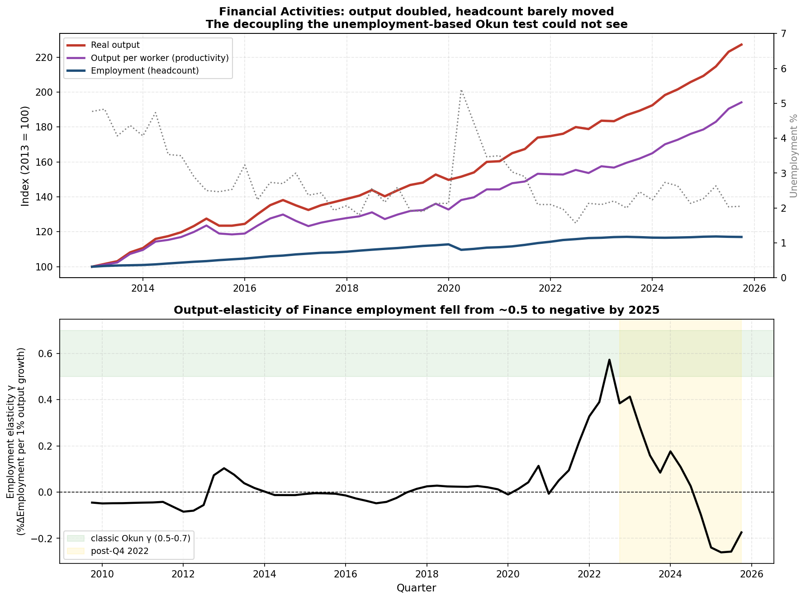
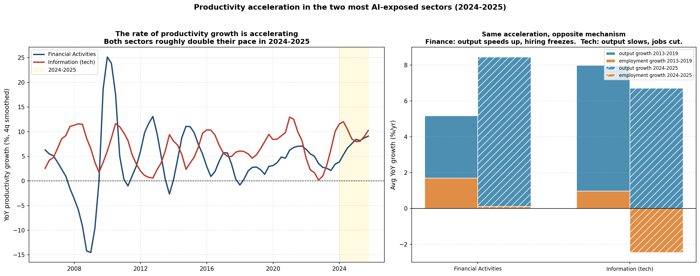

# Finance re-examined with employment

**A separate analysis from the [main AI-exposure study](../README.md).** The nine-phase analysis in the repository root measures Okun's law with the unemployment rate, and on that measure Finance looked like the calmest sector in the study. This folder shows that the unemployment rate was the wrong instrument for Finance, re-measures the sector on employment, and then asks whether the rate of productivity growth is actually speeding up.

Reproduce with `python3 finance_employment.py` and `python3 productivity_acceleration.py`.

---

## Why the unemployment test was blind to Finance

Everything in the main study measures Okun's law with the **unemployment rate**.

**The thing that did not add up.** Phase 3 put Financial Activities in the "law held or strengthened" column, one of the results that made the AI story look wrong. But Finance is the sector whose real output has nearly *doubled* since 2013 while its unemployment sat at rock bottom. A sector producing twice as much with a flat labor market is the single most vivid picture of "more output without more workers" in the whole dataset. Filing that under "the law held" felt backwards.

**The challenge that cracked it.** If output keeps rising while the labor measure stays flat, is that not the literal definition of Okun's law breaking? If so, calling Finance "held" is not a nuance, it is the wrong sign. That objection is correct, and running it down showed the test had been looking at the wrong variable the entire time.

**Why unemployment could not see it.** Okun's law says output up means unemployment down. Finance unemployment is welded to its structural floor, roughly 2 percent, the frictional minimum for a professional-services sector. Finance output grew about 7 percent a year since 2022; a normal Okun slope would drive unemployment down about 2.8 points a year. Finance unemployment went from 2.1 percent to 2.0 percent. It had nowhere left to fall. So the test read "no response" and scored it "held." The catch is that flat unemployment at full employment hides two opposite worlds: a sector hiring a lot of workers and absorbing them without adding to unemployment, or a sector hiring almost nobody while productivity soars. Unemployment cannot tell those apart. Employment can.

**Re-measuring on employment.** With the Financial Activities headcount, hours, and JOLTS series added to `../FRED-Data/`, the picture is unambiguous (2013 = 100):

| | 2013 | 2019 | 2025 |
|---|---:|---:|---:|
| Real output | 100 | 144 | **209** |
| Employment (headcount) | 100 | 111 | **117** |
| Output per worker | 100 | 130 | **179** |
| Unemployment | 4.8% | 2.6% | 2.3% (floored) |



Output more than doubled, headcount grew 17 percent, and output per worker rose 79 percent. Measured properly, this is the largest output-labor decoupling in the project, not the smallest. The formal version is the output-elasticity of employment, `%ΔEmployment = γ · %ΔOutput`, where classic Okun implies γ around +0.5 to +0.7:

- **Pre-2022 γ = +0.02.** Finance employment barely tracked output even before AI. Most of the decoupling is a long structural trend from the automation era, electronic trading and automated underwriting and back-office software, largely complete before our window opens.
- **The rolling γ then fell from about +0.5 in 2022 to −0.24 by 2025.** Output growth accelerated (5.2 to 7.0 percent a year) while employment growth slowed (1.7 to 1.1 percent a year). The link did not merely stay weak, it inverted, on the same 2024-2025 clock as the goods sectors.

**Honest caveats.** Finance real value added is a noisy output measure that includes imputed and market-linked value, so part of the doubling reflects financial conditions rather than more work, and the productivity gain is probably somewhat overstated. The output series is Finance and Insurance while the labor series are Financial Activities, which also includes Real Estate, so the coverage does not line up exactly. JOLTS is mixed rather than a clean hiring freeze: hires slipped from 2.5 to 2.2 percent while openings actually rose from 4.1 to 4.5 percent. And the post-2022 window is 13 quarters, so the negative elasticity is suggestive, not settled.

**Why this may matter more than the six phases.** The entire nine-industry cross-section, the result that produced the headline "AI exposure predicts *less* breakdown, which contradicts the AI story," was measured on unemployment. But the highest-AI sectors, Finance and Professional & Business, are exactly the low-unemployment service sectors where the unemployment test is saturated and cannot register a decoupling. Finance looked like "the law held" on unemployment and turns out to be the biggest decoupling in the dataset on employment. If the other high-AI service sectors hide the same thing, the wrong-direction correlation at the heart of Phase 3 could weaken or flip when the cross-section is rerun on the employment elasticity γ. That test is the next step.

---

## Is the rate of productivity growth increasing?

The section above shows output per worker rising, but a rising level is not surprising: productivity has climbed for as long as it has been measured. The sharper question is whether the **rate** of that climb is speeding up, and whether the speed-up is recent. It is.

Productivity growth is just the gap between output growth and employment growth:

```
productivity growth  =  output growth  −  employment growth
```

Measured that way for the two most AI-exposed sectors, both show their productivity growth roughly **doubling in 2024-2025**:

| Sector | Period | Productivity | = Output | − Employment |
|---|---|---:|---:|---:|
| Financial Activities | 2013-2019 | +3.4%/yr | +5.2% | +1.7% |
| Financial Activities | 2022-2023 | +3.5%/yr | +5.6% | +2.1% |
| Financial Activities | **2024-2025** | **+8.3%/yr** | +8.5% | +0.1% |
| Information (tech) | 2013-2019 | +6.9%/yr | +8.0% | +1.0% |
| Information (tech) | 2022-2023 | +5.1%/yr | +7.7% | +2.7% |
| Information (tech) | **2024-2025** | **+9.4%/yr** | +6.7% | −2.5% |



So the answer to the productivity question is yes, the rate is accelerating, and it is a 2024-2025 event that lines up with every other break in this project. But the decomposition on the right of the chart shows the two sectors get there by **opposite routes**, and the difference is the whole point:

- **Finance accelerates from the output side.** Output growth jumps from about 5.5 to 8.5 percent a year while hiring freezes at roughly zero. More is being produced, and almost no one is being added to produce it.
- **Tech accelerates from the labor side.** Output growth actually *slows* (7.7 to 6.7 percent) while employment goes negative, meaning tech is cutting jobs outright. Productivity rises because the denominator is shrinking.

Only the tech pattern, producing roughly the same output with fewer people, is the shape you would expect from labor-substituting AI. The finance pattern, producing much more with a flat headcount, is consistent with AI but also with a simpler story: a booming market inflating financial output. That ambiguity is exactly the caveat above, that Finance real value added is market-linked, so its productivity spike may partly be a 2024-2025 bull market rather than more real work done per person.

**What this adds.** Rising productivity by itself is never evidence of AI, because productivity always rises. A genuine signal would be the rate accelerating suddenly, and the acceleration coming from labor being shed rather than output booming. Finance shows the acceleration but through booming output. Tech shows the acceleration through actual job cuts. Tech is the cleaner candidate, which points the same direction as the rest of the project: the clearest labor-substitution signature sits in the Information sector, not across the AI-exposed sectors as a group.
