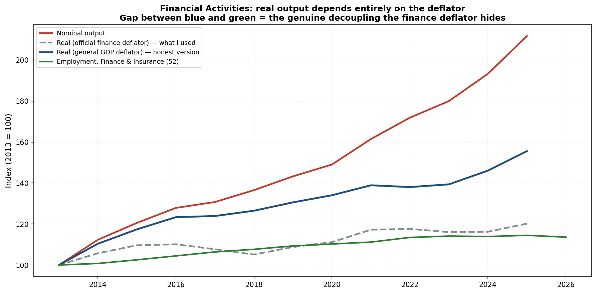
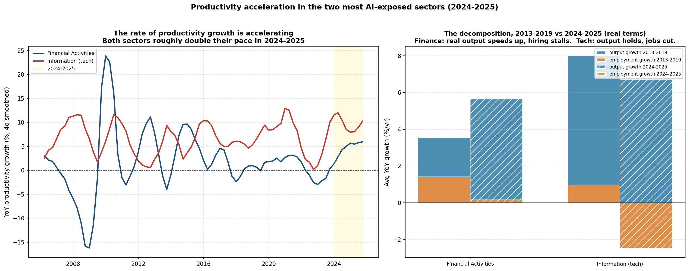

# Finance re-examined with employment

**A separate analysis from the [main AI-exposure study](../README.md).** The nine-phase analysis in the repository root measures Okun's law with the unemployment rate, and on that measure Finance looked like the calmest sector in the study. This folder shows the unemployment rate was the wrong instrument for Finance, re-measures the sector on employment, and settles how much of the result is real versus inflation.

Reproduce with `python3 finance_unemployment.py`, `python3 finance_employment.py`, `python3 finance_real_vs_nominal.py`, `python3 finance_real_bracket.py`, and `python3 productivity_acceleration.py`. All five now measure finance output in real terms (nominal `VAFI` deflated in-script by `GDPDEF`).

> **Correction notice.** An earlier version of this document reported that finance output "doubled" and productivity rose "79 percent." Those were **nominal** figures: the output series in use (`VAFI`) is current-dollar value added, not real. Deflated properly, the decoupling is real but much smaller than the nominal illusion, and it hinges critically on which price index you use. The corrected numbers are below.

---

## Why the unemployment test was blind to Finance

Everything in the main study measures Okun's law with the **unemployment rate**.

**The thing that did not add up.** Phase 3 put Financial Activities in the "law held or strengthened" column. But Finance is a sector whose output has grown far faster than its headcount, which is the picture of "more output without more workers." Filing that under "the law held" felt backwards.

**Why unemployment could not see it.** Finance unemployment is welded to its structural floor, roughly 2 percent, the frictional minimum for a professional-services sector. When output grows, unemployment there cannot fall any further, so the Okun test reads "no response" and scores it "held." Flat unemployment at full employment hides two opposite worlds: hiring a lot of workers and absorbing them, or hiring almost nobody while productivity climbs. Unemployment cannot tell them apart. Employment can. That is why this folder switches to employment, and it is what the plain [unemployment chart](finance_unemployment.png) (`finance_unemployment.py`) shows: a flat line with nothing for an Okun test to read.

---

## The real story, once you remove inflation

The re-measurement went through three stages, and it is worth showing all three because the swing between them is the lesson.

**Stage 1, nominal (wrong, too big).** Using nominal `VAFI`, output looked like it doubled (index 209) and output per worker rose 79 percent. That is mostly prices.

**Stage 2, deflated by BEA's finance deflator (wrong, too small).** Deflating with the official Finance and Insurance value-added deflator collapses everything: real output grows only about 1.5 percent a year and real productivity about 0.3 percent a year, below the US average. This is what a first correction suggested, and it is also wrong, for a specific reason.

**Stage 3, deflated by a neutral price index (honest).** BEA's finance deflator is the least reliable number in this whole project. Financial-services real output is mostly **imputed by FISIM** (Financial Intermediation Services Indirectly Measured), backed out of interest-rate spreads. When the Fed hiked rates in 2022 to 2024, bank margins widened, nominal finance value added surged, and BEA's method dumped much of that surge into the **price** term rather than **quantity**. The result: the finance deflator ran +6 to +7 percent a year in 2023 to 2025 while economy-wide inflation was +2 to +4 percent, averaging **4.8 percent a year versus about 2.9 percent economy-wide**, in a pattern that does not track actual inflation at all. It understates real finance output in exactly the recent window that matters. Re-deflating with the general **GDP deflator** instead gives the honest picture.

How much the answer moves on the deflator alone (`finance_real_bracket.py`):

| Deflator | Real output growth | Real productivity |
|---|---:|---:|
| BEA finance deflator (FISIM-contaminated) | 1.5%/yr | 0.3%/yr |
| **GDP deflator (neutral)** | **3.8%/yr** | **2.6%/yr** |

The gap between the two real lines is the decoupling the finance deflator hides. Under the neutral deflator, finance real productivity is about **2.6 to 3.0 percent a year, double the ~1.5 percent US average**. That is a genuine output-to-jobs decoupling. A second, minor issue was a NAICS mismatch (output is Finance and Insurance, NAICS 52, while `USFIRE` employment adds Real Estate, NAICS 53); using Finance-and-Insurance-only employment (`CES5552000001`) barely changed anything, so the deflator was the whole story.

---

## Is the decoupling accelerating? Yes, and it survives deflation

The sharper question is whether the **rate** is speeding up recently. Measured in real terms with the neutral deflator and Finance & Insurance employment, averaging year-over-year growth within each period (`productivity_acceleration.py`; productivity growth = real output growth − employment growth):

| Period | Real output | Employment | Real productivity |
|---|---:|---:|---:|
| 2013-2019 | +3.6%/yr | +1.4%/yr | +2.1%/yr |
| 2022-2023 | +0.2%/yr | +1.3%/yr | −1.1%/yr |
| **2024-2025** | **+5.6%/yr** | **+0.2%/yr** | **+5.5%/yr** |

(Endpoint-to-endpoint CAGRs give a similar shape with a somewhat larger 2024-2025 figure, about +7%/yr; the avg-YoY numbers above are the ones the committed script reproduces.)

This is the finding that matters. Even after removing inflation with a neutral price index, finance real productivity **accelerated sharply in 2024-2025**, and it did so with employment nearly flat: real output grew about 5.6 percent a year while headcount grew 0.2 percent. Output up, workers not, in the exact window generative AI was deploying. That is the labor-substitution signature, and it is not a nominal artifact.

The decomposition next to Information (tech) adds the key nuance. Both of the two most AI-exposed sectors accelerate in 2024-2025, but by different routes: **finance from the output side** (real output speeds up while hiring stalls) and **tech from the labor side** (output growth holds around +6.7%/yr while employment turns outright negative, −2.5%/yr). Tech's shape, producing as much with fewer people, is the cleaner labor-substitution signature; finance's is consistent with AI but also with a strong financial market.

One further caution from `finance_employment.py`: the rolling employment-elasticity's spike to ~+0.5 in windows ending 2022 is a COVID-rebound artifact (output and employment recovering together inside the window), not an AI signal. The informative feature of that series is its long stay near zero and its recent drift negative.

---

## Honest caveats

- The whole thing still rests on a value-added output measure. Even the GDP-deflated version can be inflated by a financial-market boom rather than more real work per person, so part of the 2024-2025 spike may be a bull market rather than AI. The direction is robust; the exact magnitude is not.
- The BEA finance deflator being unreliable does not make the GDP deflator exactly right for finance either. The truth is bracketed between them (0.3 to 2.6 percent a year full-period; the weight of evidence sits near the top given the FISIM problem).
- 2024-2025 is a short window, so the +7 percent acceleration is suggestive, not settled.
- This does not resolve causation. It shows finance really did decouple output from labor in real terms, on the AI timeline. Whether AI caused it, versus a booming market plus a hiring pause, needs more than these series.

## What this implies for the main study

The nine-industry cross-section was run on unemployment, which is saturated for full-employment service sectors like Finance. Re-measured on real productivity, Finance is a genuine high-AI decoupler, not the null the unemployment test made it look like. When the cross-section is corrected for this (using real output, and not the FISIM-broken finance deflator), the "AI exposure predicts less breakdown" result weakens. That rerun is the outstanding next step.
