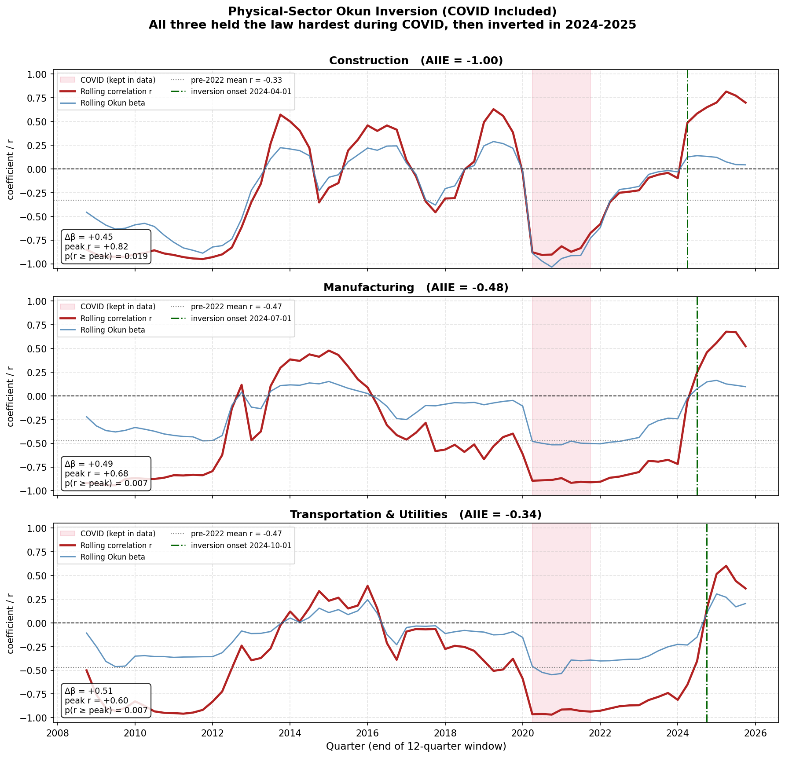

# Physical-Sector Okun Inversion

**A separate analysis from the [AI-exposure study](../README.md) in the repository root.**

This sub-project does not use AI-exposure scores or an "AI cutoff." It asks one narrow, self-contained question about three low-AI, goods-producing and rate-sensitive sectors:

**Construction, Manufacturing, and Transportation & Utilities**

> When did each sector's Okun relationship actually invert, and how unusual is that inversion when the pandemic is left in the data?

The one deliberate difference from the root study: **COVID is included here, not excluded.** Leaving the pandemic in is the entire point. It reveals that COVID was the most Okun-consistent episode in the whole sample, and that the real inversions are recent, arriving in 2024 and 2025.

## What Okun's Law is, in one line

When an economy (or a sector) produces more, it usually hires more, so unemployment falls. Measured as a slope: when output growth goes up, the change in unemployment should go down. A negative slope means the rule holds. A positive slope means it has inverted, meaning output grew but unemployment rose anyway.

## Method

- **Difference form:** regress the 4-quarter (year-over-year) change in the sector's unemployment rate on the year-over-year percent change in its real output. YoY differencing cancels the seasonality in the not-seasonally-adjusted sector unemployment series.
- **Rolling window:** re-estimate the slope (beta) and its correlation (r) on every trailing 12-quarter window, so the relationship's stability over time is visible.
- **COVID kept:** no quarters are dropped. The 2020-2021 window is shaded on the chart for context only.
- **Probability test:** for each sector, fit a normal distribution to its own pre-2022 rolling correlations (a baseline that itself includes the deep COVID negatives), then ask how likely the recent peak correlation would be under that historical distribution. This mirrors the aggregate test in the root study.

## The result



| Sector | AIIE | Held through COVID (rolling r) | Inversion onset | Peak r | p(r ≥ peak) | Δβ (pre → post 2022) |
|---|---:|---|---|---:|---:|---:|
| Construction | −1.00 | −0.68 to −0.91 | 2024 Q2 | +0.82 | 0.019 | +0.45 |
| Manufacturing | −0.48 | −0.87 to −0.92 | 2024 Q3 | +0.68 | 0.007 | +0.49 |
| Transportation & Utilities | −0.34 | −0.91 to −0.97 | 2024 Q4 | +0.60 | 0.007 | +0.51 |

Read each panel left to right. All three lines sit negative for most of history, plunge to their most negative values *during* COVID (the pink band), and only climb above zero in 2024. The green line marks where each sector's correlation turns positive and stays positive.

## What this shows

**During COVID, the law held harder than ever.** In 2020 and 2021 output collapsed and jobs vanished together, then both recovered together. That is textbook Okun behavior, and it drove the rolling correlation to between −0.68 and −0.97 across the three sectors. Whatever inverted these sectors, it was not the pandemic.

**The inversion is a 2024-2025 event.** Construction turns first (2024 Q2), then Manufacturing (2024 Q3), then Transportation (2024 Q4). By 2025 all three reach correlations between +0.60 and +0.82, meaning output kept climbing while unemployment climbed with it. Under each sector's own pre-2022 history, a positive correlation that large has a probability between 0.007 and 0.019.

**The timing rules things out.** Because the inversion arrives in 2024, it is far too late to be a direct COVID effect, and it postdates the late-2022 arrival of generative AI by roughly two years. It lines up instead with two forces that peaked in 2023-2025: federal infrastructure and industrial spending actually flowing into projects, and interest rates held high for an extended stretch.

## What this does not show

- **The sample is very short.** Each inversion rests on only four to six quarters of post-onset data. The confidence around every number here is wide.
- **Overlapping windows.** Consecutive 12-quarter windows share most of their data, so the reported probabilities are somewhat optimistic. Treat them as directional.
- **No cause is established.** This analysis dates the inversion and measures how unusual it is. It does not yet test any explanation for it.

## Causes to explore next

The natural next step, and the reason these three sectors were pulled out together, is that all three are physical, capital-intensive, and low on AI exposure, which points away from the technology story and toward two candidates:

1. **Federal fiscal spending.** The Infrastructure Investment and Jobs Act (2021), CHIPS Act (2022), and Inflation Reduction Act (2022) directed large sums into exactly these sectors. Money committed in 2021-2022 shows up as actual construction and manufacturing output in 2023-2025, which can raise output without proportional hiring when projects are capital-heavy or labor-constrained. A fiscal-exposure control per sector (federal outlays by NAICS from USAspending.gov) would test this directly.
2. **The sustained high-rate environment.** Rate-sensitive sectors can keep producing on already-financed backlogs while new hiring stalls, which would loosen the output-to-jobs link with a lag.

These are hypotheses to test, not findings. This document exists to establish the pattern cleanly first.

## Reproducing this

From this directory:

```
python3 rolling_okun_inversion.py
```

It reads the FRED CSVs from `../FRED-Data/` and writes `rolling_okun_inversion.png` plus the console table above. Requires `pandas`, `numpy`, `matplotlib`, and `scipy`.
