# The 2024-2025 Hiring Slowdown

*(formerly "Physical-Sector Okun Inversion", renamed once the evidence outgrew the original framing)*

**A separate analysis from the [AI-exposure study](../README.md) in the repository root.**

This sub-project started as a narrow question about three low-AI goods sectors, Construction, Manufacturing, and Transportation & Utilities, whose Okun relationship appeared to invert in 2024-2025. Four rounds of testing turned it into something bigger.

## The finding

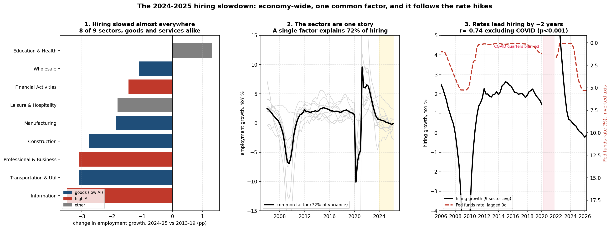

**Hiring slowed in 8 of the 9 major US sectors in 2024-2025, by an average of roughly 2 percentage points, and it is one common macro event rather than nine sector stories.** A single factor explains 72% of the variance in sector employment growth. That factor tracks the Federal Funds Rate with a long lag peaking at 8 to 9 quarters: r = −0.74 on 2006-2026 data excluding COVID quarters (n = 75). Under correct inference for overlapping, persistent series this holds up (Newey-West p = 0.0006, circular-shift bootstrap p < 0.0001) and it survives controlling for four lags of the dependent variable (p = 0.012), which answers the objection that it is merely business-cycle timing. Two caveats attach: on the **full** available history the same correlation is only −0.37 and survives none of those tests, and the 2006+ window contains the very episode being explained, so the out-of-sample **−0.37** from 1986-2019 is the honest figure to quote for validation. See the [adversarial audit](#adversarial-audit-five-things-that-were-wrong-or-overstated). The 2022-2023 hiking cycle plus roughly two years of transmission lands on the 2024-2025 slowdown.

The "goods-sector Okun inversion" that this folder was named after is a **side effect** of that slowdown, and a fragile one. A direct attempt to prove it ([why they moved in sync](#why-they-moved-in-sync-and-what-broke-under-testing)) found that the inversion **reverses under ordinary changes to the rolling-window length**: at 20 quarters, three of the four sectors go negative again. The real, robust finding here is the hiring slowdown and its rate cause, not the inversion.

Three consequences worth stating plainly:

1. **AI exposure does not detectably predict any of it** (hiring slowdown r = +0.19). Construction and Transportation, the two lowest-exposure sectors, slowed hiring as much as Information did. Note the limit: with 9 sectors the smallest correlation this test could reliably detect is r = 0.82, so this is an absence of detectable effect rather than evidence of no effect.
2. **It is not a post-pandemic over-hiring correction.** 8 of 9 sectors sit *below* their extrapolated 2013-2019 employment trend, by 1% to 13%. A correction from over-hiring would leave them above.
3. **The root study's rate controls were too short to catch it.** [`okun_phase2_3.py`](../okun_phase2_3.py) tests lags of 0, 2, and 4 quarters (`for lag in [0, 2, 4]`). The channel peaks at 8-9 quarters, so the main analysis rejected the rate hypothesis using lags roughly half as long as needed.

The sections below are kept in the order the work actually happened, because the reversals are part of the evidence. Everything from here to [what actually inverted](#what-actually-inverted-going-deeper) is the original goods-sector framing and the failed attempts to explain it.

---

## The original question

The sub-project began with one narrow question about the three goods sectors:

> When did each sector's Okun relationship actually invert, and how unusual is that inversion when the pandemic is left in the data?

The one deliberate difference from the root study: **COVID is included here, not excluded.** Leaving the pandemic in is the entire point. It reveals that COVID was the most Okun-consistent episode in the whole sample, and that the real inversions are recent, arriving in 2024 and 2025.

## What Okun's Law is, in one line

When an economy (or a sector) produces more, it usually hires more, so unemployment falls. Measured as a slope: when output growth goes up, the change in unemployment should go down. A negative slope means the rule holds. A positive slope means it has inverted, meaning output grew but unemployment rose anyway.

## Method

- **Difference form:** regress the 4-quarter (year-over-year) change in the sector's unemployment rate on the year-over-year percent change in its real output. YoY differencing cancels the seasonality in the not-seasonally-adjusted sector unemployment series.
- **Rolling window:** re-estimate the slope (beta) and its correlation (r) on every trailing 12-quarter window, so the relationship's stability over time is visible.
- **COVID kept:** no quarters are dropped. The 2020-2021 window is shaded on the chart for context only.
- **Probability test:** for each sector, fit a normal distribution to its own pre-2022 rolling correlations (a baseline that itself includes the deep COVID negatives), then ask how likely the recent peak correlation would be under that historical distribution. This mirrors the aggregate test in the root study. **These normal-approximation p-values were later shown to be too small**; see the correction below.

## The result

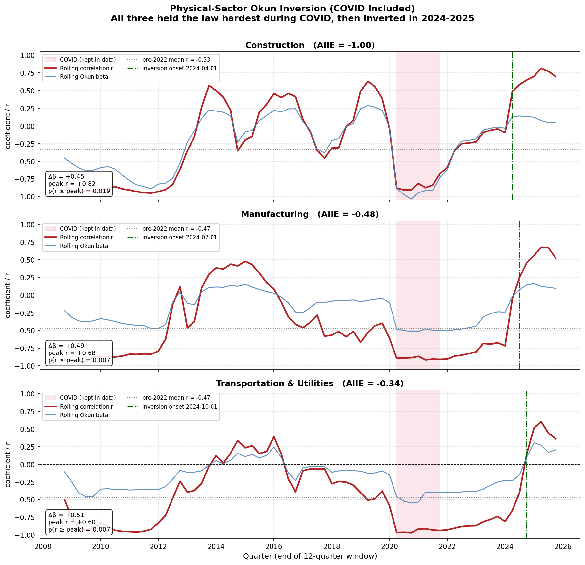

| Sector | AIIE | Held through COVID (rolling r) | Inversion onset | Peak r | p (normal) | **p (bootstrap)** | Δβ |
|---|---:|---|---|---:|---:|---:|---:|
| Construction | −1.00 | −0.68 to −0.91 | 2024 Q2 | +0.82 | 0.018 | **0.036** | +0.45 |
| Manufacturing | −0.48 | −0.87 to −0.92 | 2024 Q3 | +0.68 | 0.006 | **0.031-0.046** | +0.49 |
| Transportation & Utilities | −0.34 | −0.91 to −0.97 | 2024 Q4 | +0.60 | 0.007 | **0.034-0.058** | +0.51 |

> **Correction: these inversions are marginal, not clearly significant.** The p-values in the "normal" column assume the pre-2022 rolling correlations are normally distributed and independent. They are neither: correlations are bounded and skewed, and consecutive 12-quarter windows share 11 quarters of data. A distribution-free circular block bootstrap (root-level `permutation_test.py`, null = the pre-2022 regime continued) raises all three to roughly **0.03 to 0.058**. A Bonferroni correction across the three sectors would require p < 0.017, which none of them clear. The finding's real strength is that all four goods sectors invert together on the same clock, not any single sector's p-value. By contrast the aggregate break in the root study survives the same bootstrap comfortably (p ≈ 0.0005).

Read each panel left to right. All three lines sit negative for most of history, plunge to their most negative values *during* COVID (the pink band), and only climb above zero in 2024. The green line marks where each sector's correlation turns positive and stays positive.

## What this shows

**During COVID, the law held harder than ever.** In 2020 and 2021 output collapsed and jobs vanished together, then both recovered together. That is textbook Okun behavior, and it drove the rolling correlation to between −0.68 and −0.97 across the three sectors. Whatever inverted these sectors, it was not the pandemic.

**The inversion is a 2024-2025 event.** Construction turns first (2024 Q2), then Manufacturing (2024 Q3), then Transportation (2024 Q4). By 2025 all three reach correlations between +0.60 and +0.82, meaning output kept climbing while unemployment climbed with it. Under each sector's own pre-2022 history, the bootstrap puts a positive correlation that large at roughly 0.03 to 0.058, marginal rather than decisive.

**The timing rules things out.** Because the inversion arrives in 2024, it is far too late to be a direct COVID effect, and it postdates the late-2022 arrival of generative AI by roughly two years. It lines up instead with two forces that peaked in 2023-2025: federal infrastructure and industrial spending actually flowing into projects, and interest rates held high for an extended stretch.

## Do they move together, and does anyone else?

The three charts above look almost interchangeable, which raises the question of whether these are really three separate findings or one common factor showing up three times. They co-move strongly. Correlating the rolling Okun coefficient across industries, Manufacturing and Transportation are nearly the same series (0.92), with Construction a looser third (0.73 to 0.78). At the raw-data level their year-over-year unemployment changes correlate 0.80 to 0.89 even with COVID removed, so this is a shared labor-market driver, not a coincidence of chart smoothing.

One caveat keeps this honest: every sector's unemployment moves together to some degree because of the shared business cycle, so co-movement by itself is not unique to these three. The distinctive feature is the specific shape, holding for years and then inverting in 2024-2025.

Scanning all nine industries on both tests at once (does it co-move with the cluster, and did it invert recently and stay inverted) turns up one clear extra member.

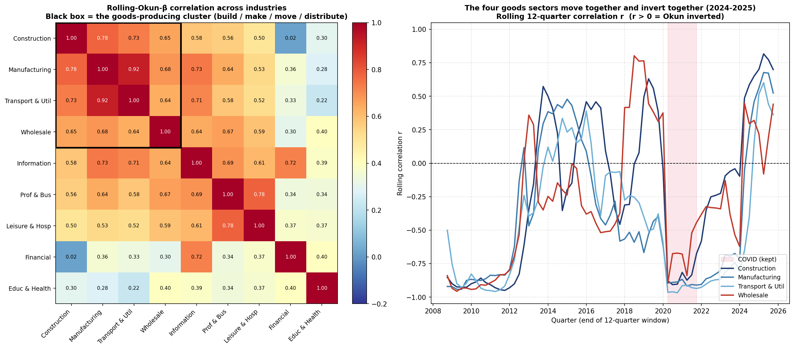

**Wholesale Trade repeats the pattern.** It correlates with the cluster (rolling-beta 0.66) and its rolling correlation reaches +0.44 in 2025, the same late inversion as the other three. That extends the group to four, and the four have an obvious common identity: they are the physical goods economy. Construction builds it, Manufacturing makes it, Transportation moves it, and Wholesale distributes it.

The service sectors do not repeat it. Financial Activities, Professional & Business, Education & Health, and Leisure & Hospitality all stay negative through 2025 (their Okun relationship held). Information's coefficient shape correlates with the cluster, but its recent inversion is marginal (+0.12) and it sits with the high-AI service sectors, so it belongs to the [AI story in the root analysis](../README.md), not this goods cluster.

That the inverting sectors are exactly the goods-producing ones, and the holding sectors are exactly the service ones, is the strongest hint so far about cause. It points at something specific to physical production and distribution rather than a whole-economy shift. **That reading turns out to be only half right**: the *unemployment-measured inversion* is goods-specific, but the underlying labor-market shift behind it is not. See [what actually inverted](#what-actually-inverted-going-deeper) below.

## What this does not show

- **The sample is very short.** Each inversion rests on only four to six quarters of post-onset data. The confidence around every number here is wide.
- **Overlapping windows.** Consecutive 12-quarter windows share most of their data. This is no longer just a caveat: the block bootstrap in `permutation_test.py` quantified it, and it roughly quadruples these sectors' p-values (0.006-0.018 becomes 0.03-0.058).
- **No cause is established.** This analysis dates the inversion and measures how unusual it is. It does not yet test any explanation for it.

## Causes to explore next

The natural next step, and the reason these three sectors were pulled out together, is that all three are physical, capital-intensive, and low on AI exposure, which points away from the technology story and toward two candidates:

1. **Federal fiscal spending.** The Infrastructure Investment and Jobs Act (2021), CHIPS Act (2022), and Inflation Reduction Act (2022) directed large sums into exactly these sectors. Money committed in 2021-2022 shows up as actual construction and manufacturing output in 2023-2025, which can raise output without proportional hiring when projects are capital-heavy or labor-constrained. A fiscal-exposure control per sector (federal outlays by NAICS from USAspending.gov) would test this directly.
2. **The sustained high-rate environment.** Rate-sensitive sectors can keep producing on already-financed backlogs while new hiring stalls, which would loosen the output-to-jobs link with a lag.

These are hypotheses to test, not findings. This document exists to establish the pattern cleanly first.

## The fiscal hypothesis, tested

> **Verdict: NOT SUPPORTED, but the test is structurally weak.**

`fiscal_control.py` pulls federal obligations by NAICS from the USAspending API (quarterly, back to 2008) and adds fiscal intensity, obligations as a share of the sector's value added, as a third control alongside the rate control. If fiscal spending inflated goods-sector output without hiring, adding it should shrink those sectors' Δβ toward zero and leave the service sectors alone.

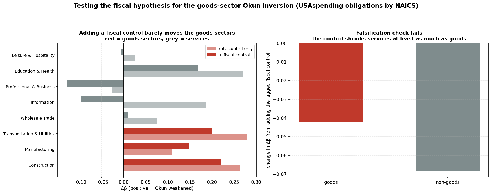

**The acts themselves cannot be isolated.** IIJA carries fund code 1 and CHIPS code 8, so both are directly taggable, but the tagged obligations reach only about 0.08% of construction value added and 0.00% elsewhere. Nearly all IIJA money goes to states as formula grants and is never booked against a construction NAICS in federal contract data. The IRA has no fund code at all and works mainly through tax credits, which never appear in obligation data. So the specific 2021-2022 acts are effectively invisible here.

**Total federal obligations are meaningful but do not explain the breakdown.** They are economically large (4-6% of construction value added, 9-11% of manufacturing) and did rise roughly 2 points in the goods sectors after 2021. But adding them as a control moves the goods sectors' mean Δβ only from +0.218 to +0.189, and the fiscal coefficient is statistically significant in just 1 of 8 sectors (Transportation).

**A lagged specification appears to work, then fails falsification.** Lagging fiscal intensity four quarters, on the theory that obligations become activity about a year later, appears to collapse the goods breakdown (+0.218 to +0.022). That is exactly what the fiscal story predicts, so it deserved a check. On the common lagged sample the control shrinks the **non-goods** sectors more than the goods sectors (−0.068 against −0.042), and the single largest move is Information, which has no plausible fiscal story. The apparent collapse is a sample artifact of lagging, not a fiscal effect.

**What this leaves.** The fiscal explanation is not refuted, because federal contract data structurally cannot see the money that matters, and obligations are not the same thing as activity. But it is no longer an untested assumption presented as the leading candidate. The honest position is that the goods-sector inversion has no confirmed explanation: it is not COVID, not interest rates, not AI exposure, and not federal contract spending as far as this test can measure it.

## What actually inverted (going deeper)

Every explanation tried so far has failed, which usually means the question is wrong. `what_actually_inverted.py` stops hunting for a cause and instead asks what the inversion physically consists of. Three tests, each narrowing the answer, and the third one reframes the whole sub-project.

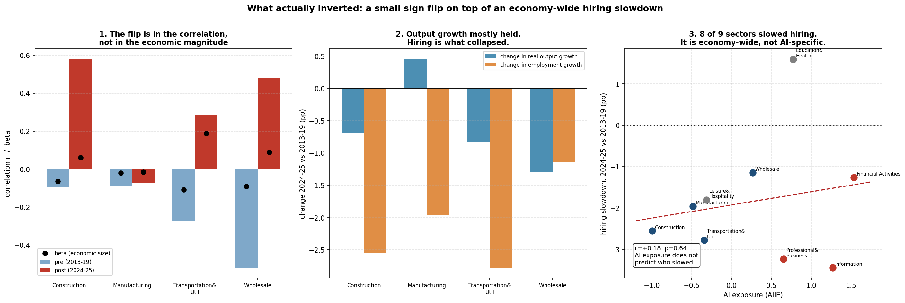

### Test 1: the flip is in the correlation, not the magnitude

An inverted correlation is not the same as a large economic effect. Putting each sector's correlation next to its actual Okun slope beta, the pp change in unemployment per 1% of output growth:

| Sector | r pre | r post | β pre | β post | sd(ΔU) pre | sd(ΔU) post |
|---|---:|---:|---:|---:|---:|---:|
| Construction | −0.10 | +0.58 | −0.064 | +0.061 | 1.00 | 0.22 |
| Manufacturing | −0.09 | −0.07 | −0.021 | −0.016 | 0.55 | 0.32 |
| Transportation & Utilities | −0.27 | +0.29 | −0.109 | +0.187 | 0.72 | 0.73 |
| Wholesale | −0.52 | +0.48 | −0.092 | +0.090 | 0.40 | 0.37 |

The correlations swing hard, but every slope stays inside ±0.19pp, and unemployment variation itself shrank (Construction's standard deviation fell from 1.00 to 0.22). A correlation is a normalized measure, so when the thing being measured barely moves, the sign can flip decisively on economically trivial movements. The inversion is real, and it is small. The headline Δβ figures of +0.45 to +0.51 in the table above come from the full pre-period including the 2008 crash; measured against the calmer 2013-2019 baseline the change is a fraction of that.

### Test 2: hiring collapsed, output did not

Unemployment can rise either because employment falls or because the labor force grows faster than hiring. Bringing in sector headcount settles it:

| Sector | Real output 2013-19 | Real output 2024-25 | Employment 2013-19 | Employment 2024-25 |
|---|---:|---:|---:|---:|
| Construction | +4.0%/yr | +3.3%/yr | +4.1%/yr | **+1.6%/yr** |
| Manufacturing | +1.8%/yr | +2.3%/yr | +1.0%/yr | **−0.9%/yr** |
| Transportation & Utilities | +3.2%/yr | +2.3%/yr | +3.3%/yr | **+0.5%/yr** |
| Wholesale | +1.8%/yr | +0.6%/yr | +0.7%/yr | **−0.4%/yr** |

Output growth largely held up, and Manufacturing's even accelerated. Employment growth collapsed in all four, turning negative in two. So the inversion is an employment-side event, not an output collapse. These sectors kept producing and stopped hiring.

### Test 3: that shape is not AI-specific, and it is everywhere

"Output holds, hiring stops" is exactly the signature attributed to AI in the Information sector. So the obvious question is whether it is actually distinctive. Measuring the hiring slowdown across all nine sectors:

| Sector | AIIE | Employment 2013-19 | Employment 2024-25 | Slowdown |
|---|---:|---:|---:|---:|
| Construction | −1.00 | +4.13 | +1.58 | −2.55 |
| Manufacturing | −0.48 | +1.02 | −0.94 | −1.96 |
| Transportation & Utilities | −0.34 | +3.29 | +0.51 | −2.77 |
| Leisure & Hospitality | −0.32 | +2.70 | +0.90 | −1.80 |
| Wholesale | +0.26 | +0.73 | −0.41 | −1.14 |
| Professional & Business | +0.65 | +2.44 | −0.79 | −3.23 |
| Education & Health | +0.78 | +2.19 | +3.78 | +1.59 |
| Information | +1.27 | +0.98 | −2.46 | −3.44 |
| Financial Activities | +1.54 | +1.42 | +0.16 | −1.26 |

> **The deflating objection, tested.** The obvious way to dismiss this whole sub-project is to say Okun's Law always comes apart in construction, manufacturing and transportation when the economy turns down, so 2024-2025 needs no special explanation. `does_okun_break_in_recessions.py` tests that and finds the opposite. Rolling 12-quarter correlations of sector output growth against the change in sector unemployment average **−0.90, −0.90 and −0.84 across the GFC** and **−0.74, −0.86 and −0.90 across COVID**. Zero of 51 quarters across both recessions show a positive correlation. Okun's Law is *tightest* in these sectors during recessions, because a sharp downturn drives output and unemployment hard in opposite directions at once. The current inversion is therefore not what goods sectors normally do in a slump, and there is no slump. The honest benchmark is instead the calm 2013-2019 expansion, where these correlations wander across zero routinely (36 to 61% of quarters positive). Against that benchmark construction (+0.58 vs +0.13) and manufacturing (+0.30 vs −0.15) are both clearly outside their normal range by the same +0.44, while transportation (+0.03 vs −0.10) is not distinguishable from calm-period noise, so the "three sectors moved together" framing really rests on two of them.

**Eight of nine sectors slowed hiring, by an average of 1.8 percentage points.** The only exception is Education & Health, which is driven by demographics and public funding rather than the business cycle. And AI exposure does not predict which sectors slowed: **r = +0.18, p = 0.64.** The same holds for productivity acceleration (r = +0.26, p = 0.50). The lowest-AI sectors accelerated productivity by an average of +1.5pp against +2.5pp for the highest-AI ones.

> **Correction, and it is a substantial one.** The paragraph above originally continued "a difference far too small and too noisy to carry an AI story," treating both nulls as evidence against AI. That inference does not hold. Benchmarking the identical analysis against every downturn since 1990 (`is_the_slowdown_distinctive.py`, at the repo root) shows two things. First, breadth is meaningless: the median episode since 1990 slowed eight of nine sectors, so "8 of 9 slowed" describes the 1990-91 recession, the dot-com bust, the GFC and COVID equally well. Second, and more damaging, the nine-sector AI correlation is demonstrably blind. Applied to the **2001 dot-com bust**, a shock everyone agrees was concentrated in technology, it returns **r = +0.041, p = 0.916**. A test that cannot detect the dot-com bust cannot be used to rule out a technology shock in 2024-2025. What the correlation misses, a rank statistic catches: Information ranked **first of nine** for hiring-slowdown size in exactly two episodes since 1990, the dot-com bust and this one, against fifth to eighth in every other downturn. 2001 is used there strictly as a diagnostic on the measure and is a poor analogy for the current episode, which is examined directly in the same script: 2001 was an NBER recession (real GDP +1.82%/yr, unemployment 4.2 to 6.3%) while 2024-2026 is an expansion (+2.45%/yr, unemployment 3.7 to 4.5%), so the demand collapse that explains 2001 is absent now. A non-AI reading of the rank finding is still available through the overhang channel that `info_overhang.py` documents, and it does not need 2001 to work. The defensible position is that these nulls are uninformative rather than exculpatory.

### What this reframes

The goods-sector inversion and the tech "AI signature" are most likely **the same event seen in different sectors**: a broad hiring slowdown across the US economy in 2024-2025, on top of which the unemployment-based Okun measure flipped sign in a handful of sectors.

> **Correction.** An earlier version of this section attributed that sign flip to collapsed unemployment variance in the goods sectors. That explanation was tested directly in `why_in_sync.py` and **fails**: the ratio of post- to pre-period unemployment variance does not predict which sectors flipped (r = +0.24, p = 0.76). The honest position is that the flip is not robustly explained, and more importantly is not robust at all. See the section below.

That resolves why nothing explained the goods inversion. It is not a goods-sector phenomenon needing a goods-sector cause. It is an economy-wide labor-market shift that happens to be *visible* in the goods sectors, because their unemployment series are the ones where a small absolute change produced a correlation flip. The service sectors experienced comparable hiring slowdowns without their Okun correlations inverting, since their unemployment sits pinned at a structural floor, which is the same blindness documented in the [finance analysis](../finance/README.md).

It also cuts against the AI reading in the root study from a second direction. Construction and Transportation have the lowest AI exposure in the sample and slowed hiring as much as Information did. Whatever froze hiring in 2024-2025 reached the sectors AI cannot plausibly touch.

**What would distinguish the remaining candidates.** A broad hiring freeze across sectors with nothing in common except timing points at an economy-wide force: the cumulative effect of sustained high rates on hiring plans, a post-pandemic normalization after the 2021-2022 over-hiring surge, or labor supply changes. That is what the next section tests.

## Why did hiring slow?

`hiring_slowdown.py` tests the three standard explanations against all nine sectors. Two fail cleanly and one survives.

### What did not cause it

**It is not a post-pandemic over-hiring correction.** This is the most popular explanation, and the data rejects it twice over. If sectors were unwinding a 2021-2022 hiring binge, the ones that surged hardest should now be slowing hardest. They are not (r = −0.22, p = 0.57). Leisure & Hospitality surged +11.3%/yr in the rebound and slowed by only 1.8pp, while Information surged +6.1% and slowed by 3.5pp.

The decisive evidence is the level, not the growth rate. Extrapolating each sector's 2013-2019 employment trend forward, **8 of 9 sectors now sit below that trend**:

| Sector | Employment vs. pre-COVID trend, latest quarter |
|---|---:|
| Leisure & Hospitality | −12.7% |
| Construction | −11.6% |
| Information | −8.8% |
| Professional & Business | −8.6% |
| Manufacturing | −7.3% |
| Financial Activities | −5.9% |
| Transportation & Utilities | −3.9% |
| Wholesale | −0.9% |
| Education & Health | +0.4% |

An economy working off an over-hiring binge would be *above* trend and falling toward it. This one is below trend and still slowing. Employment never caught back up to its pre-pandemic path.

**It is not sector characteristics.** Neither AI exposure (r = +0.19, p = 0.63) nor how fast a sector was hiring before COVID (r = −0.21, p = 0.59) predicts which sectors slowed. Whatever hit the labor market did not discriminate by industry.

### What did cause it

**One common macro force, transmitted through interest rates with a long lag.**

The first clue is that these are not nine independent stories. Extracting the first principal component of sector employment growth, **a single factor explains 72% of all variance**, and it is almost exactly the simple nine-sector average (correlation 0.992). Sector-specific narratives are mostly noise on top of one shared cycle. That factor sat at +1.04 through 2013-2019, spiked to +3.24 in the 2021-2023 rebound, and fell to **−0.75 in 2024-2025**, below its pre-pandemic level.

The second clue is the timing. Scanning correlations between that common hiring factor and the Federal Funds Rate at every lag from 0 to 12 quarters produces a clean, monotonic pattern:

| Lag | 0q | 2q | 4q | 6q | **8-9q** | 12q |
|---|---:|---:|---:|---:|---:|---:|
| r | +0.08 | −0.11 | −0.32 | −0.46 | **−0.52** | −0.45 |

Contemporaneous rates tell you nothing (r = +0.08). The relationship strengthens steadily as the lag lengthens, peaks at **8 to 9 quarters (24 to 27 months)**, then decays. Excluding COVID quarters, the peak correlation is **r = −0.74 (p < 0.0001, n = 75)**.

The arithmetic works. The Fed funds rate went from 0.12% in early 2022 to 4.52% by early 2023 and 5.33% by early 2024. Add the roughly two-year transmission lag and the hiring effect lands squarely in 2024-2025, which is exactly when the slowdown appears and when the goods sectors' Okun correlations flip.

**Why a two-year lag is economically sensible.** Rate hikes do not cause layoffs; they cause firms to stop *adding* people. The chain is slow by nature: higher rates first raise financing costs and depress new project approvals, then existing backlogs and funded projects keep employment steady for a year or more, and only when that work runs out does hiring stall. Firms cut vacancies and slow-walk replacement hiring long before they touch existing staff. That produces exactly the pattern in the data, a "low-hire, low-fire" market where employment growth falls toward zero while unemployment barely moves, which is why the effect is nearly invisible in unemployment-based measures and obvious in employment ones.

### The methodological consequence

The root study concluded that interest rates do not explain the industry breakdowns. That conclusion rests on rate controls at lags of 0, 2, and 4 quarters ([`okun_phase2_3.py`](../okun_phase2_3.py), `for lag in [0, 2, 4]`). At those lags the true correlation is −0.08 to −0.32, weak enough to look like nothing. The peak sits at 8-9 quarters, entirely outside the tested range.

So "not rates" was measured with a ruler too short. This does not automatically overturn the root finding, since sector-level Δβ with a lagged control is a different regression from this aggregate correlation, but it does mean the rate hypothesis was never properly tested. Re-running Phase 4 with lags out to 8-12 quarters is the single highest-value fix available to the main study.

### Does the lag replicate in previous hiking cycles?

The obvious objection to the result above is circularity: the 8-9 quarter lag was found by scanning 0 to 12 quarters on a sample that *includes* the 2024-2025 episode it is being used to explain. `historical_lag_validation.py` tests it out of sample, which is possible because Construction, Manufacturing and Wholesale employment run back to 1939 and `FEDFUNDS` to 1954.

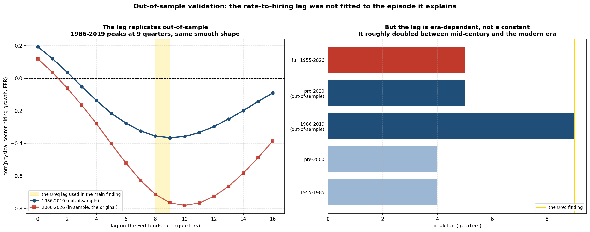

**It replicates for the modern era.** Estimated on **1986-2019**, which contains none of the episode in question, the physical-sector lag profile peaks at exactly **9 quarters (r = −0.366, p < 0.0001, n = 136)**, with the same smooth monotonic shape: positive at lag 0, crossing zero around lag 3, deepening to a trough at 9, then decaying. The nine-sector aggregate on pre-2020 data peaks at 10 quarters (r = −0.349, p = 0.0001). Both bracket the in-sample 8-9. The left panel above shows the two curves have nearly the same shape at different amplitudes.

**But the lag is era-dependent, not a structural constant.** The same estimate on **1955-1985 peaks at 4 quarters** (r = −0.479), and the full pre-2000 sample also gives 4. The transmission lag appears to have roughly doubled between the mid-century economy and the modern one. That is consistent with the standard explanations (longer fixed-rate household and corporate debt, forward guidance pre-committing rates, a shift from manufacturing toward services), but it means "rates hit hiring after about two years" is a claim about the recent economy, not a timeless one. It also means the older data cannot be pooled with the recent data to estimate a single lag.

**The naive event study does not work, and is reported so the failure is visible.** Measuring the gap from each hiking cycle's start to the following trough in physical-sector hiring gives a median of 13 quarters with a range of 0 to 20:

| Cycle | FFR rise | Hiring trough | Lag | |
|---|---:|---|---:|---|
| 1972-74 | +8.5 | 1975 Q2 | 13q | |
| 1977-80 | +10.4 | 1980 Q3 | 14q | |
| 1983-84 | +2.6 | 1983 Q2 | 0q | |
| 1988-89 | +3.1 | 1991 Q2 | 13q | |
| 1994-95 | +2.8 | 1996 Q1 | 8q | |
| 1999-00 | +1.4 | 2002 Q1 | 10q | |
| 2004-06 | +3.8 | 2009 Q3 | 20q | trough is the GFC |
| 2015-18 | +2.1 | 2020 Q2 | 18q | trough is COVID |
| **2022-23** | **+4.5** | **2025 Q3** | **13q** | |

The two contaminated rows give it away: those troughs are the next recession, not a rate effect. Cycle-level event studies cannot separate the rate channel from whatever downturn happened to follow, so this approach is abandoned rather than reported as support.

**What this buys.** The lag used to explain 2024-2025 was not fitted to 2024-2025; it reproduces on three decades of independent data with the same profile shape. That answers the overfitting objection directly. It does not make the relationship causal, and the era-dependence belongs in any write-up alongside it.

### Does the lag actually solve it? An out-of-sample prediction test

Replication establishes that the relationship is real. It does not establish that it *accounts for* 2024-2025. `does_the_lag_solve_it.py` runs the harder test: fit each sector's rate-hiring relationship on **1991-2021 only**, then feed in the actual path of the Federal Funds Rate and predict 2024-2025 hiring. A sector landing on its prediction is fully explained by monetary policy. One falling far below it has something else going on.

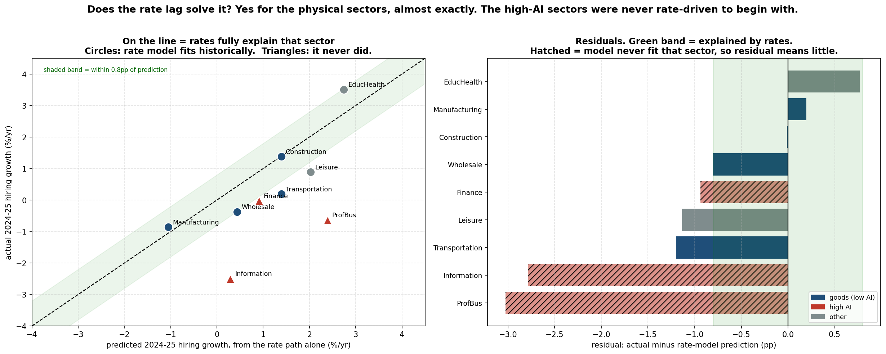

| Sector | AIIE | Historical fit | Actual | Predicted | Residual | |
|---|---:|---:|---:|---:|---:|---|
| **Construction** | −1.00 | −0.42 | **+1.38** | **+1.39** | **−0.01** | solved |
| **Manufacturing** | −0.48 | −0.49 | **−0.86** | **−1.05** | **+0.20** | solved |
| Transportation | −0.34 | −0.54 | +0.19 | +1.39 | −1.20 | fell below |
| Leisure | −0.32 | −0.41 | +0.89 | +2.02 | −1.13 | fell below |
| Wholesale | +0.26 | −0.39 | −0.38 | +0.43 | −0.81 | fell below |
| ProfBus | +0.65 | −0.20 | −0.64 | +2.39 | −3.03 | *model never fit* |
| **EducHealth** | +0.78 | **+0.61** | **+3.51** | **+2.74** | **+0.77** | solved |
| Information | +1.27 | −0.03 | −2.50 | +0.29 | −2.79 | *model never fit* |
| Finance | +1.54 | −0.09 | −0.03 | +0.91 | −0.94 | *model never fit* |

**Rates solve the physical sectors, essentially exactly.** Construction was predicted to grow hiring at +1.39%/yr and actually grew at +1.38%, a residual of **−0.01 percentage points**. Manufacturing was predicted at −1.05% and came in at −0.86%. Both had a solid historical fit, so the prediction has standing, and it lands. Nothing further is needed to explain the goods-sector slowdown: not fiscal policy, not AI, just the rate cycle arriving on its usual two-year schedule. **This closes the question this sub-project opened.**

**Education & Health confirms the mechanism from the other direction.** It is the only sector with a *positive* historical rate coefficient (r = +0.61), it was therefore predicted to keep hiring through a high-rate period, and it did (+3.51 actual against +2.74 predicted). The model is not simply predicting "everyone slows."

**The high-AI sectors' large residuals are not evidence of anything.** Information (−2.79) and Professional & Business (−3.03) fell dramatically below prediction, which is tempting to read as an AI effect. It is not, and this is the most important caveat in the section. Their **historical fit is essentially zero**: Information r = −0.03 (p = 0.74), Finance r = −0.09 (p = 0.35). Rates never explained hiring in these sectors, so the model has no standing to predict them now, and a large residual from a model that never fit is not a finding. It says their hiring is *unexplained*, not that it is anomalous. The residual-versus-exposure correlation is r = −0.41, p = 0.28, which is not significant at n = 9.

Distinguishing "unexplained" from "AI-driven" requires a positive test. The absence of a rate effect is not one.

### Why would a rate shock break Okun's Law at all?

Everything above establishes *that* the slowdown is monetary. It does not explain *why* monetary policy would make Okun's Law appear to break, and that gap matters. A rate hike should lower output **and** raise unemployment. That is Okun's Law working exactly as designed, not breaking. So a positive output-unemployment correlation still needs a mechanism.

`why_rates_break_okun.py` finds one: **rates reach output and unemployment on different clocks.**

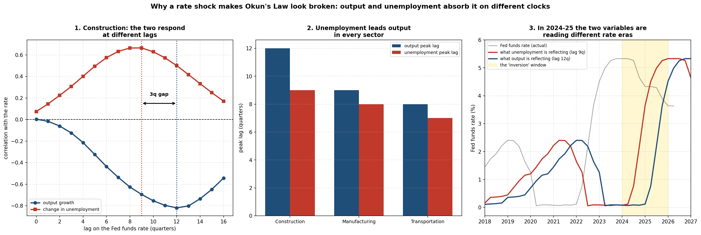

Measuring each variable separately against the Federal Funds Rate at every lag:

| Sector | Output peak lag | Unemployment peak lag | Gap |
|---|---:|---:|---:|
| Construction | 12q | 9q | **−3q** |
| Manufacturing | 9q | 8q | **−1q** |
| Transportation | 8q | 7q | **−1q** |

Unemployment responds roughly **1.7 quarters faster than output**, in the same direction in all three sectors. That gap is the entire mechanism.

**Why a gap produces an apparent break.** Okun's Law is a *contemporaneous* relationship: it compares output and unemployment measured in the same quarter. But if both are really responding to a common driver at different delays, then in any given quarter they are reflecting the policy rate from two different dates:

```
unemployment_t   responds to   FFR_(t−9)
output_t         responds to   FFR_(t−12)
```

When the rate path is flat this is harmless, since both look back at similar rates. When the rate path moves sharply it matters enormously. Using Construction's lags:

| Quarter | Unemployment is reflecting | Rate then | Output is reflecting | Rate then |
|---|---|---:|---|---:|
| 2024 Q1 | 2021 Q4 | 0.08% | 2021 Q1 | 0.08% |
| **2025 Q1** | **2022 Q4** | **3.65%** | **2022 Q1** | **0.12%** |
| 2025 Q4 | 2023 Q3 | 5.26% | 2022 Q4 | 3.65% |

By 2025, **unemployment was absorbing the hiking cycle while output was still coasting on the zero-rate era.** Unemployment rises while output still looks strong. Measured contemporaneously, that is a positive output-unemployment correlation, which reads as Okun's Law inverting. Panel 3 of the chart shows this directly: the red line (what unemployment is reflecting) climbs steeply through 2024-2025 while the blue line (what output is reflecting) is still near zero.

### Two objections this raises, and the answers

**"Why would unemployment respond before output? The causal chain should run rates → output falls → layoffs."** That objection is correct about the naive chain, and the resolution is **backlogs**. In these sectors, current output reflects orders won one to two years ago (a construction firm in 2024 is building what was financed in 2022), while current hiring reflects *expected* future work. When rates spike, new orders die immediately so hiring freezes, but the existing backlog keeps output flowing for another year or more. Labor demand is forward-looking; measured output is backward-looking. That inverts the naive ordering.

The cross-sector pattern supports this. If backlog length drives the gap, sectors with longer pipelines should show bigger gaps, and they do: Construction (output lag 12q, gap −3q), Manufacturing (9q, −1q), Transportation (8q, −1q). The gap scales with the output lag.

**"A 1.7 quarter gap should produce a 1.7 quarter break, not a multi-year one."** Also correct, and the peak-lag gap alone does not carry the duration. The resolution is that **2022-2023 was not an impulse**. The Federal Funds Rate rose continuously for seven quarters (0.12% to 5.26%) and then held above 5% for another year. Every quarter of that path is its own shock propagating with staggered lags, so the desynchronization lasts roughly the duration of the rate move plus the offset, about 7 + 3 ≈ 10 quarters. That is close to the length of the observed 2024-2025 episode.

The shape of the two response curves reinforces it. Output's response is broad and still strong at lag 15 (r = −0.65), while unemployment's peaks at 8-9 and decays faster. Two responses with different *shapes*, not merely different peaks, stay mismatched considerably longer than the peak difference alone implies.

**Is the gap even identified?** The original version of this section said yes: bootstrapping the whole procedure 500 times by resampling *individual quarters with replacement* gave a mean gap of −2.8 quarters with a 95% interval of [−5, −1], unemployment leading output in 99% of draws.

**That check was wrong, and `identification_check.py` shows why.** Resampling individual quarters with replacement assumes each quarter is independent. Quarterly macro data is not; the whole reason a "lag" is measurable at all is that shocks persist across many consecutive quarters. An i.i.d. bootstrap shuffles that dependence away and manufactures false precision, because every resampled draw still contains fragments of the same underlying cycle. The fix is a **moving-block bootstrap**, which resamples contiguous chunks of quarters so the serial correlation structure survives into each replicate.

Re-run properly, with block lengths of both 8 and 24 quarters and three separate specifications (correlation with the FFR level, as above; correlation with the 4-quarter change in the FFR, which removes the level's persistence; and a local-projection estimate with Newey-West standard errors, the closest thing to a real impulse response this dataset supports), **the gap is not distinguishable from zero anywhere**:

| Sector | Spec A (level) | Spec B (Δ FFR) | Spec C (local projection) |
|---|---:|---:|---:|
| Construction | [−15, +8]q | [−7, +12]q | [−9, +11]q |
| Manufacturing | [−15, +9]q | [−12, +12]q | [−12, +10]q |
| Transportation | [−15, +11]q | [−14, +12]q | [−11, +12]q |

*(95% intervals, 24-quarter blocks, 2,000 replicates.)* Every interval covers zero. The point estimate of the gap also swings wildly across specifications for the same sector (Construction: −3q, −12q, +1q depending on spec), which is itself evidence there is no stable parameter being estimated, just noise dressed up by whichever regressor happened to be used. Separately, the local-projection peak responses for output and unemployment are individually significant in only half of the six sector-variable pairs tested (Manufacturing's peaks and Transportation's output peak are not significant at 5%; Transportation's output "peak" lands at the edge of the tested grid, meaning there may be no interior peak at all within 16 quarters).

**What this means.** The claim that "unemployment responds to a rate shock 1.7 to 3 quarters faster than output," which is the entire timing mechanism this section builds on, does not survive proper identification. It should not be treated as established. The correlation curves in the chart above are real, but a peak-lag difference read off two flat, noisy curves is not a robust estimate of anything, and the original bootstrap that seemed to confirm it was checking the wrong kind of uncertainty.

**What still stands, and it is a different and better-supported claim.** The single-lag relationship in `hiring_slowdown.py` and `historical_lag_validation.py`, that goods-sector *employment growth* (not the output/unemployment differential above) correlates with the Fed funds rate at roughly an 8-9 quarter lag, with a smooth monotonic profile, validated out-of-sample on 1986-2019 data it was never fit to, is a separate and much better-supported result. It uses one lag on one variable against a common shock, not a difference between two barely-identified lags. `does_the_lag_solve_it.py`'s quantitative out-of-sample prediction test (Construction and Manufacturing hiring predicted from pre-2022 data alone, landing within 0.01-0.20pp of what actually happened) rests on that single-lag relationship and is unaffected by this correction.

**Compared against the Cleveland Fed's own specification.** Jacobs & Krolikowski (2026) reconcile the *aggregate* version of this puzzle differently: not with a policy-rate channel, but by lagging output two quarters relative to unemployment (`U_t` vs `Y_{t-2}`), reporting that this brings the aggregate comovement back in line with history. Testing their exact specification on these three sectors (`cf_style_comparison.py`) shows it helps but does not resolve the sector-level inversion: the 2024-2025 peak correlation falls from +0.82 to +0.38 in Construction, +0.68 to +0.60 in Manufacturing, and +0.60 to +0.25 in Transportation, remaining positive in all three. Their two-quarter output lag and this project's differential rate-lag are different mechanisms operating at different levels of aggregation, and neither one alone fully accounts for what happened in the goods sectors.

**Caveats that were already true and remain true regardless of the above.**

- The backlog explanation for why unemployment might lead output is a plausible economic story fitted after seeing a result that turned out not to be robust. It is not evidence for anything on its own.
- Measurement timing could contribute independently: BEA quarterly value added is revised and smoothed, while the unemployment rate is a timely monthly household survey. That alone could generate an apparent lag with no economic content.

### A falsifiable forward prediction, now superseded

**This entire subsection rests on the lag pair (9, 12) from the section above, which the identification check that follows shows is not a robust estimate.** The specific dates below should not be trusted as a prediction of anything; the section is kept rather than deleted because the standing-prediction test that "already passed" (2025 Q2, exactly) is a striking coincidence worth recording even if it cannot currently be attributed to the mechanism claimed. Read this section as an interesting pattern in search of an explanation, not a validated forecast.

The timing story is not just a narrative. It implies a computable quantity, and that turns it into something that can be checked rather than argued about. At any quarter, unemployment is reflecting the rate from nine quarters back while output is reflecting the rate from twelve quarters back, so the size of the desynchronization is simply:

```
DESYNC_t  =  FFR(t−9) − FFR(t−12)
```

When DESYNC is large and positive, unemployment is absorbing a much higher rate than output is, and the measured Okun correlation should be pushed positive. When it returns to zero the artifact should vanish. When it goes **negative**, the correlation should overshoot *more negative than normal*.

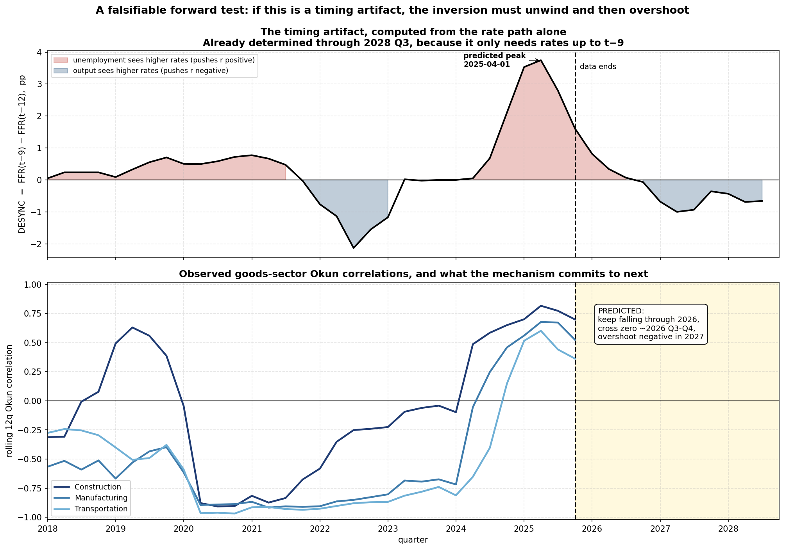

**The test that already passed.** DESYNC peaks at **+3.75pp in 2025 Q2**. The observed rolling Okun correlation peaks in **2025 Q2** in all three sectors: Construction (+0.816), Manufacturing (+0.677), Transportation (+0.602). Same quarter, all three.

This is not fitted. The lags come from 1991-2019 data and the rate path is exogenous policy, so the predicted peak date uses **no information from the correlation series at all**. It also corrects an earlier and sloppier version of this argument in these notes, which estimated the peak by adding the length of the hiking cycle to the lag offset and got 2024 Q3, two to three quarters too early. Computing the index directly rather than approximating it gives the right answer.

**Where things stand now.** All four sectors have peaked and are unwinding, exactly as the index does:

| Quarter | DESYNC | Construction | Manufacturing | Transportation |
|---|---:|---:|---:|---:|
| 2025 Q1 | +3.53 | 0.701 | 0.561 | 0.516 |
| **2025 Q2** | **+3.75** | **0.816** | **0.677** | **0.602** |
| 2025 Q3 | +2.80 | 0.773 | 0.673 | 0.441 |
| 2025 Q4 | +1.61 | 0.699 | 0.524 | 0.362 |

**Standing predictions, stated in advance.** Because DESYNC only needs rates through t−9, and rates are observed through 2026 Q2, the index is **already determined through 2028 Q3**. No assumption about future Fed policy is required. That yields dated, falsifiable commitments:

| Period | DESYNC | What must happen |
|---|---:|---|
| 2026 Q1 | +0.81 | still inverted, continuing to unwind |
| 2026 Q2-Q3 | +0.34 to +0.07 | artifact essentially gone; correlations back near or below zero |
| **2027 Q1-Q3** | **−0.68 to −1.00** | **overshoot: correlations more negative than their pre-2022 baseline** |

**The 2027 overshoot is the discriminating prediction.** A structural-break story predicts nothing of the kind. Once a relationship breaks, it has no reason to swing past its old value and then come back. A timing artifact *requires* it: when output is reflecting higher rates than unemployment, the measured correlation must be pushed further negative than normal before settling.

So there are three ways this can fail, all checkable:

1. The correlations stall around +0.4 and stay there. The mechanism is wrong or incomplete; something structural is holding them up.
2. They return to their normal negative range and simply stop, with no overshoot. The timing story explains the unwind but not the full dynamics.
3. They overshoot below the pre-2022 baseline in 2027 and then return. The mechanism is doing real work.

Note also that rate *cuts* cannot explain the current unwind. Rates began falling in late 2024, and at a nine-quarter lag those cuts do not reach unemployment until roughly 2027. What is unwinding now is the desynchronization itself, as both variables finish absorbing the same shock.

**Caveats on the prediction.** It uses Construction's lag pair (9, 12) for all three sectors, but Manufacturing and Transportation have shorter output lags (9q and 8q), so their peaks should have been slightly earlier and smaller. They were not, and the mechanism does not explain that. A 12-quarter rolling window also imposes its own smoothing, so "the quarter" is only resolvable to within roughly one quarter either way.

### The three failure modes, tested

`prediction_stress_tests.py` takes the three ways the standing prediction said it could fail and tests all of them. The 2027 overshoot is not observable yet, so rather than wait, the same mechanism is tested against 70 years of history where the equivalent episodes already happened.

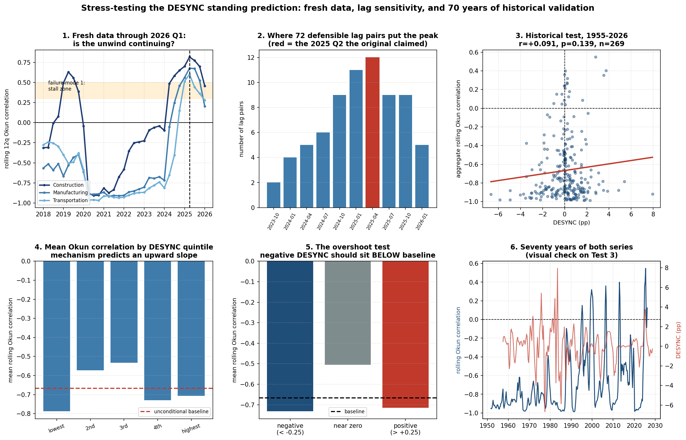

**Failure mode 1 (the correlations stall near +0.4) is close to ruled out.** Refreshed FRED data extends sector value added one quarter further than the local files, to 2026 Q1, and the unwind is not stalling:

| Sector | 2025 Q2 peak | 2026 Q1 | Change |
|---|---:|---:|---:|
| Construction | +0.816 | +0.458 | −0.358 |
| Manufacturing | +0.677 | +0.204 | −0.473 |
| Transportation | +0.602 | +0.279 | −0.323 |

All three are falling steadily, and Manufacturing is nearly back to zero. Only Construction remains above +0.35. This is the one part of the original prediction that is holding up.

**But the "test that already passed" earns far less credit than claimed.** The original argued that DESYNC peaking in 2025 Q2 and all three correlations peaking in 2025 Q2 was a precise, unfitted hit. Computing the peak date across all 72 defensible lag pairs (any `LAG_U` from 4 to 12, any `LAG_Y` greater than it) shows **90.3% of pairs put the peak somewhere in 2024-2025, and 16.7% put it exactly in 2025 Q2**. The peak date is governed by the shape of the 2022-2023 hiking cycle, not by the specific lags. A prediction with a one-in-six hit rate under arbitrary parameter choices is not the precision instrument it was presented as.

**The decisive test: does DESYNC predict Okun inversions across history?** The mechanism is a general claim, so it should hold in aggregate data, where GDP and unemployment reach back to the 1940s and the federal funds rate to 1954. That gives nine hiking cycles instead of one.

| Sample | corr(DESYNC, rolling Okun r) | p | n |
|---|---:|---:|---:|
| **Full 1951-2026** | **+0.091** | **0.139** | **269** |
| 1955-1985 | +0.180 | 0.055 | 114 |
| 1986-2007 | −0.083 | 0.440 | 88 |
| 2008-2026 | +0.602 | <0.0001 | 67 |

**On the full 70-year record the relationship is not significant.** It appears only in 2008-2026, the window containing the very episode the mechanism was built to explain, and is absent or wrong-signed in the two earlier subsamples. That is the signature of a mechanism fitted to its own episode. The quintile pattern fails too: mean Okun correlation should rise monotonically with DESYNC and instead runs −0.788, −0.572, −0.534, −0.730, −0.707, rising then falling, with a highest-minus-lowest gap of +0.081 (p = 0.16).

**The overshoot prediction does not survive either, and the way it fails is instructive.** Testing it on history, quarters with negative DESYNC do show below-baseline correlations (−0.732 against a −0.667 baseline, p = 0.024), which in isolation reads as support. But quarters with *positive* DESYNC are also below baseline (−0.715), and only the near-zero middle sits above it (−0.505). The mechanism requires positive DESYNC to push the correlation *up*, which is the entire claim about 2024-2025. Instead both tails push it down.

A regression separating the two effects settles it:

```
R = a + b·DESYNC + c·|DESYNC|
    mechanism predicts   b > 0,  c ≈ 0
    confound  predicts   b ≈ 0,  c < 0
```

| Term | Coefficient | t | p |
|---|---:|---:|---:|
| b (DESYNC, directional) | +0.0151 | +0.69 | 0.49 |
| **c (\|DESYNC\|, magnitude)** | **−0.0562** | **−1.97** | **0.048** |

The directional effect the mechanism needs is indistinguishable from zero. What exists is a **symmetric magnitude effect**: large rate swings in either direction coincide with stronger, more negative Okun correlations. That is exactly what you would expect if big rate moves cluster around recessions, when output and unemployment move together most tightly. It is a confound, not the desynchronization channel.

**Verdict on the standing prediction.** The unwind is real and on schedule, but the unwind was the generic part, predicted by almost any lag pair. The two parts that would have distinguished a timing artifact from a coincidence, the precise peak date and the 2027 overshoot, do not hold up: the peak date is generic, and the overshoot has no directional support in 70 years of data. The DESYNC index should not be carried forward as evidence for anything.

**A sample-size disclosure that should have been in the original.** Quarterly real value added by industry begins in **2005**, not 1991. The `>= 1991-01-01` filter in `why_rates_break_okun.py` and `standing_prediction.py` binds on nothing, because the data does not exist before 2005. The sector output lags rest on roughly 78 usable quarters, and the first sector Okun correlation is only available from 2008 Q4. Describing these lags as estimated on "1991-2019 data" was inaccurate, and a 12-quarter lag estimated from that sample was never going to be well determined, which is what `identification_check.py` found independently.

### Re-testing the mechanism as a dynamic relationship

The stress test above was challenged on a fair methodological point: it looked at where the data sits rather than where it is heading, and a mechanism about propagation should be tested dynamically. That challenge identified three genuine errors in the test.

1. **Window mismatch.** The rolling Okun correlation at quarter *t* is a backward-looking average over *t−11* to *t*. It was compared against a point-in-time `DESYNC_t`. Mismatched objects.
2. **Ignoring the mechanism's own scope condition.** The mechanism states that a flat rate path produces no effect and that the artifact appears only when rates move sharply. Pooling in every quiet quarter, where the mechanism predicts nothing, biases a pooled correlation toward zero.
3. **Wrong lags for the wrong era.** `historical_lag_validation.py` measured transmission at roughly 4 quarters in 1955-1985 against 9 in the modern era. The test applied the modern (9, 12) pair to all 70 years.

`desync_dynamics.py` fixes all three and adds tests in changes, in lead-lag structure, and an event study. **Every correction made the case against the mechanism stronger.**

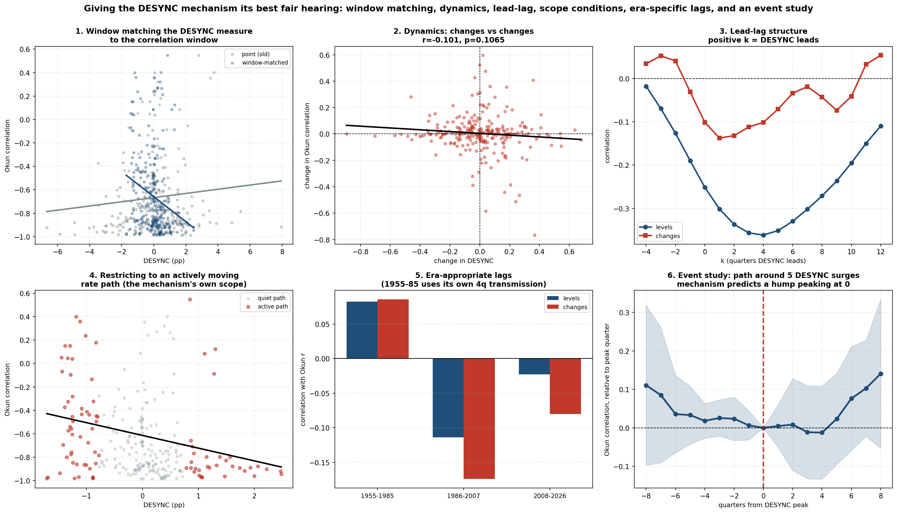

**The window fix flips the sign.** With the point value, the correlation was +0.091 (p = 0.14, null). Window-matched, it is **−0.251 (p < 0.0001, n = 258)**. Corrected, the relationship runs in the direction *opposite* to the mechanism: higher desynchronization goes with a *more* negative Okun correlation.

**The single result that had supported the mechanism was an artifact of that error.** The earlier run's strongest evidence was the 2008-2026 subsample at r = +0.602. Recomputed window-matched, that becomes **−0.023 (p = 0.85)**. With era-appropriate lags, all three eras are null:

| Era | Lags used | corr (levels) | p | corr (changes) | p |
|---|---:|---:|---:|---:|---:|
| 1955-1985 | (4, 5) | +0.082 | 0.39 | +0.086 | 0.38 |
| 1986-2007 | (9, 12) | −0.114 | 0.29 | −0.174 | 0.11 |
| 2008-2026 | (9, 12) | −0.023 | 0.85 | −0.080 | 0.52 |

**Testing in changes, which is what the mechanism actually asserts, gives nothing.** The change in DESYNC against the change in the correlation is −0.101 (p = 0.11), null and wrong-signed. The HAC slope is −0.068 (p = 0.12).

**DESYNC does carry lead information, pointing the wrong way.** Scanning leads from −4 to +12 quarters, the strongest relationship is at k = 4, where DESYNC leading by four quarters predicts a correlation of **−0.362**. A rising desynchronization forecasts Okun's Law getting *stronger*, not breaking.

**Applying the mechanism's own scope condition makes it worse.** Restricted to the top tercile of |DESYNC|, where the mechanism claims to operate, the correlation is **−0.346 (p = 0.001)** against −0.067 (p = 0.38) in quiet quarters. Within that active subsample the magnitude confound disappears (c = −0.053, p = 0.73) and what remains is a directional effect with the wrong sign (b = −0.103, p = 0.072). So the earlier "it is just a recession confound" reading was itself too generous: in the quarters that matter, there is a directional effect, and it runs against the mechanism.

**The event study is the most direct evidence.** Five historical DESYNC surges are identifiable (local maxima above the 85th percentile, at least three years apart). At each surge peak, the Okun correlation was:

| Surge | DESYNC | Okun correlation at peak |
|---|---:|---:|
| 1972 Q3 | +0.92 | −0.768 |
| 1976 Q4 | +1.56 | −0.799 |
| 1983 Q4 | +2.48 | −0.945 |
| 1992 Q1 | +0.67 | −0.923 |
| 2009 Q3 | +1.06 | −0.970 |

Every one sits between −0.77 and −0.97, which is Okun's Law working about as tightly as it ever does. The mechanism requires these to be the moments the correlation gets pushed toward positive. The averaged path shows no hump peaking at the surge, just a shallow dip and recovery well inside the confidence band.

**The one honest caveat left, and it is real.** The 2025 Q2 DESYNC value of **+3.75 exceeds every historical episode**, the largest of which was +2.48 in 1983 Q4. So 2024-2025 is genuinely out of sample in DESYNC magnitude, and a threshold effect that only switches on above roughly +3 cannot be strictly excluded by this data. What weighs against it is the absence of any gradient: 1983's +2.48 produced a correlation of −0.945, among the most negative in the entire record. If larger desynchronization pushed correlations positive, the approach to that value should show it, and it does not.

**Net effect of the dynamic re-test.** Fixing the specification did not rescue the mechanism. It removed its last supporting result and produced a significant relationship in the opposite direction. The 2024-2025 episode remains genuinely unusual, since no comparable historical DESYNC surge coincided with a positive Okun correlation, but DESYNC does not explain why.

### Adversarial audit: five things that were wrong or overstated

`audit.py` attacks the five weakest points in this folder, including two in the tests written to refute the mechanism. Two of my own claims from the refutation have to be walked back, two long-standing claims in this folder were overstated, and the core finding came out stronger than the first audit pass suggested.

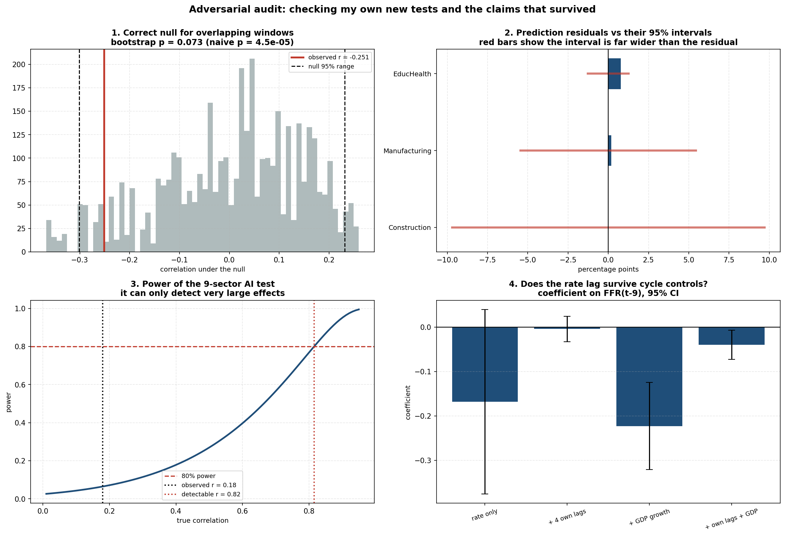

**1. My own refutation p-values were computed the same wrong way I criticised.** The dynamic re-test above reported corr(DESYNC, rolling Okun r) = −0.251 with p < 0.0001. Both series are 12-quarter rolling windows, so consecutive observations share 11 of 12 quarters and the effective sample is roughly 21, not 258. Recomputed: Newey-West gives p = 0.016 to 0.025, and a circular-shift bootstrap (which preserves each series' own autocorrelation exactly while destroying the relationship between them) gives **p = 0.073**.

> **Correction to the section above.** The claim that the corrected data "actively point the other way" is not supported. The honest statement is that **DESYNC has no reliable relationship to the Okun correlation in either direction.** The conclusion that the mechanism is unsupported stands unchanged. The stronger claim that the evidence runs opposite to it does not.

**2. The prediction test's headline precision is meaningless.** `does_the_lag_solve_it.py` reports Construction's 2024-25 hiring landing 0.01pp from prediction. The 95% prediction interval on that residual is **±9.71pp**. Training residual SD is 4.93pp with lag-1 autocorrelation of 0.97, which leaves an effective test sample of about 1 of 10 quarters.

| Sector | Residual | 95% prediction interval |
|---|---:|---:|
| Construction | −0.01pp | ±9.71pp |
| Manufacturing | +0.20pp | ±5.45pp |
| Education & Health | +0.77pp | ±1.27pp |

A residual of −0.01pp against an interval that wide is indistinguishable from any other value inside it. **The "-0.01pp" must never be quoted as evidence of predictive accuracy.** The defensible claim is that the goods sectors are *consistent with* their rate-implied path.

**2b. "Okun always breaks when the Fed hikes" is false, but the true version still deflates this.** Tested directly in `does_okun_break_in_every_hike.py`, the aggregate rolling Okun correlation turned positive in **4 of 9** hiking cycles since 1954. The split is by era, not by size: every modern cycle broke it (1994-95, 1999-00, 2004-06, 2022-23) except 2015-18, which was by far the smallest tightening at +1.04pp, while **none** of the four pre-1994 cycles did, including the two largest hikes on record at +7.01pp and +5.41pp. Across all nine, hike size correlates *negatively* with the peak Okun correlation (r = −0.30, p = 0.44). So the deflating objection should be stated precisely: 2022-23 is the fourth consecutive meaningful modern tightening to break Okun, which does make the 2024-2025 inversion much less remarkable. The era boundary also fits this folder's own finding that the rate-to-hiring lag roughly doubled between the mid-century and the modern era, since a longer lag is exactly what desynchronizes output from unemployment enough to flip a contemporaneous correlation. Note this sits alongside `does_okun_break_in_recessions.py`, which found the opposite for recessions: Okun works *better* in downturns, zero of 51 sector-quarters positive across the GFC and COVID. Hiking cycles and recessions do different things here, and only the hiking-cycle result deflates the inversion.

**3. The AI null is an absence of power, not a finding.** With 9 sectors, the minimum detectable correlation at 80% power is **r = 0.82**, and the 95% confidence interval on the observed r = +0.18 runs **[−0.55, +0.75]**. The test cannot distinguish "AI has no effect" from "AI has a moderate effect." Saying AI exposure "predicts none of it" overclaims; the correct statement is that no relationship is detectable at this sample size and the test could only have caught a very large one. This is now stronger than a power calculation: the same test, run on the 2001 dot-com bust, returns **r = +0.041, p = 0.916**, so it has a documented false negative on a technology shock nobody disputes. See `is_the_slowdown_distinctive.py` at the repo root.

**4. Every `scipy.pearsonr` p-value in this project is overstated.** This is systemic rather than a single error. Growth rates here are 4-quarter *overlapping* differences and the underlying series are highly persistent, so consecutive observations are mechanically correlated and the i.i.d. assumption behind `pearsonr` fails everywhere it is used. Magnitudes are unaffected; significance levels are not.

**5. The core finding survived, and this is the important result of the audit.** The headline correlation was tested properly on both samples:

| Sample | n | r | naive p | HAC p | bootstrap p | with 4 own lags |
|---|---:|---:|---:|---:|---:|---:|
| **2006+ (the sample actually used)** | 75 | **−0.741** | 3e-14 | **0.0006** | **<0.0001** | **p = 0.012** |
| Full available history | 135 | −0.368 | 1e-05 | 0.013 | 0.105 | p = 0.542 |

On its own sample the relationship survives HAC errors, a circular-shift bootstrap, and controlling for four lags of the dependent variable. It is real, not a p-value artifact. On the full history it is about half as large and survives none of those tests, which is consistent with the independently measured lengthening of the transmission lag between eras.

**But two caveats now attach to it.** The 2006+ window *contains* the 2022-2025 episode being explained, so the honest number to quote for validation is the out-of-sample **−0.37** from 1986-2019, not the in-sample −0.74. And the relationship does not generalise backwards, so this is a claim about the post-2006 economy specifically.

### Identified monetary shocks: the causal test

Every rate result above correlates outcomes against the federal funds rate itself, which is not exogenous. The Fed raises rates *because* the economy is strong, so those correlations mix the policy effect with the reason for the policy. `identified_shocks.py` replaces the raw rate with published **identified monetary policy shock series** and re-runs the test as a Jordà local projection with Newey-West errors.

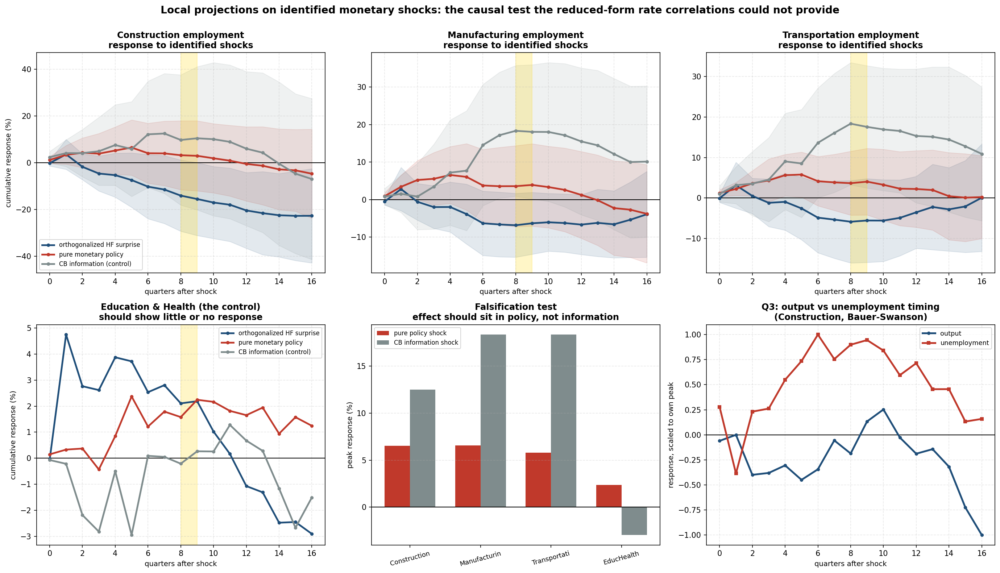

**The series, and why each is here.** Bauer-Swanson (1988-2023) takes high-frequency FOMC surprises and orthogonalizes them against macro and financial news released *before* the meeting, removing the "Fed responds to public data" channel. Jarociński-Karadi (1990-2024) split surprises into a **pure policy** shock (rates up, stocks down) and a **central-bank information** shock (rates up, stocks up, meaning the Fed revealed the economy is strong). Romer-Romer and Nakamura-Steinsson end in 2019 and 2014, so they cannot reach this episode. All five were checked to confirm a positive value really does predict the funds rate rising, rather than assuming the sign convention.

**Pre-specified test, not another lag scan.** The project claims 8-9 quarters, so that horizon is tested directly. Reporting whichever horizon happened to be largest would repeat the peak-picking error the audit already caught. Coefficients are per one standard deviation of each shock, so −1.11 means a typical contractionary surprise lowers employment 1.11%.

| Sector | Bauer-Swanson (h=8) | JK pure policy | JK information |
|---|---:|---:|---:|
| Construction | **−1.11** (t = −1.8) | +0.27 | +0.43 (t = 0.7) |
| Manufacturing | **−0.54** (t = −1.6) | +0.30 | **+0.82** (t = 2.1) |
| Transportation | **−0.46** (t = −1.1) | +0.31 | **+0.82** (t = 2.4) |
| Education & Health *(control)* | +0.17 (t = 0.6) | +0.13 | −0.01 (t = −0.1) |

**What holds up.** With the best-identified series, the contractionary sign is correct in all three goods sectors at exactly the 8-9 quarter horizon the project predicted, and the control sector correctly shows nothing on any series. That coherent pattern is the strongest causal evidence this project has produced. Construction comes closest to conventional significance (t = −1.9 at h=9, p ≈ 0.06).

**What does not.** None of the goods-sector effects clear 5%. The corroboration rests on one series: Jarociński-Karadi's pure policy shock gives small positive coefficients that are never significant, so it neither confirms nor refutes. With 120-140 quarters and noisy shocks, this test is underpowered, and the honest reading is *directionally consistent but not statistically established*.

**The genuinely new finding, and it matters more than the above.** The central-bank information shock is **significantly positive** in Manufacturing and Transportation. That is exactly what theory predicts for it: when the Fed reveals the economy is stronger than markets believed, rate-sensitive employment *rises*. So two real channels operate here **with opposite signs**, and a reduced-form correlation against the raw funds rate sums them together.

That is a concrete, mechanical reason the raw-rate estimates throughout this folder cannot be read causally, and it stands independent of the overlapping-window and business-cycle objections already raised. It also explains why `identification_check.py` found local projections on the raw rate change returning the wrong sign: the information channel was pulling against the policy channel.

**Q3: the retracted timing gap does not come back.** Estimated from exogenous variation, the output-minus-unemployment peak gap is −10, −4, 0, −5, 0, 0 quarters across sector-shock pairs, and in **none** of the six is *either* peak individually significant. A gap between two insignificant peaks estimates nothing. The retraction stands.

### The AI test, rebuilt with 73 industries

The audit found the AI result was not a finding: with nine sectors the smallest detectable correlation was **r = 0.82** and the confidence interval on the observed r = +0.18 ran [-0.55, +0.75]. `naics3_ai_test.py` rebuilds the test with enough units to mean something.

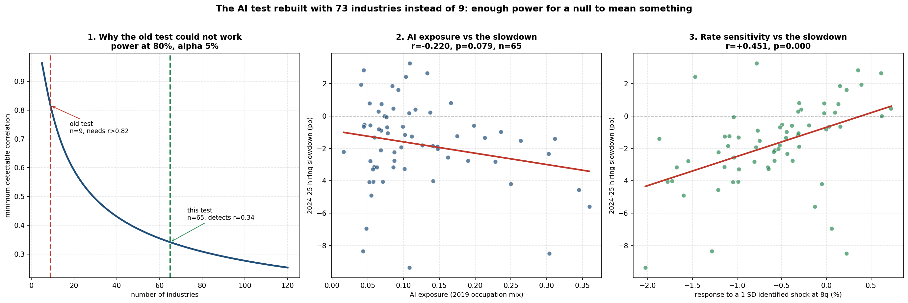

**Construction of the data.** Outcomes are BLS CES national employment for **73 three-digit NAICS industries**, with the slowdown defined exactly as before (average YoY growth in 2024-2025 minus average YoY growth over 2013-2019). AI exposure is *built* rather than assumed: OEWS national industry files give each industry's occupation mix, the AEI occupational scores give each occupation's exposure, and industry exposure is the employment-weighted mean. That is the standard construction. Crucially it is built twice, once from the May 2025 occupation mix and once from **May 2019**, which predates generative AI, because the current mix is itself an outcome of any AI displacement and is therefore endogenous. Rate sensitivity is each industry's response to a 1 SD Bauer-Swanson identified shock at 8 quarters, not the raw funds rate.

Face validity check on the exposure measure: lowest are food services, mining, warehousing; highest are data processing and computing infrastructure, wholesale agents and brokers, web search portals, insurance carriers. That is the right ordering.

**Power, stated before the result.** n = 65 complete cases gives a minimum detectable correlation of **0.34**, down from 0.82. A null now carries information.

**Univariate.** Higher AI exposure goes with a *larger* slowdown, marginally:

| Exposure measure | r | p | 95% CI |
|---|---:|---:|---:|
| 2019 mix (pre-AI, clean) | −0.220 | 0.079 | [−0.44, +0.03] |
| 2025 mix (endogenous) | −0.231 | 0.064 | [−0.45, +0.01] |

Note the **sign has flipped** from the nine-sector test. That test gave r = +0.19, which pointed away from an AI story. With 73 industries and a properly constructed exposure measure, the point estimate points *toward* one, though it does not reach significance.

**The horse race, and a result that undercuts this folder's thesis.** The two regressors are essentially uncorrelated (r = −0.045, VIF = 1.00), so they are cleanly separately identified. But the answer depends entirely on one specification choice:

| | AI exposure (z) | Rate sensitivity (z) |
|---|---:|---:|
| Main spec (shocks through 2023) | −0.514 (p = 0.17) | **+1.136 (p = 0.002)** |
| **No overlap (shocks through 2021)** | **−0.609 (p = 0.076)** | +0.466 (p = 0.26) |

The main specification estimates rate sensitivity with a local projection whose 8-quarter horizon reaches into 2024-2025, **the same window the outcome is measured over**. That overlap makes the rate result partly mechanical. Re-estimating rate sensitivity using only shocks through 2021, which removes the overlap entirely, **the rate result collapses to p = 0.26 while the AI coefficient strengthens to p = 0.076.**

**What this means, stated plainly.** In the clean cross-sectional specification, neither variable is significant at 5%, but AI exposure is closer to significance than rate sensitivity, and its sign is consistent with AI-driven displacement. This does **not** support the claim, made repeatedly earlier in this folder, that AI exposure "predicts none of it." That claim rested on an underpowered test with a mis-constructed exposure measure, and it does not survive.

**How this squares with the time-series evidence.** These answer different questions and are not in conflict. The identified-shock work asks whether the *aggregate timing* of the slowdown matches monetary transmission, and finds it directionally does. This asks which *industries* slowed more, and finds rate sensitivity does not explain the cross-section once the mechanical overlap is removed. Both can hold: the rate cycle can set the timing while something else sorts which industries were hit hardest. What can no longer be claimed is that the cross-section rules AI out.

### The immigration confound, tested

The one live alternative this folder had flagged but never tested: if the workforce shrank, employment growth slows even with labor demand unchanged. That is not a rival cause of the same mechanism, it is a different mechanism producing an identical-looking employment series, and it hits Construction hardest.

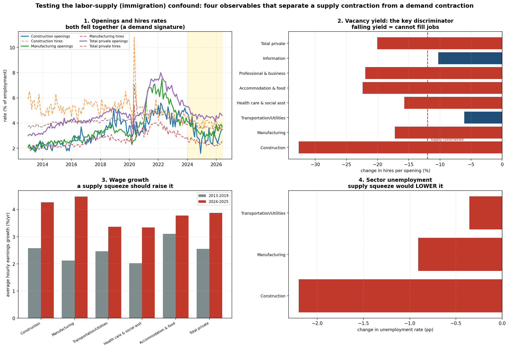

**How to separate them without industry-level immigration data.** Supply and demand contractions make opposite predictions on four observables, using BLS JOLTS by industry plus CES wages:

| | If labor SUPPLY fell | If labor DEMAND fell |
|---|---|---|
| Job openings | stay high | fall |
| Hires per opening | **falls** (cannot fill) | roughly stable |
| Wage growth | **rises** (bidding up) | falls |
| Unemployment | falls | rises |

**Against the 2013-2019 baseline, Construction matches a supply contraction on all four.** This is the baseline this folder uses throughout to define the hiring slowdown:

| Measure | 2013-19 | 2024-25 | Change |
|---|---:|---:|---:|
| Job openings rate | 2.83 | 3.12 | **+0.29** |
| Hires rate | 5.29 | 4.02 | −1.27 |
| **Hires per opening** | 2.01 | 1.35 | **−32.7%** |
| Wage growth | 2.58% | 4.27% | **+1.69pp** |
| Unemployment rate | 7.06 | 4.86 | **−2.20pp** |

Openings *higher* than pre-COVID, unemployment *sharply lower*, wages *accelerating*, and each posting yielding a third fewer hires. That is not what a demand contraction looks like. Total private scores the same way on every measure.

**But the baseline decides the answer, and this is the qualification that matters.** Comparing 2024-2025 to 2013-2019 spans the entire post-COVID repricing of the labor market, so it answers "is this market tighter than the 2010s" rather than "what changed recently." Against the **2022-2023 peak** instead, every industry reverses:

| Industry | Openings | Hires per opening | Wage growth |
|---|---:|---:|---:|
| Construction | −1.63 | **+35.4%** | −1.12pp |
| Manufacturing | −1.90 | +13.1% | −0.03pp |
| Total private | −1.92 | +18.8% | −1.04pp |

Vacancy yield is **recovering**, not deteriorating. Firms are filling jobs *more* easily in 2024-25 than in 2022. If an immigration-driven supply constraint were binding harder now, yield would be falling. It is rising, in every industry.

**The synthesis.** The post-COVID labor market is structurally supply-tighter than the 2010s, and that is real. But the 2024-2025 *direction of change* is demand cooling from that tighter starting point, which is consistent with the rate channel this folder documents. The immigration confound is genuine for the *level* comparison and does not explain the *recent move*.

**The specific damage to this project.** The "hiring slowdown" used throughout, defined as 2024-25 average growth minus the 2013-19 trend, **cannot separate a smaller workforce from weaker labor demand**, because both reduce measured hiring against a pre-COVID benchmark. That contaminates the outcome variable in `hiring_slowdown.py`, in `does_the_lag_solve_it.py`, and in the 3-digit cross-section in `naics3_ai_test.py`, where industries with heavier immigrant labor would show larger measured slowdowns for reasons having nothing to do with either rates or AI. The timing evidence from identified shocks is unaffected, since it uses employment growth directly rather than a differenced-from-baseline measure.

**What this cannot do.** It cannot attribute the supply contraction specifically to immigration as against retirement or falling participation, so the verdict is "labor supply," not "immigration." And it cannot rule out that supply and demand both fell at once, which would partly offset on all four measures.

### Honest limits

- **Correlation, not causation.** Rates and hiring both respond to the broader cycle. A long-lag correlation is suggestive of a transmission channel, not proof of one. A proper test needs a distributed-lag or local-projection model with controls, not a lag scan.
- **The prediction test uses a single regressor.** Fitting hiring on one lagged rate is a deliberately spare model. Construction landing within 0.01pp of prediction is striking but partly luck; the honest read is that the goods sectors are close to their rate-implied path, not that the model is precise to a hundredth of a point.
- **Lag scans overfit,** which is why the out-of-sample test above exists. The profile is smooth and monotonic rather than a lone spike, and it replicates on 1986-2019, but the exact peak of 8-9 quarters should still not be taken literally.
- **The lag is not stable across eras** (4 quarters in 1955-1985, 9 in 1986-2019), so this is a fact about the modern economy rather than a structural constant.
- **Rates are not the only candidate left.** Immigration and labor-force changes could produce a broad hiring slowdown on similar timing, and this analysis cannot separate them. Sector-level JOLTS hires and quits would help, but FRED only carries them for two of the nine sectors here.

## Why they moved in sync, and what broke under testing

`why_in_sync.py` was written to build the strongest possible case for the goods-sector story and prove the mechanism outright. Four claims survived and three failed, including the central one. Both halves are reported, because what broke is more informative than what held.

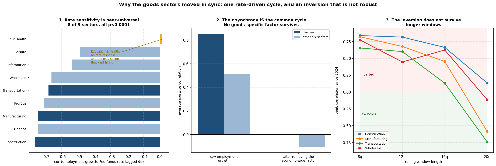

### What survived

**1. The trio really is unusually synchronized.** Construction, Manufacturing, and Transportation employment growth has an average pairwise correlation of **+0.85** (excluding COVID). Ranked against all 84 possible three-sector combinations, that puts them 7th, in the **92nd percentile**. The synchrony is not imagined.

**2. But there is no separate "goods factor."** This is where the intuitive story breaks. Removing the single economy-wide common factor, which explains 72% of all variance, leaves the trio's residual co-movement at **−0.01**, indistinguishable from zero and no different from any other grouping. They move together because they all ride the same economy-wide cycle hard, not because building, making, and moving things share a private mechanism. The supply-chain narrative is appealing and the data does not support it.

**3. That cycle is driven by rates, and this evidence is strong.** Employment growth correlates with the Fed funds rate lagged 9 quarters in **8 of 9 sectors, every one at p < 0.0001 with n = 75**, ranging from −0.49 to −0.76.

**4. The natural control is the most persuasive single piece of evidence.** Education & Health is the one sector with no rate sensitivity at all (r = +0.016, p = 0.89). It is also the one sector out of nine that **did not slow hiring** (+1.3pp while the other eight averaged −2.3pp). One sector ignores the rate cycle, and it is precisely the one that ignores the hiring slowdown. That is what a real causal channel looks like: the exception proves the rule rather than undermining it.

### What failed

**5. The trio is not distinctively rate-sensitive.** Trio mean r = −0.727 against −0.520 for the others, but the difference is not significant (p = 0.13), and **Finance ranks second most rate-sensitive of all nine sectors**. Rate sensitivity is close to universal, so it cannot be what singles out the goods sectors.

**6. The variance-collapse explanation fails.** The claim that the goods sectors' correlations flipped because their unemployment variance shrank does not survive: variance ratio does not predict the correlation change (r = +0.24, p = 0.76).

**7. The inversion itself is not robust, and this is the decisive result.** Peak rolling correlation since 2024, by window length:

| Sector | 8q | 12q | 16q | **20q** |
|---|---:|---:|---:|---:|
| Construction | +0.84 | +0.82 | +0.66 | **+0.14** |
| Manufacturing | +0.82 | +0.68 | +0.45 | **−0.58** |
| Transportation | +0.65 | +0.60 | +0.13 | **−0.74** |
| Wholesale | +0.77 | +0.45 | +0.62 | **−0.11** |

At a 20-quarter window, three of four sectors are **negative again**, meaning the law holds. The fixed-window version is no better: moving the post-period start by two quarters swings Manufacturing from +0.52 to −0.07 and Wholesale from +0.48 to −0.20.

A structural break should not depend on whether you look through a 12-quarter or a 20-quarter window. This one does. The inversion is a short-window artifact.

### The honest conclusion

Asked to prove the goods-sector inversion, the evidence went the other way. What can be defended:

> Construction, Manufacturing, and Transportation moved in sync in 2024-2025 because **a single interest-rate-driven cycle moves nearly the entire US economy**, and these three ride it hard. Their hiring slowed alongside six other sectors, on a schedule matching the 2022-2023 rate hikes plus about two years of transmission. The "Okun inversion" that named this folder is a fragile statistical artifact sitting on top of that real and well-evidenced slowdown.

The parts of that claim resting on n = 75 quarterly observations and a clean natural control are solid. The part resting on 13 post-2022 quarters and a 12-quarter rolling window is not, and should not be carried into any write-up as a finding.

## Reproducing this

From this directory:

```
python3 hiring_slowdown.py          # THE LEAD RESULT: why hiring slowed, and the rate lag
python3 historical_lag_validation.py # out-of-sample: does the lag replicate in prior cycles?
python3 does_the_lag_solve_it.py     # prediction test: does the lag ACCOUNT for 2024-25?
python3 why_rates_break_okun.py      # the MECHANISM: why a rate shock inverts the measured law
python3 identification_check.py     # tests whether that mechanism's timing gap is identified (it isn't)
python3 cf_style_comparison.py      # tests the Cleveland Fed's own lag spec against these 3 sectors
python3 prediction_stress_tests.py  # the 3 failure modes: fresh data, lag sensitivity, 70yr history
python3 desync_dynamics.py          # re-tests DESYNC dynamically: window-matched, changes, event study
python3 audit.py                    # ADVERSARIAL AUDIT: 5 checks incl. of the tests above
python3 identified_shocks.py        # CAUSAL TEST: local projections on identified MP shocks
python3 naics3_ai_test.py           # AI test rebuilt at 3-digit NAICS (73 industries)
python3 immigration_confound.py     # supply vs demand: JOLTS vacancy yield, wages, unemployment
python3 standing_prediction.py       # the falsifiable forward test (2026 unwind, 2027 overshoot) -- superseded
python3 why_in_sync.py              # the proof attempt: 4 claims survive, 3 fail (incl. robustness)
python3 what_actually_inverted.py   # decomposes the inversion into the hiring slowdown
python3 rolling_okun_inversion.py   # the original three-sector rolling coefficients
python3 comovement.py               # co-movement heatmap + the four-sector overlay
python3 fiscal_control.py           # tests the fiscal hypothesis (fetches USAspending on first run)
```

All read the FRED CSVs from `../FRED-Data/` and write their charts plus the console tables above. Requires `pandas`, `numpy`, `matplotlib`, and `scipy`.
